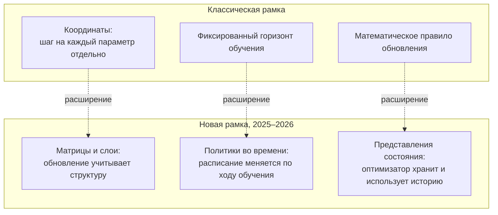

## Русская версия

# Что вообще такое «оптимизатор» и почему это уже не просто «ещё один Adam»

Если вы когда-нибудь запускали обучение нейросети, вы наверняка видели строчку вроде `optimizer = Adam(...)` и не особо задумывались, что там происходит внутри. А зря — оптимизатор это не техническая деталь, а буквально то, что решает, как модель учится на градиентах ошибки. Свежий обзорный [пост-препринт «Survey of Optimizers»](http://arxiv.org/abs/2608.28557v1) формулирует ключевую мысль: описывать развитие оптимизаторов 2025–2026 годов как «очередной вариант Adam» — это уже неточно. Дизайн-пространство расширилось сразу по трём осям, и разобраться в них стоит на пальцах, даже если вы не читаете статьи по оптимизации каждый день.

Первая ось — от координат к матрицам и слоям. Классический оптимизатор вроде Adam трактует каждый параметр модели независимо: для каждого числа в тензоре весов он считает свой собственный шаг обновления, будто эти числа никак не связаны друг с другом. Но веса нейросети организованы в матрицы и слои неспроста — они кодируют структуру: строка матрицы, слой трансформера — это не случайный набор чисел, а согласованный блок. Новые подходы учитывают эту структуру при обновлении, а не просто применяют одно и то же правило к каждому числу по отдельности.

Вторая ось — от фиксированного горизонта к политикам во времени. Раньше расписание обучения (как меняется скорость обучения, моменты и так далее) чаще всего задавалось заранее и жёстко: например, «косинусный спад за N шагов». Теперь это расписание начинают трактовать как политику, которая подстраивается по ходу самого обучения, а не фиксируется в начале — то есть решение «как обновлять веса именно сейчас» становится динамическим, а не заранее прописанным.

Третья ось — от математического правила к представлению состояния. Классические оптимизаторы — это формула: берёшь градиент, применяешь правило, получаешь шаг. Новый подход трактует оптимизатор как систему с состоянием, которая накапливает и использует историю обучения более сложным образом, чем просто скользящее среднее градиента (как в Adam) — то есть ближе к тому, как устроена «память» в других системах машинного обучения, а не к чистой математической формуле.

Важная оговорка: это обзорный пост, а не единичное открытие, и конкретных цифр по приросту качества в доступном фрагменте нет — стоит воспринимать его как карту направления, а не как «оптимизатор X теперь лучше на Y%».

### Почему вам это важно

Если вы обучаете модели (даже небольшие) и по привычке ставите Adam «потому что все так делают», этот обзор — повод пересмотреть допущение. [Прочитайте статью целиком](http://arxiv.org/abs/2608.28557v1), если хотите понять, в какую сторону вообще движется область — три оси выше дают словарь, чтобы отличать реальный архитектурный сдвиг от косметического ребрендинга «ещё одного Adam».

## English version

# What an "optimizer" actually is, and why it's no longer just "another Adam"

If you've ever trained a neural network, you've probably seen a line like `optimizer = Adam(...)` and not thought too hard about what's happening underneath. That's a shame — the optimizer isn't a technical footnote, it's literally what decides how the model learns from error gradients. A recent survey preprint, [Survey of Optimizers](http://arxiv.org/abs/2608.28557v1), makes a central point: describing the 2025–2026 evolution of optimizers as "yet another Adam variant" is no longer accurate. The design space has expanded along three axes, and they're worth unpacking in plain terms even if you don't read optimization papers for a living.

The first axis: from coordinates to matrices and layers. A classical optimizer like Adam treats every model parameter independently — it computes its own update step for every single number in a weight tensor, as if those numbers had nothing to do with each other. But neural network weights are organized into matrices and layers for a reason — they encode structure: a row of a weight matrix, a transformer layer, isn't a random bag of numbers, it's a coherent block. Newer approaches take that structure into account when computing updates, rather than applying the same rule to every number in isolation.

The second axis: from a fixed training horizon to policies over time. Training schedules — how learning rate, momentum, and so on change over the run — used to be set rigidly in advance: say, "cosine decay over N steps." Increasingly, that schedule is treated as a policy that adapts during training itself rather than being fixed at the start — meaning the decision of "how to update the weights right now" becomes dynamic instead of pre-scripted.

The third axis: from a mathematical update rule to a state representation. Classical optimizers are a formula: take the gradient, apply the rule, get the step. The newer framing treats the optimizer as a stateful system that accumulates and uses training history in a more elaborate way than a simple running average of the gradient (as Adam does) — closer to how "memory" works in other machine-learning systems than to a pure mathematical formula.

One caveat worth stating plainly: this is a survey post, not a single new result, and the available excerpt doesn't include concrete quality-gain numbers — treat it as a map of direction, not a claim that "optimizer X now beats Y by Z%."

### Why it matters

If you train models — even small ones — and reach for Adam out of habit "because everyone does," this survey is a good prompt to revisit that default. [Read the full piece](http://arxiv.org/abs/2608.28557v1) if you want a sense of where the field is actually heading — the three axes above give you a vocabulary for telling a real architectural shift apart from a cosmetic rebrand of "yet another Adam."
