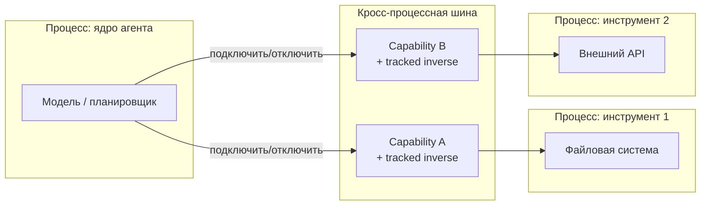

## Русская версия

# Харнесс на шине между процессами: зачем агенту «отменяемые» способности

Препринт [Logos: An Agent Harness on a Cross-Process Bus](http://arxiv.org/abs/2608.28553v1) начинается с формулировки, которую стоит разобрать по частям, прежде чем пугаться терминов вроде «spatiotemporal-composability calculus». Начнём с основ: «агентский харнесс» (agent harness) — это не сама модель, а обвязка вокруг неё, которая решает, какие инструменты доступны агенту прямо сейчас, как передавать ему результаты вызовов и как контролировать, что он вообще может сделать. По сути, харнесс — это runtime-контракт между моделью и реальным миром.

Авторы отмечают, что современные агентские системы собирают свои возможности («capabilities» — доступные инструменты, права, интеграции) не заранее, а динамически, во время работы — агент может «получить» новую способность посреди сессии, а не только на старте. Ключевая идея статьи в том, что такую динамическую сборку можно формально описать: каждая способность («capability») — это компонент, который несёт с собой «tracked inverse» — отслеживаемый способ её отменить. Иными словами, если агент получает право писать в файл или дёргать внешний API, система заранее знает, как именно это право откатить, а не просто «дала и забыла».

Это прямое попадание в тему границы авторизации — вопрос о том, где заканчивается «модель предложила действие» и начинается «действие реально произошло». Формальная гарантия «у каждой выданной способности есть отслеживаемая обратная операция» — это архитектурный ответ на проблему: как не потерять контроль над агентом, который сам себе на лету докручивает права.

Второй элемент названия — «cross-process bus», кросс-процессная шина. Это означает, что инструменты и ядро агента работают в отдельных процессах (возможно, на разных машинах), а не как функции внутри одного монолитного приложения, и общаются через общую шину сообщений, а не через прямые вызовы функций. Такой дизайн даёт изоляцию — сбой в инструменте не обязательно роняет ядро агента — и позволяет собирать агента как набор независимо запускаемых плагинов, что перекликается сегодня же с архитектурой deepseek-harness («Everything is a Plugin»), только здесь это подкреплено формальным аппаратом, а не просто инженерным паттерном.

Стоит сделать честную оговорку: доступный фрагмент абстракта обрывается на полуслове («agents are assembled as plugin…»), так что деталей формализма — как именно считается «tracked inverse», какие гарантии он даёт математически — в нашем распоряжении нет. Судить о статье целиком по одному абзацу было бы нечестно.

### Почему вам это важно

Если вы проектируете харнесс, где агент может динамически получать новые инструменты в рантайме, идея «каждая выданная способность обязана нести с собой способ отмены» — практический принцип дизайна, а не только теория. [Загляните в препринт](http://arxiv.org/abs/2608.28553v1), если строите систему, где нужна формальная, а не «на честном слове», гарантия отзываемости прав.

## English version

# A harness on a cross-process bus: why agent capabilities need a built-in undo

The preprint [Logos: An Agent Harness on a Cross-Process Bus](http://arxiv.org/abs/2608.28553v1) opens with a description worth unpacking piece by piece before getting intimidated by terms like "spatiotemporal-composability calculus." Start with the basics: an "agent harness" isn't the model itself — it's the scaffolding around it that decides which tools the agent can reach right now, how tool results get fed back to it, and what it's actually allowed to do. In short, the harness is the runtime contract between the model and the real world.

The authors note that modern agent systems assemble their capabilities (available tools, permissions, integrations) not upfront but dynamically, at runtime — an agent can "gain" a new capability mid-session rather than only at startup. The paper's central idea is that this dynamic assembly can be given a formal treatment: each capability is a component that carries with it a "tracked inverse" — a trackable way to undo it. In other words, if an agent gains the right to write to a file or call an external API, the system already knows exactly how to roll that right back, rather than just granting it and forgetting about it.

That lands squarely on the authorization-boundary question — where "the model proposed an action" ends and "the action actually happened" begins. A formal guarantee that "every granted capability comes with a trackable inverse operation" is an architectural answer to a real problem: how not to lose control of an agent that keeps extending its own permissions on the fly.

The second half of the name — "cross-process bus" — means tools and the agent's core run as separate processes (possibly on separate machines), rather than as functions inside one monolithic app, communicating over a shared message bus instead of direct function calls. That design buys isolation (a tool crashing doesn't necessarily take down the agent core) and lets the agent be assembled from independently deployable plugins — which echoes today's other item, deepseek-harness's "Everything is a Plugin" philosophy, only here it's backed by a formal apparatus rather than just an engineering pattern.

Worth an honest caveat: the available abstract excerpt cuts off mid-sentence ("agents are assembled as plugin…"), so the formal details — exactly how a "tracked inverse" is defined, what guarantees it provides mathematically — aren't available to us. Judging the full paper off one truncated paragraph wouldn't be fair.

### Why it matters

If you're designing a harness where an agent can gain new tools dynamically at runtime, "every granted capability must carry its own undo path" is a practical design principle, not just theory. [Check out the preprint](http://arxiv.org/abs/2608.28553v1) if you're building a system that needs a formal — not just an honor-system — guarantee that permissions are revocable.
