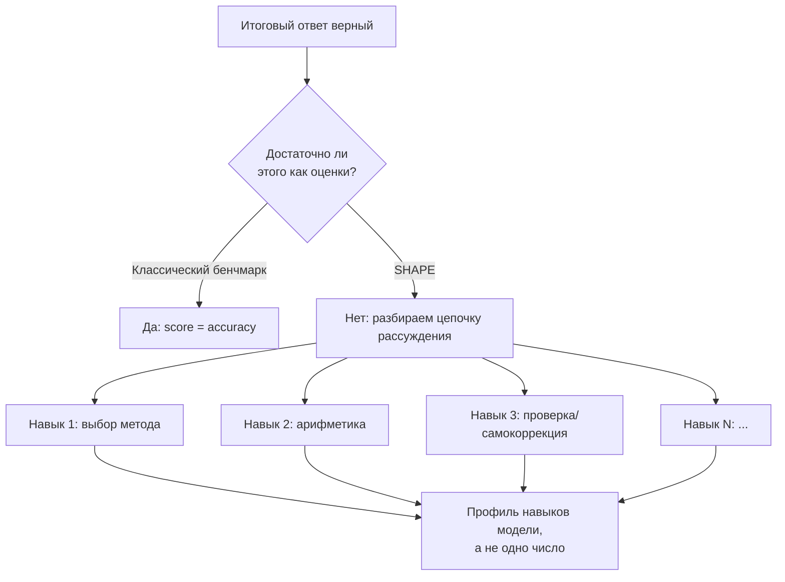
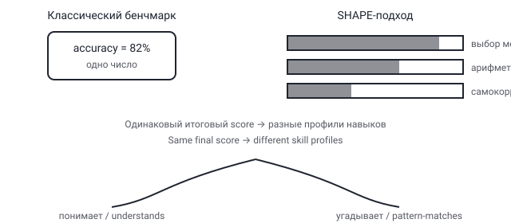

## Русская версия

# Что значит «модель умеет решать математику» на самом деле

Когда языковая модель показывает высокий результат на математическом бенчмарке, естественно читать это как «модель умеет решать математику». Но за одной итоговой цифрой accuracy может стоять что угодно — от действительно устойчивого навыка рассуждения до удачного совпадения с паттернами из обучающей выборки, которое ломается при малейшем изменении формулировки задачи. Именно этот разрыв разбирает свежая работа [SHAPE](https://huggingface.co/papers/2608.28600) авторства Jonghyun Song, Sangjun Song, Minjae Oh, Haesung Pyun, Sungsik Lee и соавторов: по их формулировке, «LLM достигают высоких результатов на бенчмарках математического рассуждения, но математически значимые навыки, лежащие в основе этого рассуждения, остаются малоизученными».

Разница между «итоговый ответ верен» и «навык рассуждения устойчив» — это разница между результатом и процессом. Представьте ученика, который правильно решил задачу по геометрии, потому что запомнил похожую задачу из учебника, а не потому что понял, почему нужно применить именно эту теорему. Внешне — правильный ответ. Внутренне — ноль переносимого навыка: чуть измени условие, и решение развалится. Классические бенчмарки математического рассуждения в основном смотрят только на финальный ответ и не различают эти два случая — модель, которая «понимает» задачу, и модель, которая её «узнаёт», получают одинаковый балл.

Работа SHAPE, судя по названию и цели, идёт дальше: вместо одной агрегированной метрики она пытается разложить процесс рассуждения на отдельные, измеримые математически значимые навыки — скорее всего, что-то вроде выбора подходящего метода решения, корректности промежуточных арифметических шагов, способности заметить и исправить собственную ошибку в цепочке рассуждений. Смысл такого разложения не в том, чтобы получить более сложную единую оценку, а в том, чтобы увидеть профиль модели: где именно она сильна, а где угадывает. Две модели с одинаковой итоговой accuracy на бенчмарке могут иметь совершенно разные профили навыков — и это принципиально разная информация для того, кто решает, доверять ли модели в задачах, которые чуть отличаются от тестовых.

### Почему вам это важно

Если вы выбираете модель для задач, где корректность рассуждения критична — от финансовых расчётов до инженерных оценок, — одной итоговой цифры на лидерборде недостаточно: два решения с одинаковым score могут провалиться на совершенно разных классах входных данных. Подход вроде [SHAPE](https://huggingface.co/papers/2608.28600) — сигнал в сторону более честной оценки: спрашивайте не «какой у модели score», а «на каких именно навыках держится этот score» и «что происходит, когда именно этот навык оказывается недостаточным».

## English version

# What "the model can do math" actually means

When a language model posts a high score on a math benchmark, it's natural to read that as "the model can do math." But a single accuracy number can hide anything from genuinely robust reasoning to a lucky pattern match against training data that falls apart the moment the problem's wording shifts. That gap is exactly what the new [SHAPE](https://huggingface.co/papers/2608.28600) paper digs into, by Jonghyun Song, Sangjun Song, Minjae Oh, Haesung Pyun, Sungsik Lee, and co-authors: as they put it, "large language models achieve strong performance on mathematical reasoning benchmarks, yet the mathematically meaningful skills underlying their reasoning remain underexplored."

The difference between "the final answer is correct" and "the reasoning skill is robust" is the difference between outcome and process. Picture a student who solves a geometry problem correctly because they memorized a similar problem from the textbook, not because they understood why that particular theorem applies. From the outside — a correct answer. On the inside — zero transferable skill: tweak the setup slightly and the solution collapses. Classic math-reasoning benchmarks mostly look only at the final answer, and they don't distinguish these two cases — a model that "understands" the problem and a model that "recognizes" it get the exact same score.

SHAPE, judging by its name and stated goal, goes further: instead of one aggregated metric, it tries to decompose the reasoning process into separate, measurable, mathematically meaningful skills — likely things like choosing the right solution method, correctness of intermediate arithmetic steps, and the ability to notice and correct one's own mistake mid-chain. The point of that decomposition isn't a fancier single score — it's seeing a model's profile: exactly where it's strong and where it's guessing. Two models with identical benchmark accuracy can have completely different skill profiles, and that's fundamentally different information for anyone deciding whether to trust a model on tasks that differ slightly from the test set.

### Why it matters

If you're picking a model for tasks where reasoning correctness matters — from financial calculations to engineering estimates — a single leaderboard number isn't enough: two solutions with the same score can fail on completely different classes of input. An approach like [SHAPE](https://huggingface.co/papers/2608.28600) points toward a more honest kind of evaluation: don't just ask "what's the model's score," ask "which skills is that score actually built on," and "what happens when exactly that skill turns out to be insufficient."
