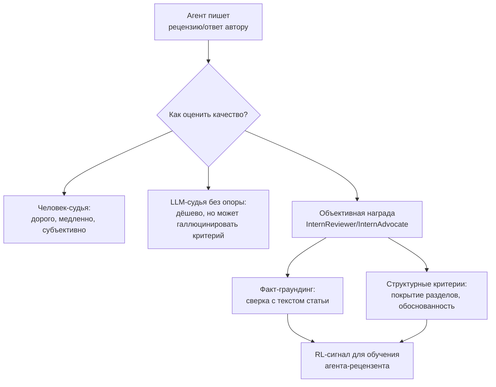
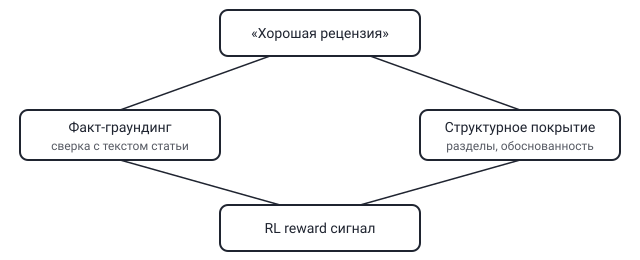

## Русская версия

# Как вообще оценить, что агент написал хорошую рецензию

Написать текст рецензии на научную статью или ответ автору на критику (rebuttal) — задача, которую в принципе можно поручить агенту: она текстовая, структурированная, с понятным входом (статья) и выходом (связный аргументированный текст). Проблема в другом: как понять, что агент справился хорошо, а не просто сгенерировал складный, но пустой набор фраз? Именно этим вопросом занимается работа [InternReviewer & InternAdvocate](https://huggingface.co/papers/2608.28612) авторства Xuerui Su, Liya Guo, Qizhi Pei, Qipeng Guo, Zhongbo Tian и соавторов, представляющая, по их формулировке, «комплексный фреймворк для» — задачи, требующей «сложного синтеза доменного рассуждения и фактологической обоснованности».

Проблема оценки здесь двухслойная. Во-первых, «хорошая рецензия» — понятие, которое сложно свести к одной метрике вроде точности или BLEU: рецензия может быть грамматически безупречной и при этом не заметить главной методологической проблемы статьи, или наоборот — резкой по тону, но абсолютно по делу. Во-вторых, если для reinforcement learning нужен reward — числовой сигнал «это было хорошо/плохо», — то откуда его взять для настолько субъективной задачи? Человеческая оценка каждой рецензии в цикле обучения RL-агента попросту не масштабируется: RL требует тысяч и десятков тысяч итераций, а не десятков.

Название «объективная награда» (objective reward) в контексте статьи указывает на попытку разбить эту субъективность на измеримые компоненты, которые не требуют участия человека на каждом шаге: например, сверку конкретных фактических утверждений рецензии с реальным текстом статьи (не выдумала ли рецензия деталь, которой в статье нет), проверку структурного покрытия — затронуты ли ключевые разделы работы (методология, эксперименты, ограничения), — и, возможно, согласованность рекомендации с приведёнными в тексте рецензии аргументами. Это тот же общий паттерн, что стоит за многими современными RL-фреймворками для языковых агентов: там, где нельзя напрямую измерить «хорошесть» результата, её раскладывают на набор более простых, автоматически проверяемых прокси-сигналов.

### Почему вам это важно

Если вы обучаете или оцениваете агента на любой субъективной по своей природе текстовой задаче — суммаризация, код-ревью, редактура, — вопрос «на чём именно основан reward» всегда стоит задавать в первую очередь. Подход [InternReviewer / InternAdvocate](https://huggingface.co/papers/2608.28612) — конкретный пример того, как разбить неизмеримое качество на измеримые прокси, и этот же принцип декомпозиции применим далеко за пределами peer review.

## English version

# How do you even evaluate whether an agent wrote a good review

Writing a peer review of a research paper, or a rebuttal responding to a reviewer's criticism, is a task that's plausibly agent-shaped: it's text-based, structured, with a clear input (the paper) and output (a coherent, argued piece of text). The real problem is different: how do you know the agent did it well, rather than just generating fluent but empty prose? That's exactly the question tackled by [InternReviewer & InternAdvocate](https://huggingface.co/papers/2608.28612), by Xuerui Su, Liya Guo, Qizhi Pei, Qipeng Guo, Zhongbo Tian, and co-authors, who present, in their words, a comprehensive framework for a task that "requires an intricate synergy between domain reasoning and factual grounding."

The evaluation problem here has two layers. First, "a good review" is hard to collapse into a single metric like accuracy or BLEU: a review can be grammatically flawless and still miss the paper's core methodological flaw, or be sharp in tone yet completely on point. Second, if reinforcement learning needs a reward — a numeric "this was good/bad" signal — where does that come from for such a subjective task? Having a human rate every review inside an RL training loop simply doesn't scale: RL needs thousands to tens of thousands of iterations, not dozens.

The phrase "objective reward" in the paper's framing points to an attempt to break that subjectivity into measurable components that don't need a human in the loop at every step: for instance, checking specific factual claims in the review against the actual paper text (did the review invent a detail that isn't in the paper), checking structural coverage — did it address the key sections of the work (methodology, experiments, limitations) — and possibly whether the review's stated recommendation is consistent with the arguments it actually makes. That's the same general pattern behind a lot of modern RL frameworks for language agents: where "goodness" of an output can't be measured directly, it gets decomposed into a set of simpler, automatically checkable proxy signals.

### Why it matters

If you're training or evaluating an agent on any inherently subjective text task — summarization, code review, editing — "what exactly is the reward based on" is always the first question worth asking. [InternReviewer / InternAdvocate](https://huggingface.co/papers/2608.28612) is a concrete example of decomposing unmeasurable quality into measurable proxies, and that same decomposition principle applies far beyond peer review.
