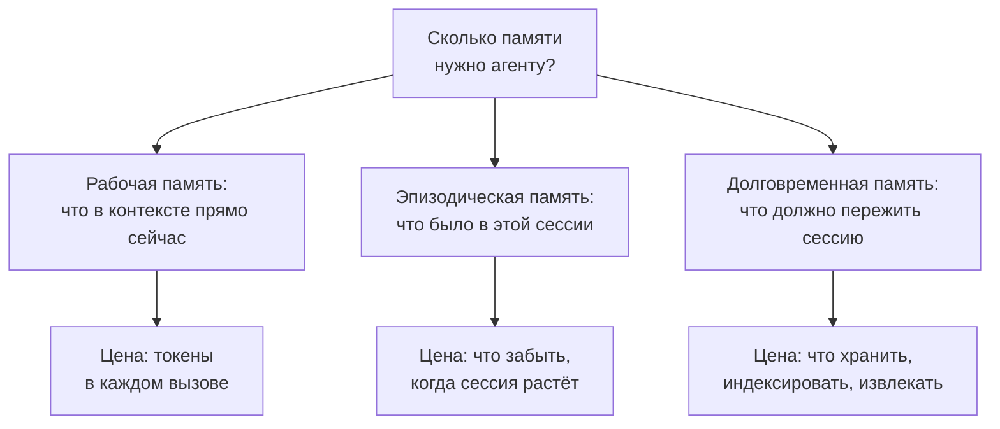
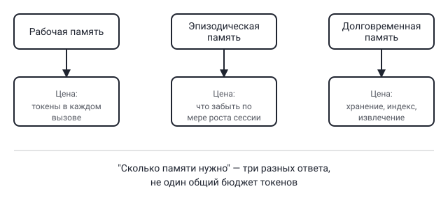

## Русская версия

# Сколько памяти реально нужно агенту — и почему это не один вопрос, а несколько

В сегодняшнем дайджесте — запись в блоге IBM Research с говорящим названием: [«How Much Memory Does Your Agent Actually Need?»](https://huggingface.co/blog/ibm-research/altk-evolve-hmm) — «сколько памяти на самом деле нужно вашему агенту». Сам заголовок формулирует вопрос ровно так, как его стоит формулировать: не «нужна ли агенту память» (очевидно, что да), а «сколько именно» — то есть вопрос про размер и стоимость, а не про наличие функции. Вокруг этого вопроса стоит разложить сам термин «память агента», потому что под одним словом обычно скрываются три разные вещи с разной ценой.

Первое — рабочая память: то, что буквально лежит в контекстном окне модели прямо в момент текущего вызова. Это самая дорогая память в буквальном смысле — каждый токен здесь оплачивается при каждом запросе, и чем больше вы туда пихаете «на всякий случай», тем медленнее и дороже становится каждый шаг агента. Рабочая память обнуляется между вызовами, если её явно не пересобрать заново.

Второе — эпизодическая память: то, что произошло за текущую сессию с пользователем — какие инструменты вызывались, какие решения были приняты, что пользователь уже говорил пять шагов назад. Это не обязательно должно постоянно лежать в контекстном окне целиком — часть можно сжимать (суммаризация), часть — держать доступной через отдельный механизм извлечения, а не через постоянное присутствие в промпте. Цена здесь другая: не токены за вызов, а решение о том, что забыть по мере роста сессии, не потеряв то, что действительно понадобится позже.

Третье — долговременная память: то, что должно пережить не только текущий вызов, но и всю сессию целиком — факты о пользователе, накопленные знания, паттерны из прошлых взаимодействий. Здесь цена уже инженерная: где это хранить, как индексировать, как извлекать релевантный фрагмент в нужный момент, не превращая долговременную память в ещё одну свалку токенов, которую приходится целиком прогонять через модель.

Смысл разделения не в терминологии ради терминологии — а в том, что ответ на «сколько памяти нужно» разный для каждого из трёх слоёв, и решение «дать агенту больше памяти» без уточнения, о каком слое речь, обычно означает просто «дать агенту больше токенов в промпте», что решает проблему рабочей памяти и одновременно создаёт новую проблему — стоимость и задержку каждого вызова.

### Почему вам это важно

Если вы проектируете память для своего агента, не задавайте вопрос «сколько памяти ему дать» как один вопрос — разложите его на три: что должно быть в контексте прямо сейчас, что можно сжать или вытащить через retrieval из текущей сессии, и что действительно должно храниться отдельно и переживать сессию. Именно этот вопрос — «actually need», а не «максимум, сколько можно дать» — и задаёт [заголовок разбираемого поста](https://huggingface.co/blog/ibm-research/altk-evolve-hmm): память агента стоит проектировать под минимально достаточный объём для каждого слоя, а не тащить в контекст всё подряд «на всякий случай».

## English version

# How much memory does an agent actually need — and why that's three questions, not one

Today's digest includes an IBM Research blog post with a title that says it all: [«How Much Memory Does Your Agent Actually Need?»](https://huggingface.co/blog/ibm-research/altk-evolve-hmm). The title itself frames the question exactly the way it should be framed — not "does an agent need memory" (obviously yes), but "how much," which is a question about size and cost, not about whether the feature exists. It's worth unpacking the term "agent memory" itself here, because one word usually hides three different things with three different price tags.

First: working memory — whatever literally sits in the model's context window at the moment of the current call. This is the most expensive memory in a very literal sense — every token here gets paid for on every single request, and the more you stuff in "just in case," the slower and pricier every agent step becomes. Working memory resets between calls unless it's explicitly reassembled each time.

Second: episodic memory — what happened during the current session with the user: which tools got called, what decisions were made, what the user already said five steps ago. This doesn't have to sit entirely in the context window at all times — part of it can be compressed (summarization), part can be made available through a separate retrieval mechanism rather than a constant presence in the prompt. The cost here is different: not tokens per call, but the decision of what to forget as the session grows, without losing what you'll actually need later.

Third: long-term memory — what needs to survive not just the current call but the entire session, and beyond it: facts about the user, accumulated knowledge, patterns from past interactions. Here the cost is engineering: where to store it, how to index it, how to retrieve the relevant fragment at the right moment without turning long-term memory into just another pile of tokens you have to run through the model in full.

The point of splitting it up isn't terminology for its own sake — it's that the answer to "how much memory is needed" differs for each of the three layers, and "give the agent more memory" without specifying which layer usually just means "give the agent more tokens in the prompt," which fixes the working-memory problem while creating a new one — cost and latency on every call.

### Why it matters

If you're designing memory for your own agent, don't ask "how much memory should it get" as a single question — split it into three: what needs to be in context right now, what can be compressed or pulled in via retrieval from the current session, and what genuinely needs to be stored separately and outlive the session. That's precisely the question — "actually need," not "the most you could give it" — that [this post's title](https://huggingface.co/blog/ibm-research/altk-evolve-hmm) is pointing at: agent memory should be designed for the minimum sufficient size at each layer, not stuffed with everything "just in case."
