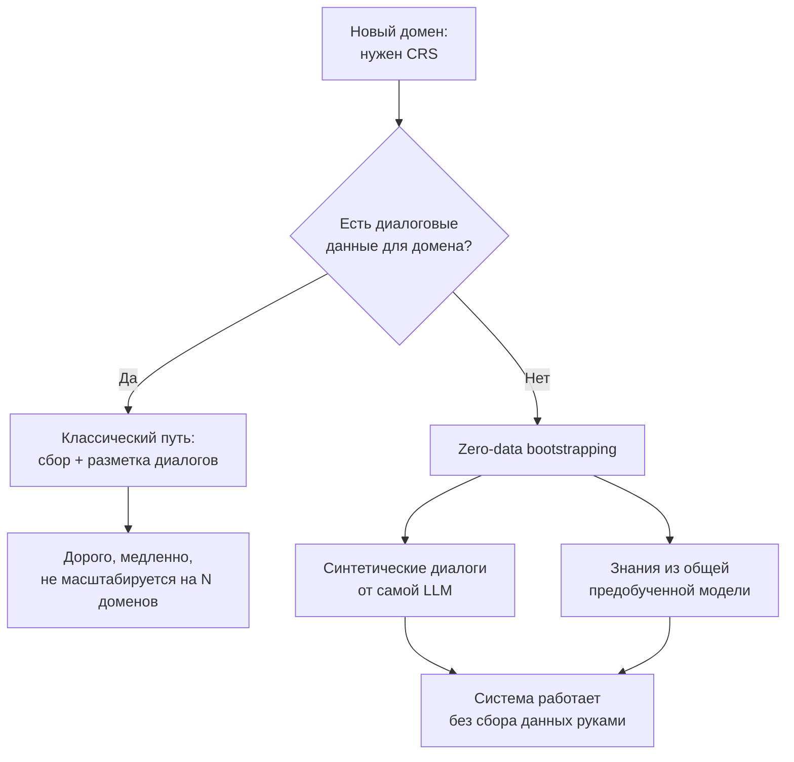

## Русская версия

# Zero-data bootstrapping: как запустить диалоговую систему в новом домене без диалоговых данных

В сегодняшнем дайджесте — статья [«An Empirical Study on Zero-Data Bootstrapping for Conversational Recommender Systems»](https://huggingface.co/papers/2504.15476) (Rohan Surana, Junda Wu, Zhouhang Xie, Yu Xia, Nathan Kallus и другие). Conversational Recommender Systems (CRS) — это системы, которые не просто выдают список рекомендаций (фильм, товар, ресторан), а ведут с пользователем диалог, уточняя предпочтения: «а вам нравится что-то более лёгкое?», «а бюджет какой?». Авторы формулируют проблему прямо в первом предложении аннотации: такие системы обычно требуют диалоговых данных, специфичных для домена — а это дорого, дефицитно и часто вообще недоступно, когда домен новый. Стоит разобрать, почему это так и что вообще значит «zero-data bootstrapping» как класс подходов, не только применительно к этой конкретной статье.

Классический способ построить CRS для нового домена — собрать реальные диалоги между людьми (или человеком и системой-прототипом) именно в этом домене, разметить их (что было предпочтением пользователя, что — уточняющим вопросом, что — финальной рекомендацией) и на этом обучить или дообучить модель. Проблема масштабирования очевидна: если у вас 20 доменов — фильмы, книги, рестораны, отели, одежда, — вам нужно повторить весь этот дорогостоящий процесс сбора и разметки 20 раз, и каждый новый домен — это снова недели работы людей, прежде чем система вообще заработает.

«Zero-data» в названии означает не «без каких-либо данных вообще» (современные LLM и так предобучены на огромном корпусе текста), а конкретно — без диалоговых данных, размеченных под конкретный домен и конкретную задачу CRS. Общая стратегия таких подходов обычно строится на одной из двух (или их комбинации) идей: во-первых, использовать саму LLM, чтобы сгенерировать синтетические диалоги — смоделировать разговор пользователя и рекомендательной системы, опираясь на то, что модель уже знает о домене из предобучения, а не на реальные записанные диалоги; во-вторых, опереться на знания, уже закодированные в предобученной модели общего назначения, вместо того чтобы учить систему предпочтениям пользователей с нуля на размеченном датасете. Аннотация статьи в дайджесте обрывается до описания конкретной методологии авторов, поэтому детали именно их подхода здесь не разбираем — но сама постановка вопроса как «systematic empirical study» важна: это не предложение одного трюка, а попытка систематически сравнить, что из класса zero-data подходов реально работает, а что — нет.

### Почему вам это важно

Если вы планируете запускать диалоговую систему (рекомендательную, консультационную, саппорт-бота) в новом домене и упираетесь в отсутствие размеченных диалогов — [посмотрите постановку задачи в этой статье](https://huggingface.co/papers/2504.15476) как на карту решений: прежде чем закладывать месяцы на сбор и разметку диалогов вручную, оцените, можно ли получить работающую систему через синтетические диалоги от самой LLM или через знания, уже заложенные в предобученную модель — цена ошибки здесь не в том, что подход не идеален, а в том, что «собрать данные для каждого нового домена заново» часто оказывается вообще не нужным первым шагом.

## English version

# Zero-data bootstrapping: launching a dialogue system in a new domain without dialogue data

Today's digest includes the paper [«An Empirical Study on Zero-Data Bootstrapping for Conversational Recommender Systems»](https://huggingface.co/papers/2504.15476) (Rohan Surana, Junda Wu, Zhouhang Xie, Yu Xia, Nathan Kallus, and others). Conversational Recommender Systems (CRS) don't just output a list of recommendations (a movie, a product, a restaurant) — they hold a dialogue with the user, narrowing down preferences: "would you like something lighter?", "what's your budget?" The authors state the problem right in the abstract's opening line: such systems typically require domain-specific dialogue data, which is costly, scarce, and often simply unavailable when the domain is new. It's worth unpacking why that is, and what "zero-data bootstrapping" means as a class of approaches, beyond this one paper.

The classic way to build a CRS for a new domain is to collect real dialogues between people (or a person and a prototype system) specifically in that domain, label them (what was a user preference, what was a clarifying question, what was the final recommendation), and train or fine-tune a model on that. The scaling problem is obvious: if you have 20 domains — movies, books, restaurants, hotels, clothing — you have to repeat that entire costly collection-and-labeling process 20 times, and every new domain again means weeks of human work before the system even runs.

"Zero-data" in the title doesn't mean "no data whatsoever" (modern LLMs are already pretrained on a massive text corpus) — specifically, it means without dialogue data labeled for that particular domain and that particular CRS task. The general strategy behind such approaches usually rests on one of two ideas, or a combination of them: first, using the LLM itself to generate synthetic dialogues — simulating a conversation between a user and a recommender system, drawing on what the model already knows about the domain from pretraining rather than on real recorded conversations; second, leaning on the knowledge already encoded in a general-purpose pretrained model instead of teaching the system user preferences from scratch on a labeled dataset. The digest's abstract snippet cuts off before the authors' specific methodology, so we won't dig into the details of their exact approach here — but the framing itself, as a "systematic empirical study," matters: this isn't proposing a single trick, it's an attempt to systematically compare what actually works within the zero-data class of approaches, and what doesn't.

### Why it matters

If you're planning to launch a dialogue system (recommender, advisory, support bot) in a new domain and are stuck on the lack of labeled dialogues, [look at this paper's problem framing](https://huggingface.co/papers/2504.15476) as a map of options: before budgeting months for manual dialogue collection and labeling, assess whether you can get a working system from synthetic dialogues generated by the LLM itself, or from the knowledge already baked into a pretrained model — the risk here isn't that the approach is imperfect, it's that "collect data for every new domain from scratch" often turns out not to be a necessary first step at all.
