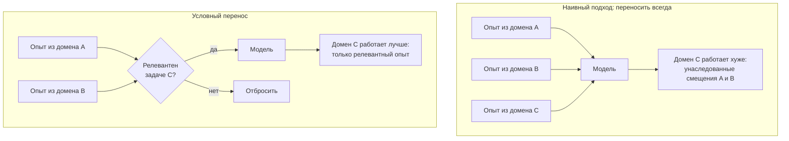
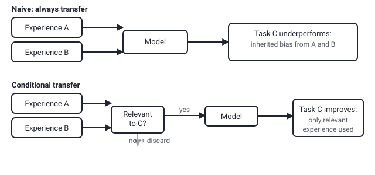

## Русская версия

# Почему больше накопленного опыта не всегда значит лучше дообучение

Сегодняшний пост уже касался работы [«Knowing When Not to Reuse: Conditional Experience Transfer in Autonomous LLM Post-Training»](https://huggingface.co/papers/2608.26730) (Tingyun Li, Wenfeng Feng, Weiqing Li, Abudukelimu Wuerkaixi, Guohua Liu и другие) — здесь стоит разобрать подробнее сам концепт, который стоит за названием, потому что он шире, чем одна конкретная статья.

Идея начинается с наблюдения, знакомого любому, кто дообучал модель хотя бы на двух разных задачах подряд: перенос обучения (transfer learning) в общем случае — это хорошо. Модель, уже видевшая много данных из смежной области, обычно учится новой задаче быстрее и с меньшим количеством размеченных примеров, чем модель, стартующая с нуля. Это настолько интуитивно понятная идея, что по умолчанию кажется: чем больше накопленного опыта дообучения доступно системе, тем лучше — просто скармливай всё, что было, и модель возьмёт из этого полезное.

Проблема в том, что «взять полезное и отбросить бесполезное» — это не то, что происходит автоматически при дообучении на смеси старого и нового опыта. Если домен A научил модель одним эвристикам, а новая задача C требует прямо противоположного поведения, старый опыт не остаётся нейтральным — он тянет параметры модели в сторону, которая была правильной для A, но неправильна для C. В литературе про continual learning это явление известно под именем catastrophic forgetting или, в более общем виде, negative transfer: перенос, который не помогает, а активно мешает, потому что источник и цель недостаточно похожи. Ключевая сложность в том, что «недостаточно похожи» — это не бинарный, заранее известный факт, а то, что зависит от конкретной пары домен-задача и часто выясняется только постфактум, когда модель на новой задаче работает хуже, чем если бы её обучали с нуля.

Именно здесь появляется идея «условного» переноса опыта, вынесенная в название статьи. Вместо того чтобы решать вопрос «переносить или нет» один раз и навсегда на уровне архитектуры системы, решение принимается на уровне каждого конкретного случая: перед тем как задействовать накопленный опыт для новой задачи, система должна оценить, насколько этот опыт вообще релевантен — и в части случаев осознанно от переноса отказаться, даже если формально данные доступны и «жалко не использовать». Особенно остро эта задача стоит именно в автономных пайплайнах, где решение о переносе принимает не инженер, вручную сравнивающий домены, а сама система, действующая без разметки «похоже/не похоже» от человека на каждом шаге.

Практический вывод шире, чем эта одна работа: банк накопленного опыта дообучения — это актив, но актив с обратной стороной, если относиться к нему как к однородному ресурсу. Полезная система должна не только копить опыт, но и уметь фильтровать его по применимости — и чем более автономно система принимает решения о собственном дообучении, тем важнее, чтобы этот фильтр был явным механизмом, а не молчаливым предположением «больше данных — всегда лучше».

### Почему вам это важно

Если вы проектируете пайплайн continual learning или автоматического дообучения на нескольких задачах или доменах подряд, закладывайте механизм оценки релевантности прошлого опыта как отдельный, явный шаг — а не полагайтесь на то, что модель сама «разберётся», что из старого опыта уместно, а что нет. Простейший practical proxy — держать отдельные срезы метрик по каждому домену после переноса и явно проверять, не просело ли качество на новой задаче по сравнению с обучением без переноса вовсе.

## English version

# Why more accumulated experience doesn't always mean better fine-tuning

Today's news post already touched on [«Knowing When Not to Reuse: Conditional Experience Transfer in Autonomous LLM Post-Training»](https://huggingface.co/papers/2608.26730) (Tingyun Li, Wenfeng Feng, Weiqing Li, Abudukelimu Wuerkaixi, Guohua Liu, and others) — it's worth unpacking the concept behind the title in more depth, since it's broader than this one paper.

The idea starts from something familiar to anyone who's fine-tuned a model on more than one task in sequence: transfer learning, in general, is a good thing. A model that has already seen a lot of data from a related area usually learns a new task faster and with fewer labeled examples than one starting from scratch. That's intuitive enough that the default assumption becomes: the more accumulated fine-tuning experience a system has access to, the better — just feed it everything that came before, and the model will pick out what's useful.

The problem is that "pick out what's useful and discard the rest" isn't something that happens automatically when fine-tuning on a mix of old and new experience. If domain A taught the model one set of heuristics, and new task C requires the opposite behavior, the old experience doesn't stay neutral — it pulls the model's parameters toward what was correct for A but is wrong for C. In the continual learning literature this is known as catastrophic forgetting, or more generally negative transfer: a transfer that actively hurts rather than helps, because source and target aren't similar enough. The hard part is that "not similar enough" isn't a binary, known-in-advance fact — it depends on the specific domain-task pair, and often only becomes visible after the fact, once the model performs worse on the new task than it would have if trained from scratch.

That's exactly where the idea of "conditional" experience transfer, from the paper's title, comes in. Instead of deciding "transfer or not" once and for all at the system's architecture level, the decision gets made case by case: before drawing on accumulated experience for a new task, the system has to assess how relevant that experience actually is — and in some cases deliberately decline to transfer it, even when the data is formally available and it feels wasteful not to use it. This problem is especially sharp in autonomous pipelines, where the transfer decision isn't made by an engineer manually comparing domains, but by the system itself, acting without a human labeling "similar / not similar" at every step.

The practical takeaway is broader than this one paper: a bank of accumulated fine-tuning experience is an asset, but one with a downside if you treat it as a uniform resource. A useful system needs not just to accumulate experience but to filter it by applicability — and the more autonomously a system makes decisions about its own fine-tuning, the more that filter needs to be an explicit mechanism, not a silent assumption that "more data is always better."

### Why it matters

If you're designing a continual-learning or automated multi-task/multi-domain fine-tuning pipeline, build in an explicit relevance-assessment step for past experience — don't rely on the model to "figure out" on its own what's applicable and what isn't. A simple practical proxy: keep per-domain metric slices after each transfer and explicitly check whether quality on the new task dropped compared to training without transfer at all.
