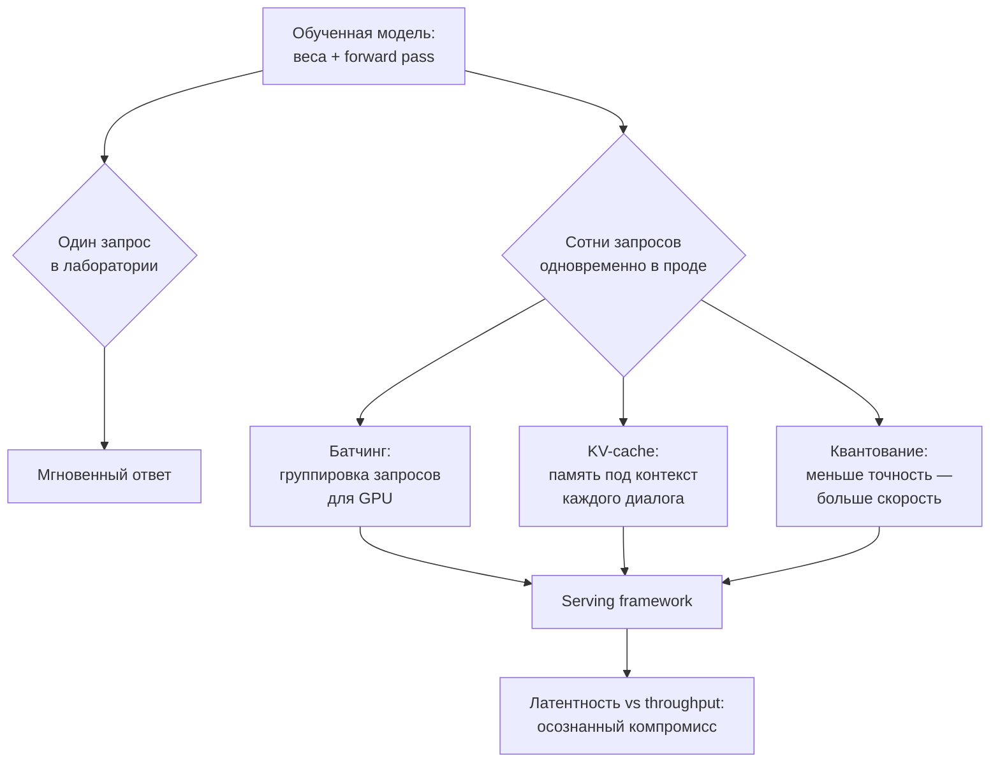

## Русская версия

# Что вообще решает «high-performance serving framework» для LLM

Сегодняшний дайджест трендов GitHub принёс [sglang](https://github.com/sgl-project/sglang) с описанием «high-performance serving framework for large language models and multimodal models». В отдельном посте разобран сюжет вокруг роста звёзд конкретно этого проекта — здесь стоит на шаг отступить и объяснить, какую категорию задач вообще решают такие фреймворки, независимо от конкретной реализации.

Обученная модель сама по себе — это веса и код одного прохода вперёд. Если вы запускаете её в блокноте и задаёте один вопрос за раз, разница между «моделью» и «сервисом» не заметна: вы подождали, получили ответ. Проблема начинается, когда к той же модели одновременно обращаются сотни или тысячи пользователей. Здесь и начинается работа serving-слоя, и у неё есть несколько типовых составляющих.

Первая — батчинг: вместо того чтобы гонять GPU по одному запросу за раз (что дорого простаивает железо между токенами), несколько запросов группируются в один проход. Это не тривиально: запросы приходят не одновременно, разной длины, и нужно решить, сколько ждать перед батчем и как не задержать самый ранний запрос ради экономии на батче.

Вторая — управление памятью под растущий контекст: каждый диалог с моделью накапливает так называемый KV-cache — промежуточные состояния внимания, которые нужно хранить, чтобы не пересчитывать весь контекст заново на каждом новом токене. Чем больше одновременных диалогов и чем они длиннее, тем быстрее упирается лимит видеопамяти — и здесь serving-слой решает, чьи данные хранить в быстрой памяти, а чьи вытеснять.

Третья — квантование: намеренное снижение числовой точности весов (например, с 16 бит до 8 или 4), которое снижает объём памяти и ускоряет вычисления ценой небольшой потери точности ответа. Это осознанный компромисс, а не бесплатное ускорение.

И над всем этим — выбор между латентностью (как быстро отвечает конкретный запрос) и throughput (сколько запросов в секунду обслуживает система в целом): оптимизация одного почти всегда немного бьёт по другому, и правильная настройка зависит от того, что важнее для конкретного продукта — быстрый чат в реальном времени или массовая пакетная обработка.

Сам дайджест не раскрывает, какие конкретно из этих механизмов реализует sglang и как именно — это общая карта задачи, а не описание конкретного решения.

### Почему вам это важно

Если вы выбираете инфраструктуру для LLM в продакшене, эти четыре понятия — батчинг, память под KV-cache, квантование, компромисс латентность/throughput — стоит держать как чек-лист вопросов к любому serving-фреймворку, [включая sglang](https://github.com/sgl-project/sglang): не «модный ли он», а «как именно он решает каждую из этих четырёх задач под вашу нагрузку».

## English version

# What a "high-performance serving framework" for LLMs actually solves

Today's GitHub trending digest surfaced [sglang](https://github.com/sgl-project/sglang), described as a "high-performance serving framework for large language models and multimodal models." A separate post covers the growth story around this specific project — here it's worth stepping back and explaining what category of problem such frameworks solve at all, independent of any particular implementation.

A trained model by itself is weights and a single forward pass. If you run it in a notebook and ask one question at a time, the distinction between "a model" and "a service" doesn't show up — you wait, you get an answer. The problem starts when hundreds or thousands of users hit the same model at once. That's where the serving layer's job begins, and it breaks down into a few recurring pieces.

The first is batching: instead of running the GPU on one request at a time (which leaves expensive hardware idle between tokens), several requests get grouped into a single pass. This isn't trivial — requests arrive at different times, with different lengths, and the system has to decide how long to wait before batching and how not to delay the earliest request just to save on batch efficiency.

The second is memory management for growing context: every conversation with the model accumulates what's called a KV-cache — intermediate attention states that need to be kept around so the whole context doesn't have to be recomputed for every new token. The more concurrent conversations there are, and the longer they run, the faster the system hits its VRAM ceiling — and the serving layer decides whose data stays in fast memory and whose gets evicted.

The third is quantization: deliberately lowering the numeric precision of the weights (say, from 16 bits down to 8 or 4), which cuts memory use and speeds up computation at the cost of some answer quality. It's a conscious tradeoff, not a free speedup.

And over all of this sits a choice between latency (how fast a single request gets answered) and throughput (how many requests per second the whole system serves) — optimizing one almost always costs something on the other, and the right setting depends on what a given product actually needs: a fast real-time chat, or high-volume batch processing.

The digest itself doesn't say which of these mechanisms sglang implements, or how — this is the general map of the problem, not a description of any one solution.

### Why it matters

If you're choosing LLM infrastructure for production, these four concepts — batching, KV-cache memory, quantization, and the latency/throughput tradeoff — are worth keeping as a checklist for any serving framework, [sglang included](https://github.com/sgl-project/sglang): not "is it trendy," but "how exactly does it handle each of these four problems under your own load."
