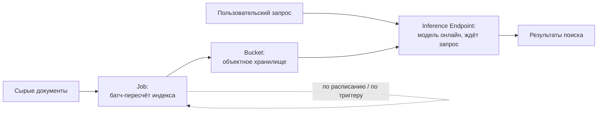
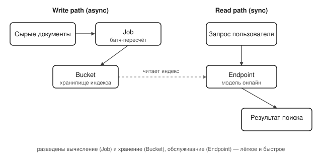

## Русская версия

# Endpoints, Jobs, Buckets: три примитива, из которых обычно и собирают поиск

Сегодняшний дайджест принёс запись [«How Hugging Face Inference Endpoints, Jobs, and Buckets Power Search on Papers with Code»](https://huggingface.co/blog/pwc-search) (Niels Rogge) — в дайджест попал только заголовок, без абстракта, поэтому конкретную архитектуру Papers with Code здесь разбирать не будем. Зато заголовок сам по себе называет три инфраструктурных примитива, которые стоит понимать по отдельности — они встречаются почти в любой системе поиска поверх больших данных, не только в этой конкретной.

Inference Endpoint — это модель, развёрнутая как постоянно доступный сервис: вы отправляете запрос (например, текст для получения эмбеддинга), сервис отвечает почти сразу. Ключевое свойство — «онлайн»: инстанс либо уже поднят, либо поднимается по требованию за секунды, а не за минуты. Для поиска эндпоинт нужен там, где нельзя ждать — в первую очередь для превращения пользовательского запроса в вектор в момент, когда человек уже нажал «искать».

Job — это ровно противоположный режим: разовый или периодический батч-процесс, у которого нет требования отвечать быстро. Индексацию миллионов документов не имеет смысла гонять через тот же путь, что и один пользовательский запрос — это долгая, ресурсоёмкая, перезапускаемая при сбое операция. Job запускается по расписанию или по триггеру (например, «в репозитории появилась новая статья»), берёт пачку документов, прогоняет их через модель и записывает результат.

Bucket — это объектное хранилище: место, куда Job складывает посчитанные эмбеддинги или индекс, а Endpoint потом оттуда читает при обслуживании запроса. Разделение вычисления (Job) и хранения (Bucket) — не случайность, а способ не пересчитывать индекс каждый раз заново и не держать вычислительные ресурсы занятыми, пока данные просто лежат и ждут запроса.

Вместе эти три примитива образуют типовой паттерн: тяжёлая, асинхронная подготовка данных (Job → Bucket) отделена от лёгкого, синхронного обслуживания запроса (Bucket → Endpoint). Это тот же принцип, что лежит в основе почти любого продакшен-поиска, независимо от конкретного поставщика инфраструктуры — разделение read-path и write-path.

### Почему вам это важно

Если вы проектируете поиск поверх собственных данных, эти три роли — «модель онлайн для запроса», «батч-процесс для индексации», «хранилище посередине» — стоит держать как минимальный чек-лист архитектуры, прежде чем сравнивать конкретные инструменты вроде [связки из статьи](https://huggingface.co/blog/pwc-search): важно не то, чьими продуктами вы это реализуете, а то, разведены ли у вас вычисление и хранение так же чётко.

## English version

# Endpoints, Jobs, Buckets: the three primitives most search systems are actually built from

Today's digest surfaced [«How Hugging Face Inference Endpoints, Jobs, and Buckets Power Search on Papers with Code»](https://huggingface.co/blog/pwc-search) (Niels Rogge) — only the title made it into the digest, no abstract, so the specific Papers with Code architecture won't be covered here. But the title alone names three infrastructure primitives worth understanding on their own — they show up in nearly any search system built over large data, not just this particular one.

An Inference Endpoint is a model deployed as an always-available service: you send a request (say, text to embed), the service answers almost immediately. The key property is "online" — the instance is either already running or spins up on demand within seconds, not minutes. For search, an endpoint is needed exactly where you can't wait: primarily, turning a user's query into a vector the moment they've already hit "search."

A Job is the opposite mode: a one-off or periodic batch process with no requirement to answer quickly. Indexing millions of documents makes no sense to route through the same path as a single user query — it's a long-running, resource-heavy operation you'd want to be able to restart on failure. A Job runs on a schedule or a trigger (say, "a new paper landed in the repository"), pulls a batch of documents, runs them through the model, and writes out the result.

A Bucket is object storage: the place a Job writes computed embeddings or an index to, and where an Endpoint later reads from while serving a request. Separating computation (Job) from storage (Bucket) isn't incidental — it's how you avoid recomputing the index from scratch every time, and avoid tying up compute resources while data just sits there waiting to be queried.

Together, these three primitives form a common pattern: heavy, asynchronous data preparation (Job → Bucket) kept separate from light, synchronous request serving (Bucket → Endpoint). That's the same principle underlying nearly any production search system, regardless of which infrastructure vendor you use — separating the read path from the write path.

### Why it matters

If you're designing search over your own data, these three roles — "a model online for the query," "a batch process for indexing," "storage in between" — are worth keeping as a minimum architecture checklist before comparing specific tools like [the combination in the article](https://huggingface.co/blog/pwc-search): what matters isn't whose products you implement it with, but whether compute and storage are separated just as cleanly.
