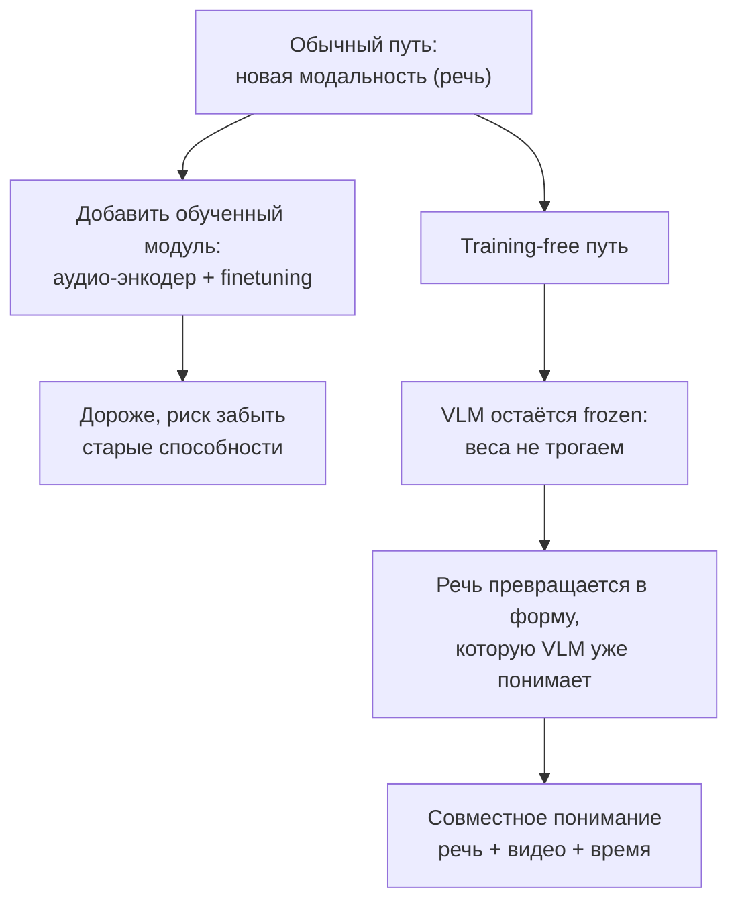
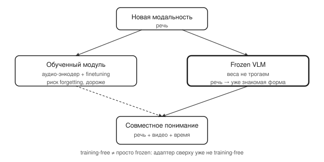

## Русская версия

# «Training-free» и «frozen»: что на самом деле значит адаптация модели без единого шага обучения

В сегодняшнем дайджесте — статья [«Training-Free Speech-Centric Omni Understanding with Frozen VLMs»](https://huggingface.co/papers/2609.04242) (Ankan Deria, Hanoona Rasheed, Xilin He, Fahad Shahbaz Khan, Salman Khan). Абстракт в дайджесте обрывается на полуслове: «Existing omni models typically introduce dedicated audi…» — так что о конкретной архитектуре из этой конкретной работы говорить не будем. А вот два термина в заголовке — «training-free» и «frozen» — стоит разобрать отдельно, потому что это не синонимы, и путаница между ними встречается часто.

«Frozen» (замороженная модель) — это чисто механическое свойство: веса модели зафиксированы, градиенты через них не считаются и не обновляются. VLM (vision-language model) в такой схеме используется ровно как есть, без единого шага дообучения. «Training-free» — свойство более широкое: это значит, что вся система адаптации к новой задаче или модальности не требует обучения вообще ни одного компонента, включая любые дополнительные модули поверх frozen-модели. Можно заморозить основную модель, но при этом обучить маленький адаптер сверху — это уже не training-free, хотя базовая модель и остаётся frozen.

Зачем вообще так делать, если можно просто дообучить модель под новую задачу? Обычный путь — то, что абстракт называет «dedicated audio…» (и, судя по контексту, продолжается словами про дополнительные обученные аудио-модули или энкодеры) — работает, но стоит дорого: нужны размеченные данные для новой модальности, вычислительные ресурсы на дообучение, и есть риск catastrophic forgetting — модель, дообученная под речь, может неожиданно хуже справляться с тем, что умела раньше. Training-free подход ставит другую задачу: не учить модель новому, а найти способ представить новую модальность (в данном случае — речь и её связь с визуальными событиями во времени) в форме, которую модель уже умеет понимать, используя её существующие представления как есть.

Это не бесплатный обед: training-free методы обычно проигрывают дообученным специализированным моделям в пиковом качестве на конкретной задаче — именно потому, что модель не видела релевантных данных ни разу и работает через перенос уже существующих способностей, а не через прямую оптимизацию под задачу. Выигрыш — в стоимости эксперимента, скорости итерации и в том, что один и тот же frozen backbone можно переиспользовать для десятка разных «training-free» надстроек, не трогая его вовсе.

### Почему вам это важно

Когда в следующий раз увидите заявление «наш метод training-free» — первый вопрос стоит задать не «работает ли», а «что именно осталось замороженным, и что вместо обучения делает всю работу»: обычно это либо промптинг, либо нетривиальное преобразование входа в форму, которую модель уже знает. [Статья](https://huggingface.co/papers/2609.04242) — хороший повод сверить это на конкретном примере с речью и видео, когда полный текст станет доступен.

## English version

# "Training-free" and "frozen": what adapting a model without a single training step actually means

Today's digest includes [«Training-Free Speech-Centric Omni Understanding with Frozen VLMs»](https://huggingface.co/papers/2609.04242) (Ankan Deria, Hanoona Rasheed, Xilin He, Fahad Shahbaz Khan, Salman Khan). The abstract in the digest cuts off mid-word: "Existing omni models typically introduce dedicated audi…" — so this piece won't speculate about this specific paper's architecture. But the two terms in the title, "training-free" and "frozen," are worth unpacking on their own, since they aren't synonyms and get conflated often.

"Frozen" is a purely mechanical property: the model's weights are fixed, no gradients are computed through them, nothing gets updated. A VLM (vision-language model) in this setup is used exactly as-is, with zero fine-tuning steps applied to it. "Training-free" is a broader property: it means the entire adaptation system for the new task or modality requires training of exactly nothing, including any extra modules layered on top of the frozen model. You can freeze the base model while still training a small adapter on top — that's no longer training-free, even though the base model stays frozen.

Why bother with this at all, when you could just fine-tune the model for the new task? The conventional path — what the abstract calls "dedicated audio…" (and, going by context, likely continues into dedicated trained audio modules or encoders) — works, but it's expensive: you need labeled data for the new modality, compute for fine-tuning, and there's a real risk of catastrophic forgetting — a model fine-tuned for speech can unexpectedly get worse at things it used to do well. The training-free approach reframes the problem: instead of teaching the model something new, find a way to represent the new modality (here, speech and its relationship to visual events over time) in a form the model already knows how to interpret, using its existing representations as-is.

This isn't a free lunch: training-free methods typically trail fine-tuned specialist models on peak task-specific quality, precisely because the model never saw relevant training data and works by transferring existing capabilities rather than being directly optimized for the task. The payoff is in experiment cost, iteration speed, and the fact that the same frozen backbone can be reused across a dozen different training-free add-ons without ever touching it.

### Why it matters

Next time you see a claim of "our method is training-free," the first question worth asking isn't "does it work" but "what exactly stayed frozen, and what's doing the work instead of training" — usually it's either prompting or a non-trivial transformation of the input into a form the model already understands. [The paper](https://huggingface.co/papers/2609.04242) is a good one to check this against once the full text is available for the speech-and-video case specifically.
