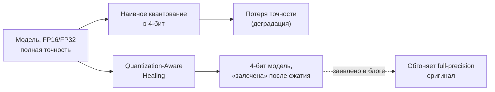
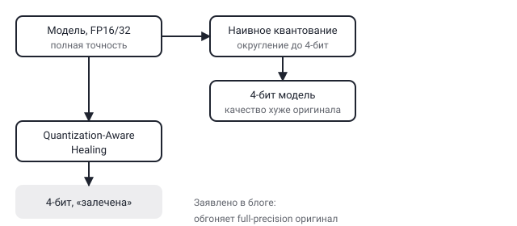

## Русская версия

# Что вообще значит «квантование» и как сжатая модель может обогнать оригинал

В сегодняшнем дайджесте — заметка в блоге Hugging Face от компании Multiverse Computing: [«Quantization-Aware Healing: a compressed, 4-bit model that outperforms its full-precision original»](https://huggingface.co/blog/MultiverseComputingCAI/quantization-aware-healing). Сам дайджест даёт только заголовок без развёрнутого текста, поэтому этот разбор — объяснение того, что вообще стоит за словами «quantization-aware healing» и почему заявление в заголовке звучит контринтуитивно, а не пересказ методологии Multiverse Computing (для неё нужно читать полный текст по ссылке).

Начнём с базы. У большой языковой модели каждый вес (параметр) хранится числом — обычно 16 или 32 битами (FP16, FP32). Чем больше битов на число, тем точнее оно представлено, но тем больше модель весит в памяти и тем медленнее считается. «Квантование» — это сжатие: те же веса пересчитываются в формат с меньшим числом битов, например 4-бит. Модель в 4-бит занимает в разы меньше памяти и может считаться быстрее — это то, что делает возможным запуск больших моделей на скромном железе.

Проблема в том, что квантование в лоб — просто округлить каждое число до ближайшего значения в узкой 4-битной сетке — почти всегда портит качество модели: чем меньше битов, тем грубее приближение, тем больше суммарная ошибка по миллиардам параметров. Отсюда и название «наивное квантование» на диаграмме — оно работает, но модель начинает ошибаться чаще, чем оригинал.

«Healing» («залечивание») в названии указывает на дополнительный шаг после самого сжатия: какой-то процесс дообучения или коррекции весов уже после квантования, который компенсирует внесённую квантованием ошибку. Сама идея не нова в общем виде — quantization-aware training (обучение с учётом будущего квантования, а не просто сжатие готовой модели) существует как направление уже несколько лет, и суть в том, чтобы модель «знала» на этапе дообучения, что её в итоге сожмут, и подстраивала веса заранее под низкую точность.

Заявление в заголовке — что 4-битная «залеченная» модель не просто не хуже, а лучше полноточной оригинальной — сильнее обычного результата в этой области (обычно цель — минимизировать потерю качества, а не превзойти оригинал). Без доступа к полному тексту нельзя сказать, на каких задачах и с какой методологией измерено это превосходство; это ровно тот случай, когда заголовок блога — рекламная формулировка компании о собственном продукте, а не независимо проверенный результат.

### Почему вам это важно

Если вы разворачиваете модели на ограниченном железе (edge-устройства, доступный GPU без десятков гигабайт VRAM), квантование — стандартный инструмент, но важно понимать разницу между «наивным» (округлить и смириться с потерей качества) и «aware»-подходами (учесть сжатие заранее и скорректировать после). Прежде чем закладывать конкретные цифры превосходства из [блога Multiverse Computing](https://huggingface.co/blog/MultiverseComputingCAI/quantization-aware-healing) в свои расчёты, стоит прочитать полную методологию и бенчмарки, а не только заголовок.

## English version

# What "quantization" actually means, and how a compressed model can beat the original

Today's digest carries a Hugging Face blog post from Multiverse Computing: [«Quantization-Aware Healing: a compressed, 4-bit model that outperforms its full-precision original»](https://huggingface.co/blog/MultiverseComputingCAI/quantization-aware-healing). The digest only gives the title, no body text, so this explainer covers what "quantization-aware healing" means as a concept and why the headline claim sounds counterintuitive — not a summary of Multiverse Computing's specific method, which needs the full post to assess.

Start with the basics. Every weight (parameter) in a large language model is stored as a number — typically using 16 or 32 bits (FP16, FP32). More bits per number means more precision, but also more memory and slower computation. "Quantization" is compression: the same weights get re-encoded into a format with fewer bits, say 4-bit. A 4-bit model takes a fraction of the memory and can run faster — this is what makes it possible to run large models on modest hardware.

The problem is that naive quantization — just rounding each number to the nearest value on a coarse 4-bit grid — almost always hurts model quality: fewer bits means a rougher approximation, and that error compounds across billions of parameters. Hence "naive quantization" in the diagram — it works, but the model starts making more mistakes than the original.

"Healing" in the title points to an extra step after the compression itself: some fine-tuning or weight-correction process applied after quantization that compensates for the error the compression introduced. The general idea isn't new — quantization-aware training (training with the eventual quantization in mind, rather than compressing an already-finished model) has been a research direction for years, with the goal of letting the model "know," during training, that it will eventually be squeezed, and adjust its weights ahead of time for low precision.

The headline's claim — that a 4-bit "healed" model isn't just as good as, but better than, the full-precision original — is a stronger result than usual for this field (the typical goal is minimizing quality loss, not exceeding the original). Without the full text, there's no way to say what tasks and methodology this superiority was measured on; this is exactly the kind of case where a blog headline is a company's own marketing framing of its product, not an independently verified result.

### Why it matters

If you deploy models on constrained hardware (edge devices, a GPU without tens of gigabytes of VRAM), quantization is a standard tool — but it matters to understand the gap between "naive" (round and accept the quality loss) and "aware" approaches (account for compression ahead of time and correct for it afterward). Before building the specific superiority numbers from [Multiverse Computing's blog post](https://huggingface.co/blog/MultiverseComputingCAI/quantization-aware-healing) into your own planning, it's worth reading the full methodology and benchmarks, not just the headline.
