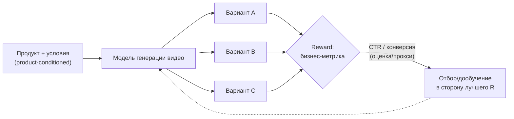
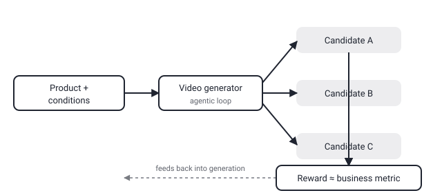

## Русская версия

# Что значит «reward-guided» генерация видео и почему это не то же самое, что «красивое видео»

В сегодняшнем дайджесте — статья [«AgenticGen: Reward-Guided Agentic Video Generation for Advertising»](https://huggingface.co/papers/2609.09187) (Xingyuan Bu, Chengru Song, Hao Zhou, Tao Zhou, Dong Li и соавторы). Аннотация формулирует тезис заранее: генерация рекламного видео — это не просто задача синтеза видео, а «product-conditioned reasoning problem», успех которой измеряется онлайн-бизнес-метриками. Разберём, что каждая часть этой фразы значит на практике, а не только звучит.

Обычная модель генерации видео (text-to-video) оптимизируется под метрики визуального качества: чёткость, соответствие промпту, временную согласованность кадров. Это хорошо измеримо, но не отвечает на вопрос, который волнует рекламодателя: приведёт ли это видео к клику или покупке. «Product-conditioned» в названии задачи означает, что генерация должна учитывать не абстрактный визуальный запрос, а конкретный продукт — его реальный внешний вид, особенности, контекст использования — то есть накладывает жёсткое ограничение сверху на то, что можно сгенерировать, в отличие от свободной генерации по тексту.

Ключевое слово в названии статьи — «reward-guided». В классическом обучении с подкреплением (RL) reward — это сигнал, который говорит модели, насколько хорош был конкретный результат, и модель со временем учится генерировать варианты с более высоким reward. Здесь reward — это не эстетическая оценка кадра человеком, а бизнес-метрика: то, что реально происходит после показа видео (клик, досмотр, конверсия). Смысл подхода в том, чтобы не оптимизировать видео под «выглядит хорошо», а замкнуть цикл обратной связи на то, что действительно нужно рекламодателю — работающий креатив, а не просто эстетичный.

Слово «agentic» в названии, скорее всего, указывает на то, что генерация организована не как один проход модели, а как последовательность шагов с промежуточными решениями (сгенерировать вариант → оценить → скорректировать) — то есть ближе к агентному циклу, чем к одноразовому запросу к модели. Аннотация обрывается прямо на переходе к описанию метода, поэтому детали архитектуры reward-модели и то, как именно устроен агентный цикл, нужно смотреть в [полном тексте](https://huggingface.co/papers/2609.09187).

Главная методологическая сложность такого подхода, которую стоит держать в уме независимо от деталей статьи: онлайн-бизнес-метрика (CTR, конверсия) — дорогой и шумный сигнал, редко доступный в реальном времени для каждой генерации, поэтому на практике reward почти всегда — это некоторая прокси-модель, обученная предсказывать бизнес-метрику по офлайн-данным. Насколько хорошо такая прокси коррелирует с реальным поведением пользователей — отдельный, не менее важный вопрос, чем сама архитектура генератора.

### Почему вам это важно

Если вы работаете с генеративными моделями для маркетинга или продукта, «reward-guided» — сигнал, что стоит спрашивать не «насколько красиво выглядит результат», а «на каком сигнале обучена reward-модель и насколько он близок к метрике, которая реально важна бизнесу». Разрыв между прокси-reward и настоящей бизнес-метрикой — это именно то место, где подобные системы чаще всего расходятся с ожиданиями на практике.

## English version

# What "reward-guided" video generation means, and why it isn't the same as "video that looks good"

Today's digest includes [«AgenticGen: Reward-Guided Agentic Video Generation for Advertising»](https://huggingface.co/papers/2609.09187) (Xingyuan Bu, Chengru Song, Hao Zhou, Tao Zhou, Dong Li, and co-authors). The abstract states its thesis up front: advertising video generation isn't just a video synthesis task, it's a "product-conditioned reasoning problem" whose success is measured by online business metrics. Let's unpack what each part of that actually means in practice, not just what it sounds like.

A standard text-to-video generation model is optimized for visual-quality metrics: sharpness, prompt adherence, temporal coherence across frames. Those are well-measurable, but they don't answer the question an advertiser actually cares about: will this video drive a click or a purchase. "Product-conditioned" in the task's name means generation has to respect a concrete product — its real appearance, features, usage context — rather than an abstract text prompt, imposing a hard constraint on top of what free-form generation would otherwise allow.

The load-bearing word in the title is "reward-guided." In classic reinforcement learning (RL), a reward is a signal telling the model how good a particular output was, and over time the model learns to produce outputs with higher reward. Here, the reward isn't a human's aesthetic rating of a frame — it's a business metric: what actually happens after the video is shown (click, watch-through, conversion). The point of the approach is to close the feedback loop on what the advertiser actually needs — a creative that works, not merely one that looks polished.

"Agentic" in the title most likely points to generation being organized not as a single model pass but as a sequence of steps with intermediate decisions (generate a candidate → evaluate → adjust) — closer to an agent loop than a one-shot model call. The abstract cuts off right where it would describe the method, so the reward-model architecture and how exactly the agentic loop is structured need the [full paper](https://huggingface.co/papers/2609.09187).

The main methodological difficulty worth keeping in mind regardless of the paper's specifics: an online business metric (CTR, conversion) is an expensive, noisy signal, rarely available in real time for every single generation — so in practice the reward is almost always some proxy model trained to predict the business metric from offline data. How well that proxy correlates with real user behavior is a separate question, just as important as the generator's architecture itself.

### Why it matters

If you work with generative models for marketing or product, "reward-guided" is a cue to ask not "how good does the output look" but "what signal was the reward model trained on, and how close is it to the metric the business actually cares about." The gap between a proxy reward and the real business metric is exactly where systems like this most often diverge from expectations in practice.
