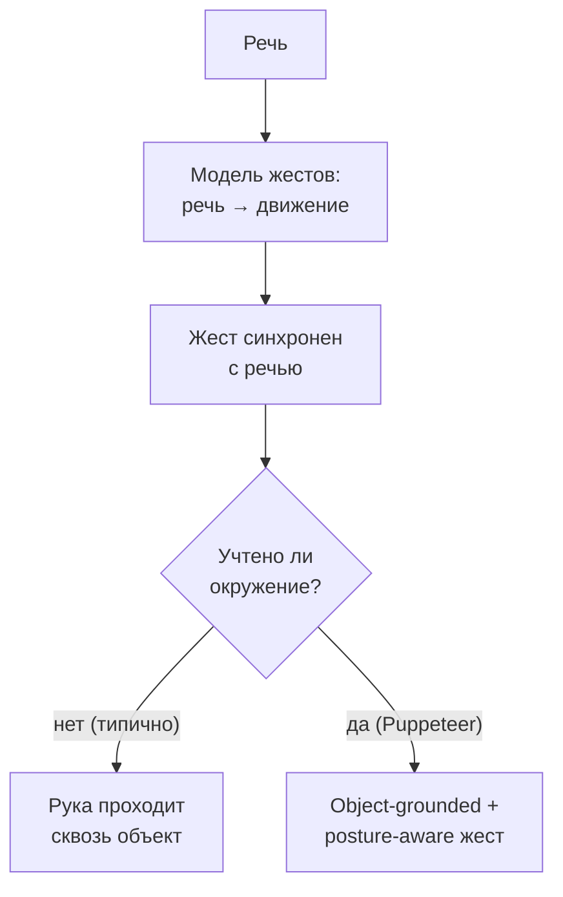
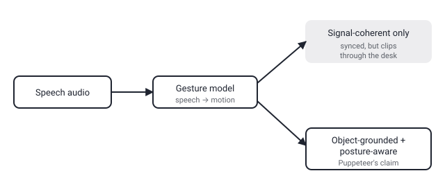

## Русская версия

# Co-speech жесты: почему «в такт речи» и «не задевая стол» — это две разные, несовместимые задачи

В сегодняшнем дайджесте — статья [«Puppeteer: Object-Grounded Posture-Aware Co-Speech Gesture Generation»](https://huggingface.co/papers/2609.00369) (Vida Adeli, Soroush Mehraban, Jacob Rommann, Harrison Sanborn, Cole Clifford и соавторы). Тема — генерация «co-speech» жестов: движений рук и тела виртуального персонажа или робота, которые сопровождают речь. Разберём, что стоит за каждым словом в названии и почему это не тривиальная задача синтеза анимации.

«Co-speech gesture» — это не жестовый язык (там жест несёт самостоятельное лексическое значение) и не случайная анимация — это жесты, которые люди делают непроизвольно во время разговора: подчёркивающий взмах рукой на ударном слове, разведённые ладони при перечислении, указание в сторону предмета, о котором идёт речь. Аннотация статьи формулирует требования к качественной генерации таких жестов: временная согласованность (жест должен совпадать по фазе с речью, а не отставать или опережать), семантическая связность (жест должен соответствовать смыслу произносимого, а не быть общим «размахиванием руками») и — это заявлено как главный вклад статьи — «grounded with surrounding objects», то есть жест должен учитывать физическое окружение персонажа.

Третье требование — самое интересное и по абстракту, судя по всему, наименее решённое в предыдущих работах. Модель, которая генерирует жест только из аудиосигнала речи, ничего не знает о том, что перед персонажем, например, стоит стол или в кадре есть предмет, о котором идёт речь. В результате жест физически корректен как движение в вакууме (рука двигается плавно, в такт), но некорректен в контексте сцены — рука может «пройти сквозь» объект или указать не в ту сторону, если персонаж на самом деле держит что-то в руке. «Posture-aware» — второе требование того же рода: жест должен согласовываться с текущей позой тела в целом, а не генерироваться как движение изолированной руки поверх статичного скелета.

Аннотация обрывается на формулировке проблемы, не раскрывая архитектуру решения — как именно модель получает информацию об объектах в сцене (по видео? по явному 3D-представлению окружения?) и как эта информация встраивается в генеративный процесс. Для этого нужен [полный текст статьи](https://huggingface.co/papers/2609.00369).

Практическая причина, почему это важно за пределами анимации персонажей: то же самое разделение — «движение, согласованное с сигналом» vs. «движение, согласованное с физическим миром» — стоит и за генерацией движений роботов-манипуляторов, и за VR-аватарами в общих пространствах. Учёт физического окружения — это не косметическая деталь, а отдельная, часто недооценённая часть задачи.

### Почему вам это важно

Если вы работаете с генерацией анимации, аватарами или анимацией роботов на основе речи или намерения, стоит явно проверять, учитывает ли модель окружение персонажа, а не только источник сигнала (речь, текст). [Puppeteer](https://huggingface.co/papers/2609.00369) — хороший пример того, что «синхронно с речью» и «физически корректно в сцене» — это два разных критерия качества, которые нужно валидировать по отдельности.

## English version

# Co-speech gestures: why "in sync with speech" and "not clipping through the desk" are two separate, incompatible-by-default requirements

Today's digest includes [«Puppeteer: Object-Grounded Posture-Aware Co-Speech Gesture Generation»](https://huggingface.co/papers/2609.00369) (Vida Adeli, Soroush Mehraban, Jacob Rommann, Harrison Sanborn, Cole Clifford, and co-authors). The topic is co-speech gesture generation: the arm and body movements of a virtual character or robot that accompany speech. Let's unpack what each word in the title actually implies and why this isn't a trivial animation-synthesis task.

A "co-speech gesture" isn't sign language (where a gesture carries independent lexical meaning) and it isn't random animation either — it's the movements people make involuntarily while talking: an emphatic wave on a stressed syllable, hands spreading apart while listing items, pointing toward an object being discussed. The paper's abstract lays out requirements for generating such gestures well: temporal coherence (the gesture must align in phase with speech, not lag or lead), semantic alignment (the gesture must match what's being said, not just be generic arm-waving) — and, claimed as the paper's main contribution — being "grounded with surrounding objects," meaning the gesture has to account for the character's physical environment.

That third requirement is the most interesting one, and per the abstract, apparently the least solved in prior work. A model that generates gestures purely from the speech audio signal knows nothing about, say, a desk standing in front of the character, or an object in frame that the speech is referring to. The result is a gesture that's physically fine as motion in a vacuum (smooth, well-timed) but wrong in scene context — a hand might clip through an object, or point the wrong way if the character is actually holding something. "Posture-aware" is a requirement of the same kind: the gesture needs to cohere with the body's overall current pose, rather than being generated as an isolated arm movement layered on a static skeleton.

The abstract cuts off right at the problem statement, without revealing the solution's architecture — how exactly the model gets information about objects in the scene (from video? an explicit 3D representation of the environment?) and how that information feeds into the generative process. That needs the [full paper](https://huggingface.co/papers/2609.00369).

The practical reason this matters beyond character animation: the same split — "motion coherent with the signal" vs. "motion coherent with the physical world" — underlies robot-manipulator motion generation and shared-space VR avatars too. Accounting for the physical environment isn't a cosmetic detail; it's a separate, often underrated part of the task.

### Why it matters

If you work with animation generation, avatars, or robot motion driven by speech or intent, it's worth explicitly checking whether a model accounts for the character's environment, not just the driving signal (speech, text). [Puppeteer](https://huggingface.co/papers/2609.00369) is a good example that "in sync with speech" and "physically correct in the scene" are two separate quality criteria that need validating independently.
