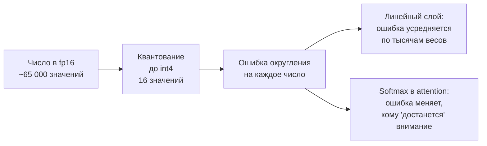
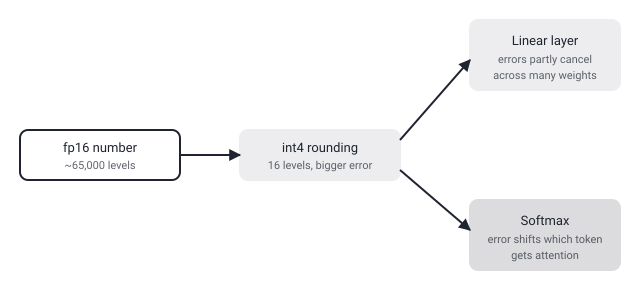

## Русская версия

# Что такое «битность» в квантовании и почему softmax теряет от неё больше, чем линейный слой

Сегодняшний дайджест содержит статью [«HyQuant: Hybrid-Precision Quantization for LLM Attention»](https://huggingface.co/papers/2608.27875) (Jiatong Ding, Bingxin Xing, Yu Zhang, Dian Ding, Xiaodong Yi и соавторы), где заявлено, что низкобитное квантование attention-модуля вносит непропорционально большую ошибку по сравнению с остальной моделью. В посте об этой же статье мы разобрали, что такое «гибридная точность» как решение. Здесь стоит остановиться на самом термине «битность» и на том, почему именно attention оказывается уязвимым местом — это общая техническая база, полезная не только для одной статьи.

Число с плавающей точкой в стандартном формате fp16 занимает 16 бит и может представить порядка 65 тысяч различных значений с достаточно высокой точностью около нуля. Квантование до int8 сжимает то же число до 8 бит — 256 возможных значений; int4 — до 16 значений. Чтобы уместить исходный диапазон чисел в этот узкий набор, вводят масштаб (scale) и иногда сдвиг (zero-point): реальное число приближают к ближайшему из доступных дискретных уровней. Чем меньше бит, тем крупнее шаг между соседними уровнями — и тем больше ошибка округления на каждое отдельное число. Экономия очевидна: меньше бит на число — меньше памяти и быстрее вычисления, что напрямую снижает стоимость инференса на серверах.

Вопрос в том, куда эта ошибка округления девается дальше. В линейном слое (обычная матрица весов MLP) выход — это сумма произведений множества весов на входы. Ошибка округления в отдельном весе — это маленькое случайное отклонение, и при суммировании по тысячам измерений такие отклонения в среднем частично гасят друг друга статистически, поэтому итоговая ошибка выхода растёт медленнее, чем ошибка отдельного веса. В attention всё иначе: там значения проходят через softmax — операцию, которая превращает набор чисел (attention-скоры) в распределение вероятностей, где даже небольшая разница между двумя скорами может резко изменить, какая доля «внимания» достанется каждому токену, потому что softmax экспоненциально усиливает разницы. Маленькая ошибка округления перед softmax — это не усреднённое отклонение, а потенциально ощутимый сдвиг в том, на какие токены модель фактически смотрит.

Отсюда и мотивация «гибридной точности» из статьи: если ошибка в attention обходится дороже, чем та же по величине ошибка в MLP-слое, экономически разумно тратить биты неравномерно — держать более высокую точность именно там, где чувствительность выше. Сама статья, судя по обрезанной аннотации, детализирует, как именно провести эту границу; общая же логика — почему граница вообще нужна — не зависит от конкретной реализации и применима к любому квантованному трансформеру.

### Почему вам это важно

Если вы настраиваете квантование модели и видите деградацию качества при агрессивной битности, первым делом проверяйте не общий битрейт, а то, какая часть архитектуры теряет точность сильнее всего — attention обычно первый кандидат на подозрение, и именно поэтому неоднородное («гибридное») квантование чаще оказывается разумнее равномерного.

## English version

# What "bit-width" in quantization actually means, and why softmax loses more from it than a linear layer

Today's digest includes [«HyQuant: Hybrid-Precision Quantization for LLM Attention»](https://huggingface.co/papers/2608.27875) (Jiatong Ding, Bingxin Xing, Yu Zhang, Dian Ding, Xiaodong Yi, and co-authors), which claims that low-bit quantization of the attention module introduces disproportionately large error compared to the rest of the model. In the post covering the same paper, we walked through "hybrid precision" as the proposed fix. Here it's worth slowing down on the term "bit-width" itself, and on why attention specifically turns out to be the vulnerable spot — general technical background useful well beyond this one paper.

A floating-point number in the standard fp16 format takes up 16 bits and can represent roughly 65,000 distinct values with fairly high precision near zero. Quantizing down to int8 compresses that same number into 8 bits — 256 possible values; int4 gets it down to 16 values. To fit the original range of numbers into that narrow set, a scale factor (and sometimes a zero-point offset) is introduced: the real number gets rounded to the nearest available discrete level. Fewer bits mean a bigger gap between neighboring levels — and a larger rounding error on every individual number. The payoff is obvious: fewer bits per number means less memory and faster compute, which directly cuts inference cost on servers.

The question is where that rounding error goes next. In a linear layer (an ordinary MLP weight matrix), the output is a sum of many weight-times-input products. A rounding error in one weight is a small random perturbation, and when summed across thousands of dimensions, such perturbations tend to statistically cancel out in part, so the output's total error grows more slowly than the error in any single weight. Attention behaves differently: its values pass through softmax, an operation that turns a set of numbers (attention scores) into a probability distribution, where even a small difference between two scores can sharply change how much "attention" each token receives, because softmax exponentially amplifies differences. A small rounding error just before softmax isn't an averaged-out deviation — it's a potentially noticeable shift in which tokens the model actually looks at.

That's the motivation behind the paper's "hybrid precision": if an error inside attention is more costly than the same-sized error in an MLP layer, it's economically sound to spend bits unevenly — keeping higher precision exactly where sensitivity is higher. The paper itself, judging from the truncated abstract, presumably details exactly where to draw that line; the general logic for why a line is needed at all doesn't depend on the specific implementation and applies to any quantized transformer.

### Why it matters

If you're tuning a model's quantization and see quality degrade at an aggressive bit-width, the first thing to check isn't the overall bit rate but which part of the architecture loses precision the fastest — attention is usually the first suspect, which is exactly why uneven ("hybrid") quantization tends to beat a uniform one.
