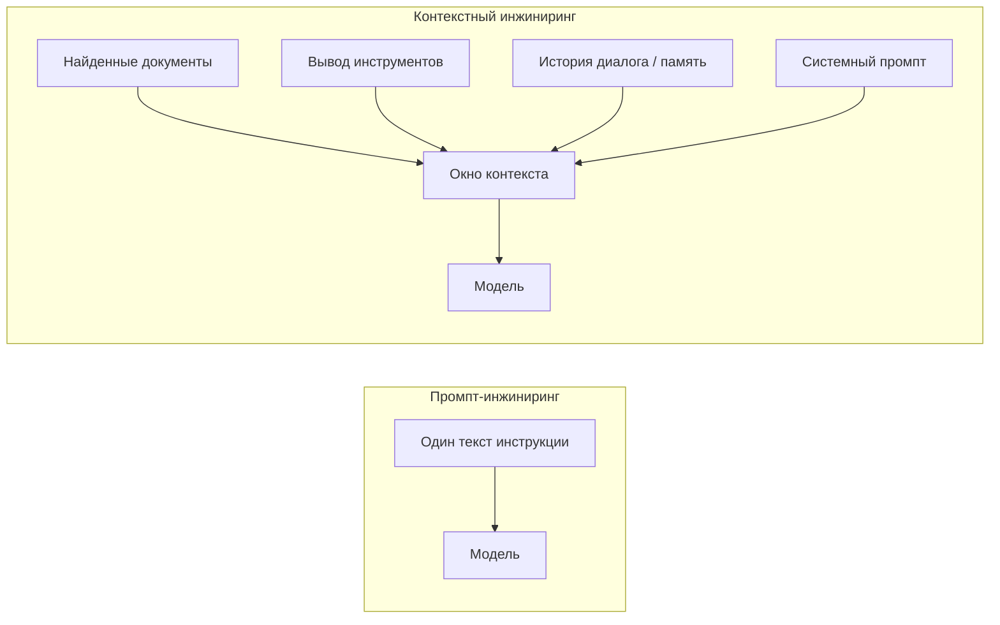
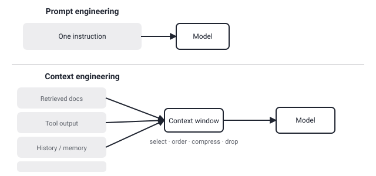

## Русская версия

# Чем контекстный инжиниринг отличается от промпт-инжиниринга — на пальцах

В описании репозитория [dair-ai/Prompt-Engineering-Guide](https://github.com/dair-ai/Prompt-Engineering-Guide), который сегодня фигурирует в трендах, «prompt engineering» и «context engineering» перечислены через запятую как два соседних, но разных пункта. Это не опечатка и не синонимы — стоит разобраться, где именно проходит граница, потому что путаница между этими двумя терминами встречается постоянно.

Промпт-инжиниринг — это работа с одной репликой: как сформулировать инструкцию модели в конкретном запросе, чтобы получить нужный результат. Сюда входят техники вроде few-shot примеров внутри самого промпта, цепочки рассуждений («think step by step»), явного указания формата ответа. Это искусство формулировки текста, который вы отправляете модели прямо сейчас, — единица работы здесь одна реплика.

Контекстный инжиниринг — это на порядок шире. Это не про то, как написать промпт, а про то, что вообще оказывается в окне контекста модели к моменту, когда она генерирует ответ, — и что туда сознательно НЕ попадает. В современной агентной системе в контекст обычно приходится собирать сразу несколько потоков: результаты поиска по базе знаний (RAG), вывод предыдущих вызовов инструментов, историю диалога или выжимку из долгосрочной памяти, системные инструкции. Контекстный инжиниринг — это дисциплина о том, как выбрать, что из этого релевантно именно сейчас, в каком порядке это расположить (модели по-разному чувствительны к порядку кусков информации) и, что не менее важно, как сжать или выбросить то, что перестало быть нужным, потому что окно контекста конечно и стоит денег на каждый токен.

Разница на практике ощутима сразу. Если ответ модели неточен из-за плохо сформулированного вопроса — это задача промпт-инжиниринга: переформулировать инструкцию. Если ответ неточен, потому что модель физически не видела нужный документ, видела его в неудачном месте контекста или контекст оказался перегружен нерелевантным мусором из десяти предыдущих шагов агента — это уже задача контекстного инжиниринга, и никакая переформулировка промпта её не решит, потому что промпт — лишь один из кусочков, которые складываются в итоговый контекст.

Именно поэтому оба термина стоят рядом в описании одного и того же репозитория: они не конкурируют, а образуют разные уровни одной и той же задачи — заставить модель дать нужный ответ. Промпт-инжиниринг решает, что сказать модели. Контекстный инжиниринг решает, что модель вообще видит, когда вы это говорите.

### Почему вам это важно

Если вы отлаживаете агента или RAG-систему и упираетесь в потолок качества, для начала проверьте, какую из двух задач вы на самом деле решаете: переписывание промпта не поможет, если проблема в том, что нужный кусок информации вообще не попал в контекст или потерялся среди нерелевантного шума.

## English version

# What context engineering actually means, versus prompt engineering — explained simply

The description of [dair-ai/Prompt-Engineering-Guide](https://github.com/dair-ai/Prompt-Engineering-Guide), trending today, lists "prompt engineering" and "context engineering" side by side as two adjacent but distinct items. That's not a typo or a pair of synonyms — it's worth pinning down exactly where the line between them sits, since the two terms get conflated constantly.

Prompt engineering is about a single turn: how you phrase the instruction you send the model in one specific request to get the result you want. This covers techniques like few-shot examples embedded in the prompt itself, chain-of-thought cues ("think step by step"), and explicitly specifying an output format. It's the craft of wording the text you're sending the model right now — the unit of work is one message.

Context engineering is an order of magnitude broader. It isn't about how to write a prompt; it's about everything that ends up in the model's context window by the time it generates a response — and, just as deliberately, everything that does NOT. In a modern agentic system, several streams typically need to be assembled into context at once: retrieved knowledge-base results (RAG), output from earlier tool calls, conversation history or a summary pulled from long-term memory, and system-level instructions. Context engineering is the discipline of choosing what's actually relevant right now, in what order to place it (models are sensitive to the ordering of information chunks), and, just as importantly, how to compress or drop what's no longer needed — because the context window is finite and every token in it costs money.

The difference is immediately practical. If a model's answer is off because the question was poorly phrased, that's a prompt-engineering problem: reword the instruction. If the answer is off because the model never actually saw the relevant document, saw it in an unfavorable spot in the context, or the context got flooded with irrelevant leftovers from ten prior agent steps — that's a context-engineering problem, and no amount of prompt rewording fixes it, because the prompt is just one of the pieces that get assembled into the final context.

That's exactly why the two terms sit next to each other in the same repo's description: they aren't competitors, they're different layers of the same underlying task — getting the model to produce the right answer. Prompt engineering decides what you say to the model. Context engineering decides what the model actually sees when you say it.

### Why it matters

If you're debugging an agent or a RAG system and hitting a quality ceiling, first check which of the two problems you're actually facing: rewriting the prompt won't help if the real issue is that the needed piece of information never made it into context, or got lost in irrelevant noise.
