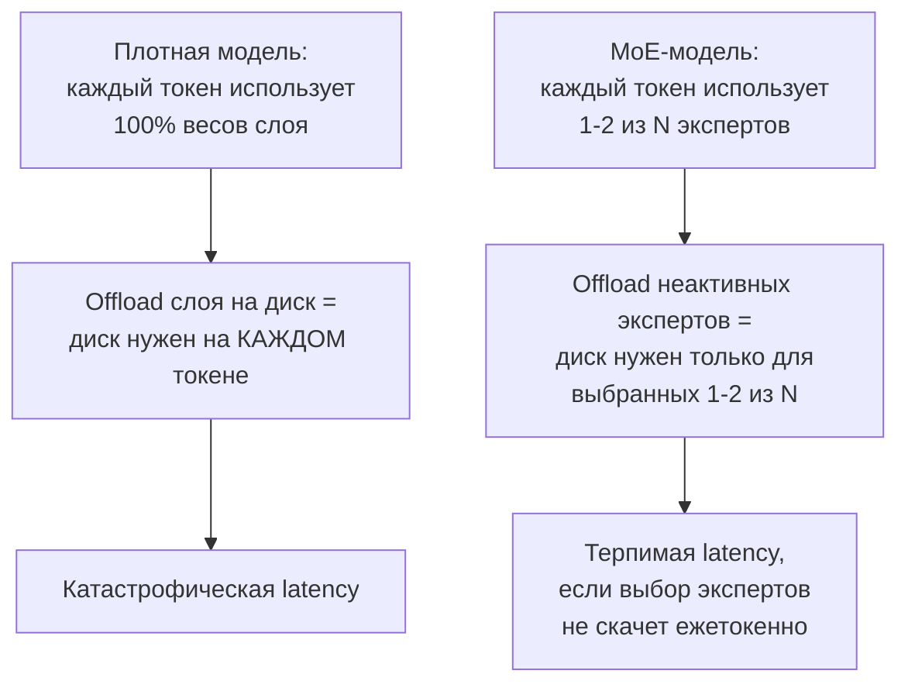
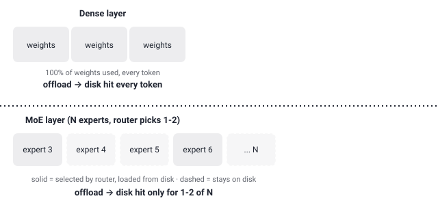

## Русская версия

# Почему offloading экспертов на диск в MoE работает, а offloading слоёв плотной модели — почти никогда

В сегодняшнем трендинге — [JustVugg/colibri](https://github.com/JustVugg/colibri), движок инференса на чистом C, который держит часть экспертов MoE-модели на диске и подгружает их по требованию, чтобы запускать крупные модели на скромном железе. В посте об этом репозитории мы разобрали сам продукт; здесь стоит отдельно объяснить, почему этот трюк вообще возможен для MoE и почти бессмыслен для обычной плотной модели — это общая механика, которая пригодится при оценке любого похожего проекта.

Возьмём плотную модель (обычный трансформер без MoE-слоёв). Каждый токен на выходе каждого слоя обязан пройти через все веса этого слоя — без исключений, потому что архитектура не оставляет выбора: линейный слой умножает вход на полную матрицу весов, и пропустить часть матрицы — значит посчитать другую функцию. Если попытаться сделать offloading такого слоя на диск — держать веса не в VRAM, а подгружать при обращении, — то диск понадобится буквально на каждом токене, для каждого слоя, потому что использование весов не выборочное, а стопроцентное. Экономия VRAM обернётся тем, что почти вся модель начнёт работать со скоростью самого медленного звена в цепи — диска.

MoE-слой устроен иначе: вместо одной большой матрицы весов там N отдельных «экспертов» (каждый — своя подсеть, обычно тоже линейный блок), и лёгкий роутер на входе слоя выбирает, какие 1-2 эксперта из N обработают этот конкретный токен. Формально это тоже часть архитектуры MoE (mixture-of-experts) — sparse-активация параметров, придуманная именно для того, чтобы наращивать общее число параметров модели, не наращивая пропорционально вычисления на каждый токен. Раз для любого токена реально нужны лишь 1-2 эксперта из, скажем, 64 или 128, оставшиеся ~98% параметров слоя в этот момент физически не участвуют в вычислении — и именно поэтому их можно держать не в VRAM, а на диске, без риска для корректности результата.

Но есть тонкость, которую легко упустить: экономия работает только если выбор экспертов от токена к токену не скачет хаотично между всеми N вариантами. Если роутер для каждого следующего токена выбирает нового эксперта, движку придётся заново обращаться к диску почти при каждом шаге — и разница с offloading-ом плотного слоя стирается. На практике это зависит от того, насколько «специализированы» эксперты и насколько соседние токены в реальном тексте склонны маршрутизироваться к одним и тем же экспертам — а это уже вопрос конкретной обученной модели, а не архитектуры MoE вообще. Именно поэтому цифры latency в конкретном проекте вроде colibri важнее общего архитектурного объяснения — оно говорит, почему подход в принципе возможен, но не говорит, насколько он быстр на реальных данных.

### Почему вам это важно

Sparse-активация в MoE — это не просто способ «впихнуть больше параметров», это ещё и структурное условие, которое делает offloading экспертов на диск разумным инженерным решением, а не хаком. Но при оценке любого MoE-движка с offloading-ом спрашивайте не «работает ли это в принципе» (да, работает по архитектуре), а «насколько стабильна маршрутизация экспертов на моих реальных данных» — именно от этого зависит, получите вы терпимую задержку или диск на каждом токене.

## English version

# Why disk offloading works for MoE experts and almost never for dense-model layers

Today's trending list includes [JustVugg/colibri](https://github.com/JustVugg/colibri), a pure-C inference engine that keeps part of an MoE model's experts on disk and loads them on demand, to run large models on modest hardware. The post about that repo covered the product itself; here it's worth separately explaining why this trick is even possible for MoE and nearly pointless for an ordinary dense model — general mechanics worth knowing when evaluating any similar project.

Take a dense model (a standard transformer with no MoE layers). Every token, at the output of every layer, has to pass through all of that layer's weights — no exceptions, because the architecture leaves no choice: a linear layer multiplies the input by the full weight matrix, and skipping part of the matrix means computing a different function. If you tried to offload such a layer to disk — keeping weights off VRAM and loading them on access — the disk would be needed on literally every token, for every layer, because weight usage isn't selective, it's 100%. The VRAM savings would come at the cost of almost the entire model running at the speed of the slowest link in the chain — the disk.

An MoE layer is built differently: instead of one large weight matrix, it has N separate "experts" (each its own sub-network, usually also a linear block), and a lightweight router at the layer's input decides which 1-2 experts out of N handle this specific token. That's formally the core idea of mixture-of-experts — sparse parameter activation, designed precisely to let total parameter count grow without proportionally growing the compute spent per token. Since any given token genuinely needs only 1-2 experts out of, say, 64 or 128, the remaining ~98% of that layer's parameters simply aren't involved in the computation at that moment — which is exactly why they can live on disk instead of VRAM without any risk to correctness.

There's a subtlety easy to miss, though: the savings only hold if expert selection doesn't jump chaotically across all N options from one token to the next. If the router picks a different expert for nearly every following token, the engine will have to hit the disk on almost every step, and the gap with offloading a dense layer disappears. In practice this depends on how "specialized" the experts are and how likely neighboring tokens in real text are to route to the same experts — which is a property of the specific trained model, not of the MoE architecture in general. That's exactly why the latency numbers for a concrete project like colibri matter more than the general architectural explanation: the explanation says why the approach is possible in principle, not how fast it is on real data.

### Why it matters

Sparse activation in MoE isn't just a way to "cram in more parameters" — it's also the structural condition that makes disk offloading of experts a sound engineering choice rather than a hack. But when evaluating any MoE engine with offloading, ask not "does this work in principle" (yes, by architecture) but "how stable is expert routing on my actual data" — that's what determines whether you get tolerable latency or a disk hit on every token.
