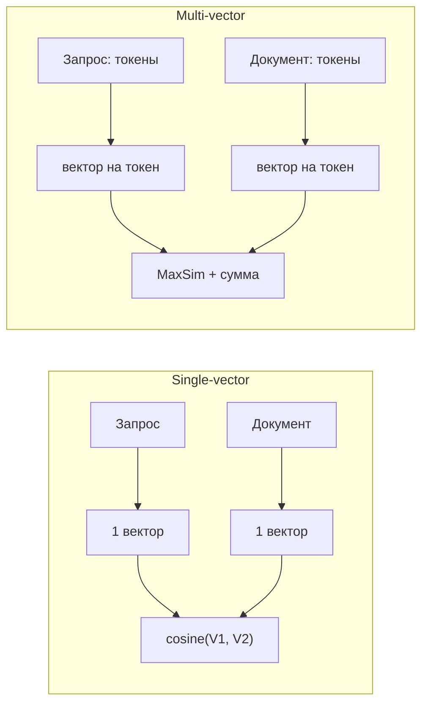
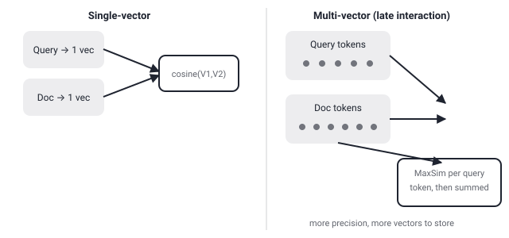

## Русская версия

# Один вектор на документ или вектор на каждый токен: что такое multi-vector эмбеддинги и зачем они нужны

В сегодняшнем дайджесте — заголовок поста в блоге Hugging Face от Sentence Transformers про дообучение [multi-vector эмбеддинг-моделей](https://huggingface.co/blog/train-multi-vector-encoder). Сам пост в дайджест попал только заголовком, без текста, так что здесь мы остановимся не на его содержании, а на самой концепции multi-vector эмбеддингов — она достаточно фундаментальна для retrieval-систем, чтобы разобрать её отдельно.

Классический подход к семантическому поиску — bi-encoder с single-vector представлением: и запрос, и документ независимо прогоняются через модель, каждый сжимается в один вектор фиксированной размерности, а релевантность считается как косинусное сходство между этими двумя векторами. Это быстро — векторы можно заранее посчитать и искать через приближённый поиск ближайших соседей (ANN) по миллионам документов за миллисекунды. Но у сжатия в один вектор есть цена: любой документ, короткий или длинный, простой или сложный, ужимается в одну и ту же точку в пространстве фиксированной размерности, и тонкие детали — например, что конкретное редкое имя или число встречается именно в этом документе — размываются при усреднении по всему тексту.

Multi-vector подход, самый известный представитель которого — архитектура ColBERT, решает эту проблему иначе: вместо одного вектора на документ (и один на запрос) сохраняется отдельный вектор для каждого токена. Похожесть запроса и документа считается не одним косинусом, а через операцию, которую называют MaxSim: для каждого вектора токена запроса находится максимально похожий на него вектор токена документа, и эти максимумы суммируются по всем токенам запроса. Механизм называют late interaction — «поздним взаимодействием» — потому что запрос и документ кодируются полностью независимо (как в bi-encoder, что позволяет предвычислить эмбеддинги документов заранее), а взаимодействие между их представлениями происходит только на последнем шаге, при сравнении векторов, а не внутри самой модели, как в дорогом cross-encoder.

Плата за точность — объём: вместо одного вектора на документ нужно хранить и индексировать вектор на каждый токен, что увеличивает объём индекса и стоимость запроса на порядок по сравнению с single-vector поиском. Именно поэтому дообучение multi-vector моделей — отдельная техническая задача, а не просто «тот же тренинг, что и для bi-encoder»: нужно, чтобы векторы разных токенов действительно специализировались на разных аспектах текста, а не дублировали друг друга, иначе весь выигрыш в точности от многовекторности пропадает, а расходы на хранение остаются.

### Почему вам это важно

Если у вас в поиске плохо находятся документы с точными редкими терминами, именами или числами, хотя по смыслу они близки к запросу — это классический симптом потери детализации в single-vector эмбеддингах, и multi-vector / late-interaction подход стоит рассмотреть как альтернативу, трезво оценив рост стоимости хранения и инференса, который он приносит.

## English version

# One vector per document, or one vector per token: what multi-vector embeddings are and why they exist

Today's digest includes the title of a Hugging Face / Sentence Transformers blog post on finetuning [multi-vector embedding models](https://huggingface.co/blog/train-multi-vector-encoder). The post itself made it into the digest as a title only, with no body text, so instead of its specific content, this guide covers the underlying concept — it's fundamental enough to retrieval systems to be worth unpacking on its own.

The classic approach to semantic search is a bi-encoder with single-vector representations: both the query and the document are run independently through a model, each compressed into one fixed-size vector, and relevance is scored as the cosine similarity between those two vectors. This is fast — vectors can be precomputed and searched with approximate nearest-neighbor (ANN) search across millions of documents in milliseconds. But compressing everything into one vector has a cost: any document, short or long, simple or complex, gets squeezed into the same single point in a fixed-dimensional space, and fine detail — say, that one specific rare name or number appears in this particular document — gets blurred out when averaged across the whole text.

The multi-vector approach, whose best-known example is the ColBERT architecture, solves this differently: instead of one vector per document (and one per query), a separate vector is kept for every token. Similarity between query and document isn't a single cosine anymore — it's computed via an operation called MaxSim: for each query token vector, find the most similar document token vector, then sum those per-token maxima across all query tokens. This is called late interaction, because the query and document are encoded fully independently (as in a bi-encoder, which still allows document embeddings to be precomputed ahead of time), and interaction between their representations happens only at the final comparison step, not inside the model itself the way it does in an expensive cross-encoder.

The price for that precision is volume: instead of one vector per document, you have to store and index one vector per token, which pushes index size and per-query cost up by an order of magnitude compared to single-vector search. That's exactly why finetuning multi-vector models is a distinct technical problem, not just "the same training as a bi-encoder": the token vectors need to actually specialize on different aspects of the text rather than duplicating each other, or the whole accuracy gain from going multi-vector disappears while the storage cost stays.

### Why it matters

If your search struggles to surface documents containing exact rare terms, names, or numbers even though they're semantically close to the query, that's a classic symptom of detail loss in single-vector embeddings — and a multi-vector / late-interaction approach is worth considering as an alternative, with a clear-eyed view of the storage and inference cost increase it brings.
