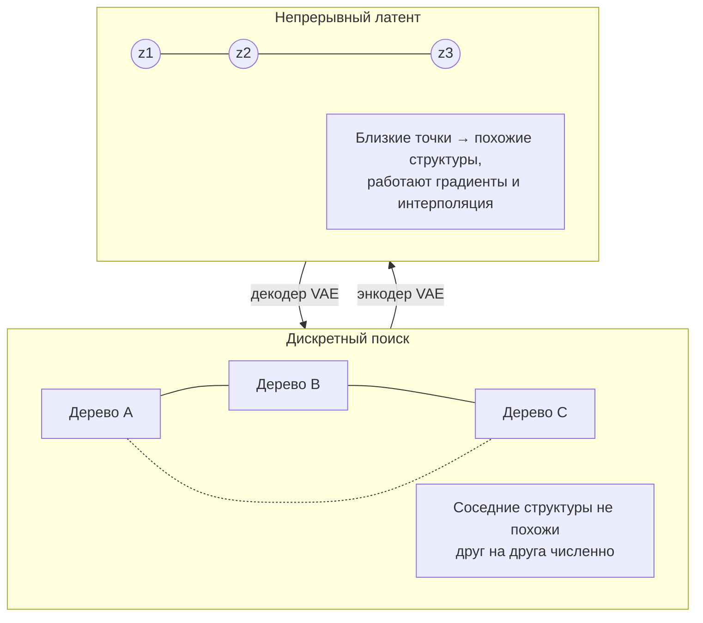
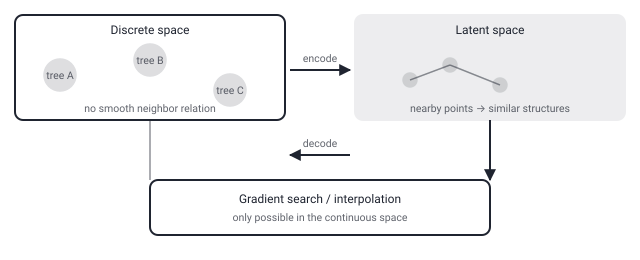

## Русская версия

# Почему дискретные структуры обучают через непрерывное латентное пространство

Сегодняшний дайджест включает статью [«Learning Sparse Decision Trees via Transformer Variational Auto-Encoders»](https://huggingface.co/papers/2609.01430) (Giacomo Fidone, Alessio Cascione, Riccardo Guidotti), которая уже разобрана в отдельном посте. Здесь — не пересказ статьи, а более общее объяснение приёма, который она использует: зачем вообще кодировать дискретную структуру (дерево решений, молекулу, программу) в непрерывный вектор перед тем, как её оптимизировать.

Проблема в самой природе дискретных объектов. У дерева решений нет естественного понятия «немного другое дерево» — можно добавить узел, убрать узел, поменять признак в разбиении, но между двумя соседними по структуре деревьями нет плавного перехода, как есть между двумя близкими числами. Из-за этого к дискретным структурам нельзя напрямую применить градиентный спуск — главный инструмент современного глубокого обучения, — потому что градиент требует, чтобы небольшое изменение входа давало пропорционально небольшое изменение результата, а «немного изменить дерево» может означать как крошечный, так и катастрофический скачок качества. Именно поэтому классические алгоритмы построения деревьев — жадные эвристики вроде CART: они не оптимизируют глобально, а последовательно принимают локально лучшие решения, потому что честный перебор всех возможных деревьев экспоненциально дорог.

Variational auto-encoder (VAE) — способ обойти эту стену. Энкодер (в данном случае — трансформер) учится сопоставлять каждой дискретной структуре точку в непрерывном векторном пространстве фиксированной размерности, причём так, чтобы структуры, похожие по своим свойствам (например, по точности на данных или по количеству узлов), оказывались рядом друг с другом в этом пространстве. Декодер учится обратному преобразованию — превращать точку пространства обратно в конкретную дискретную структуру. Если это обучение прошло успешно, само латентное пространство становится «гладкой картой» дискретного мира: маленький шаг в пространстве соответствует маленькому и предсказуемому изменению структуры, а значит, к этому пространству уже применимы стандартные непрерывные методы — градиентная оптимизация, интерполяция между точками, поиск локального оптимума через небольшие шаги.

Этот приём — не изобретение именно для деревьев решений. Тот же паттерн используют для генерации молекул с нужными химическими свойствами, для синтеза программного кода и для поиска архитектур нейросетей: везде, где целевой объект дискретен и комбинаторно необъятен, а перебор всех вариантов невозможен, VAE (или похожая генеративная модель) даёт непрерывную «прокси»-версию пространства, в которой удобнее искать.

### Почему вам это важно

Если вы сталкиваетесь с задачей оптимизации над дискретным, комбинаторным пространством — деревом, графом, последовательностью дискретных решений — и жадные эвристики упираются в потолок качества, стоит присмотреться к классу методов «encode discrete → optimize continuous → decode back»: он не гарантирует глобальный оптимум, но систематически меняет саму механику поиска.

## English version

# Why discrete structures get trained through a continuous latent space

Today's digest includes the paper [«Learning Sparse Decision Trees via Transformer Variational Auto-Encoders»](https://huggingface.co/papers/2609.01430) (Giacomo Fidone, Alessio Cascione, Riccardo Guidotti), already covered in a separate post. This isn't a recap of the paper — it's a broader explanation of the trick it relies on: why encode a discrete structure (a decision tree, a molecule, a program) into a continuous vector before trying to optimize it at all.

The problem is baked into the nature of discrete objects. A decision tree has no natural notion of "slightly different tree" — you can add a node, remove a node, change a split feature, but there's no smooth path between two structurally neighboring trees the way there is between two nearby numbers. Because of that, you can't directly apply gradient descent — the workhorse of modern deep learning — to discrete structures, since gradients require that a small change in input produce a proportionally small change in output, and "slightly changing a tree" can mean anything from a tiny to a catastrophic jump in quality. That's exactly why classic tree-building algorithms are greedy heuristics like CART: they don't optimize globally, they sequentially make locally-best decisions, because honestly enumerating all possible trees is exponentially expensive.

A variational auto-encoder (VAE) is one way around that wall. An encoder (here, a transformer) learns to map every discrete structure to a point in a fixed-dimensional continuous vector space, in such a way that structures with similar properties (say, similar accuracy on data, or similar node count) end up near each other in that space. A decoder learns the reverse mapping — turning a point in that space back into a concrete discrete structure. If this training succeeds, the latent space itself becomes a "smooth map" of the discrete world: a small step in the space corresponds to a small, predictable change in structure, which means standard continuous methods now apply to it — gradient-based optimization, interpolation between points, local-optimum search via small steps.

This trick isn't specific to decision trees. The same pattern shows up in generating molecules with target chemical properties, synthesizing program code, and neural architecture search: anywhere the target object is discrete and combinatorially vast, and exhaustive enumeration is off the table, a VAE (or a similar generative model) gives you a continuous "proxy" version of the space that's much easier to search.

### Why it matters

If you're facing an optimization problem over a discrete, combinatorial space — a tree, a graph, a sequence of discrete decisions — and greedy heuristics are hitting a quality ceiling, it's worth looking at the "encode discrete → optimize continuous → decode back" family of methods: it doesn't guarantee a global optimum, but it systematically changes the mechanics of the search itself.
