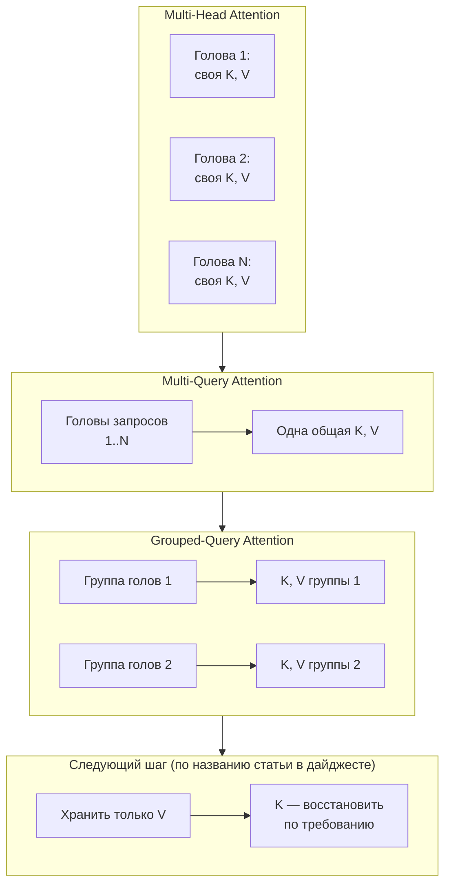

## Русская версия

# От Multi-Head Attention до «ключи по требованию»: куда движется экономия KV-кэша

Сегодняшний дайджест принёс статью [«Grouped Value Attention: Efficient KV Caching via On-Demand Key Reconstruction»](https://huggingface.co/papers/2609.13285), название которой подсказывает следующий шаг в давней эволюции одного и того же механизма. Сам механизм и путь к нему стоит разобрать отдельно — это фундаментальная часть того, почему инференс LLM стоит именно столько, сколько стоит.

Начнём с истока: почему KV-кэш вообще существует. При генерации текста трансформер предсказывает токены по одному, и каждый новый токен должен «видеть» внимание ко всем предыдущим токенам. Пересчитывать ключи (K) и значения (V) для всех предыдущих токенов на каждом новом шаге было бы квадратично дорого по времени. Поэтому K и V, посчитанные один раз для каждого токена, сохраняются в память — это и есть KV-кэш — и на каждом новом шаге пересчитывается K/V только для нового токена, а внимание считается по всему накопленному кэшу. Цена этого решения: объём кэша растёт линейно с длиной последовательности, умноженной на число слоёв и число голов внимания, и именно поэтому длинный контекст с большим числом одновременных диалогов упирается в лимит видеопамяти раньше, чем в лимит вычислений.

Первый шаг к экономии — Multi-Query Attention (MQA): вместо отдельного набора K/V у каждой из, скажем, 32 голов внимания, все головы запросов делят один общий набор K/V. Кэш уменьшается в разы, но это резкое сокращение может заметно бить по качеству, потому что разные головы внимания в норме специализируются на разных паттернах, а общий K/V лишает их этой специализации.

Grouped-Query Attention (GQA) — компромисс между Multi-Head (максимум качества, максимум памяти) и Multi-Query (минимум памяти, риск для качества): головы запросов делятся на группы (например, 32 головы на 8 групп по 4), и K/V общий внутри группы, но разный между группами. Это и стало де-факто стандартом в современных open-weight LLM: настраиваемый рычаг между качеством и памятью.

Статья из дайджеста, судя по названию, идёт дальше в том же направлении: даже GQA всё ещё хранит и K, и V — просто в меньшем числе копий. Следующий логичный вопрос — а нужно ли хранить K вообще, если его можно «восстановить по требованию» в момент вычисления внимания. Это тот же принцип, что стоит за activation/gradient checkpointing при обучении: обменять память на пересчёт. Работает ли это для K конкретно, какой ценой в задержке и какой реальный выигрыш в памяти — аннотация статьи в дайджесте обрывается раньше этого места, так что ответ — только в [полном тексте статьи](https://huggingface.co/papers/2609.13285).

### Почему вам это важно

Если вы выбираете архитектуру инференса под длинный контекст и много одновременных сессий, стоит понимать, что «экономия KV-кэша» — не одна техника, а целый спектр компромиссов между качеством внимания и объёмом памяти (MHA → MQA → GQA → возможное дальнейшее сокращение), и каждый шаг вдоль этого спектра нужно проверять на собственных данных, а не принимать на веру по названию статьи.

## English version

# From Multi-Head Attention to "keys on demand": where KV-cache savings are headed

Today's digest surfaced the paper [«Grouped Value Attention: Efficient KV Caching via On-Demand Key Reconstruction»](https://huggingface.co/papers/2609.13285), whose title hints at the next step in a long-running evolution of one mechanism. That mechanism, and the path leading to it, is worth unpacking on its own — it's a fundamental part of why LLM inference costs what it costs.

Start with why the KV cache exists at all. When generating text, a transformer predicts tokens one at a time, and each new token needs attention over every previous token. Recomputing the keys (K) and values (V) for every previous token at every new step would be quadratically expensive in time. So K and V, computed once per token, get stored in memory — that's the KV cache — and each new step only computes K/V for the new token, while attention is calculated against the whole accumulated cache. The cost of this design: cache size grows linearly with sequence length, multiplied by the number of layers and attention heads, which is exactly why long contexts with many simultaneous conversations hit a VRAM limit before they hit a compute limit.

The first step toward savings was Multi-Query Attention (MQA): instead of a separate K/V set for each of, say, 32 attention heads, all query heads share one common K/V set. The cache shrinks by a large factor, but that sharp cut can noticeably hurt quality, because different attention heads normally specialize in different patterns, and a shared K/V strips them of that specialization.

Grouped-Query Attention (GQA) is the compromise between Multi-Head (maximum quality, maximum memory) and Multi-Query (minimum memory, quality risk): query heads are split into groups (say, 32 heads into 8 groups of 4), with K/V shared within a group but distinct across groups. This became the de facto standard in modern open-weight LLMs — a tunable lever between quality and memory.

The digest's paper, judging by its title, pushes further in the same direction: even GQA still stores both K and V, just in fewer copies. The next logical question is whether K needs to be stored at all, if it can be "reconstructed on demand" at the moment attention is computed. That's the same principle behind activation/gradient checkpointing during training: trading memory for recomputation. Whether that works for K specifically, at what latency cost, and with what real memory payoff — the digest's abstract snippet cuts off before that point, so the answer lives only in [the full paper](https://huggingface.co/papers/2609.13285).

### Why it matters

If you're choosing an inference architecture for long contexts with many concurrent sessions, it helps to understand that "KV-cache savings" isn't one technique but a whole spectrum of tradeoffs between attention quality and memory footprint (MHA → MQA → GQA → possible further reduction), and every step along that spectrum needs validating on your own data, not taken on faith from a paper's title.
