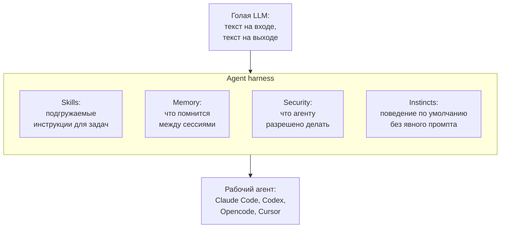

## Русская версия

# Что такое agent harness, и почему «skills, instincts, memory, security» — это не маркетинговый список

Сегодняшний дайджест принёс репозиторий [affaan-m/ECC](https://github.com/affaan-m/ECC): 259,580 → 260,657 звёзд (+1,077 за окно), 39,014 форков, описан как «The agent harness performance optimization system. Skills, instincts, memory, security, and research-first development for Claude Code, Codex, Opencode, Cursor and beyond». За этим описанием стоит термин, который стоит разобрать отдельно от конкретного репозитория — «agent harness», потому что он объясняет, почему один и тот же языковая модель может вести себя как беспомощный чат-бот в одном окружении и как продуктивный инженерный агент в другом.

Сама по себе LLM — это функция «текст на входе → текст на выходе», без памяти между вызовами, без доступа к файловой системе, без понятия о том, что ей вообще можно делать. Harness — это весь код и структура вокруг модели, которые превращают этот голый текстовый интерфейс в рабочего агента: цикл «модель предложила действие → система его выполнила → результат вернулся модели», набор доступных инструментов (чтение файлов, выполнение команд, поиск в интернете), правила о том, что можно делать автоматически, а что требует подтверждения, и способ решить, что именно из истории разговора модель увидит в следующем запросе, потому что окно контекста конечно. Без harness модель — это просто автозавершение текста; harness — это то, что превращает автозавершение в агента, способного довести задачу до конца.

Четыре термина в описании ECC — это, по сути, названия для четырёх разных частей этой инфраструктуры, и их стоит понимать именно как категории, а не как конкретные фичи именно этого репозитория (их реализацию дайджест не раскрывает). «Skills» — единица упаковки специализированных инструкций, которые загружаются в контекст не всегда, а только когда задача им соответствует — экономия контекстного окна ровно в духе вектора этого канала «Context economy». «Memory» — то, что переживает конец одной сессии и попадает в следующую: без неё агент каждый раз начинает с нуля. «Security» — тот самый «authorization boundary»: что агент может сделать сам, а что требует явного разрешения человека. «Instincts» — менее стандартный термин, но, судя по месту в списке, речь о поведении по умолчанию, которое не нужно прописывать в промпте каждый раз — своего рода «встроенные привычки» агента. А «research-first development» намекает на методологию самой разработки harness, а не на его рантайм-поведение.

Важная оговорка: ни объём метрик роста (+1,077 звёзд, 39k форков), ни звучные названия компонентов сами по себе не доказывают, что harness работает лучше альтернатив — это разбиралось применительно к этому же репозиторию ещё 9 сентября, когда отмечалось, что форки честнее звёзд как сигнал реального использования. Термины из описания стоит воспринимать как карту возможных архитектурных решений, а не как готовую оценку качества.

### Почему вам это важно

Если вы выбираете или строите обвязку для агентного кодинга, использование этих четырёх категорий — skills, memory, security, instincts — как чек-листа помогает сравнивать harness-решения предметно: спрашивайте не «насколько он умный», а «как здесь решены загрузка контекста по требованию, персистентность памяти, граница разрешений и поведение по умолчанию» — это и есть та инженерия, которая обычно скрыта за словом «агент».

## English version

# What an agent harness is, and why "skills, instincts, memory, security" isn't just marketing copy

Today's digest surfaced [affaan-m/ECC](https://github.com/affaan-m/ECC): 259,580 → 260,657 stars (+1,077 for the window), 39,014 forks, described as "The agent harness performance optimization system. Skills, instincts, memory, security, and research-first development for Claude Code, Codex, Opencode, Cursor and beyond." Behind that description is a term worth unpacking separately from the specific repo — "agent harness" — because it explains why the same underlying language model can behave like a helpless chatbot in one environment and a productive engineering agent in another.

An LLM by itself is a function: text in, text out, with no memory between calls, no access to a filesystem, and no concept of what it's even allowed to do. The harness is all the code and structure wrapped around the model that turns that bare text interface into a working agent: the loop of "model proposes an action → the system executes it → the result goes back to the model," a set of available tools (reading files, running commands, searching the web), rules for what can happen automatically versus what needs confirmation, and a way to decide what slice of the conversation history the model actually sees on the next call, since the context window is finite. Without a harness, a model is just text autocomplete; the harness is what turns autocomplete into an agent capable of seeing a task through.

The four terms in ECC's description are, in effect, names for four distinct pieces of that infrastructure, and they're worth understanding as categories rather than as confirmed features of this specific repo (the digest doesn't disclose the implementation). "Skills" is a packaging unit for specialized instructions that get loaded into context only when a task calls for them — context-window economy, in the exact spirit of this channel's "Context economy" vector. "Memory" is whatever survives past the end of one session into the next: without it, the agent starts from zero every time. "Security" is exactly the "authorization boundary" this channel tracks — what the agent can do on its own versus what needs explicit human permission. "Instincts" is a less standard term, but going by its place in the list, it likely refers to default behavior that doesn't need to be spelled out in every prompt — a kind of built-in habit set for the agent. And "research-first development" hints at the methodology behind building the harness itself, not its runtime behavior.

One important caveat: neither the growth numbers (+1,077 stars, 39k forks) nor the punchy component names prove on their own that this harness outperforms alternatives — this same repo already got that treatment on September 9, when forks were flagged as the more honest usage signal over stars. The terms in the description are best read as a map of possible architectural decisions, not a ready-made quality verdict.

### Why it matters

If you're choosing or building tooling for agentic coding, using these four categories — skills, memory, security, instincts — as a checklist makes it possible to compare harnesses concretely: don't ask "how smart is it," ask "how does it handle on-demand context loading, persistent memory, the permission boundary, and default behavior" — that's the actual engineering usually hiding behind the word "agent."
