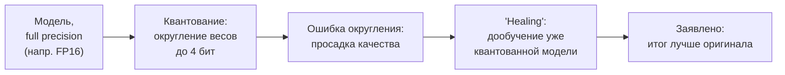

## Русская версия

# Как квантованная модель может обогнать свой же полноточный оригинал: объясняем «healing»

В дайджесте от 18 сентября уже упоминался пост Multiverse Computing [«Quantization-Aware Healing: a compressed, 4-bit model that outperforms its full-precision original»](https://huggingface.co/blog/MultiverseComputingCAI/quantization-aware-healing), и заголовок стоит того, чтобы разобрать заявление по частям, потому что на первый взгляд оно звучит парадоксально: как модель, у которой отняли точность представления чисел, может стать лучше той, у которой эта точность была?

Начнём с квантования. Веса нейросети обычно хранятся как числа с плавающей точкой (например, 16 или 32 бита на число). Квантование до 4 бит означает, что каждое число теперь может принимать лишь одно из 16 дискретных значений вместо практически непрерывного диапазона — это резко уменьшает размер модели и объём памяти, нужный для инференса, но неизбежно вносит ошибку округления: исходное значение веса заменяется на ближайшее из 16 разрешённых. Простейший вариант квантования — «post-training», когда округление делается один раз, после обучения, без какой-либо коррекции. Именно здесь чаще всего и теряется качество: модель, которую обучали работать с одними весами, внезапно вынуждена работать с чуть другими.

«Healing» (дословно — «лечение») в названии, судя по всему, указывает на дообучение модели уже после квантования, а не вместо него. Общая идея, стоящая за такими подходами в индустрии (независимо от конкретной реализации Multiverse Computing, которую дайджест не раскрывает) обычно звучит так: зафиксировать дискретную сетку значений, разрешённую после квантования, и дальше дообучать модель — с использованием техник вроде straight-through estimator, — чтобы она заново подстроилась именно под эту сетку, а не под исходные непрерывные веса. Это отличается от квантования «в один проход» тем, что модель получает шанс скомпенсировать внесённую ошибку через дополнительный, пусть и небольшой, этап обучения на реальных данных.

Момент, который делает заявление в заголовке необычным: обычная цель такого дообучения — вернуть качество, потерянное при округлении, то есть приблизиться к исходному full-precision результату, а не превзойти его. Превосходство над оригиналом — более сильное заявление, и у него может быть несколько объяснений, ни одно из которых дайджест не подтверждает напрямую: дополнительный этап дообучения мог случайно сработать как ещё один проход тонкой настройки на новых данных (эффект, не имеющий отношения к самому квантованию), либо квантованная модель, ограниченная более грубой сеткой весов, могла случайно оказаться менее склонна к переобучению на конкретном тестовом наборе. Разобраться, какое из объяснений верно, можно только по [полному тексту поста](https://huggingface.co/blog/MultiverseComputingCAI/quantization-aware-healing) — там же должны быть бенчмарки и задачи, на которых измерялось превосходство, которых нет ни в заголовке, ни в кратком описании из дайджеста.

### Почему вам это важно

Если вы сжимаете модели для продакшена, не принимайте заголовок вида «X лучше оригинала» на веру: разница между «сохранили качество при меньшем размере» (стандартная и уже впечатляющая цель квантования) и «превзошли оригинал» требует отдельной проверки на ваших собственных задачах — второе не следует автоматически из первого.

## English version

# How a quantized model can outperform its own full-precision original: unpacking "healing"

The September 18 digest already mentioned a Multiverse Computing post, [«Quantization-Aware Healing: a compressed, 4-bit model that outperforms its full-precision original»](https://huggingface.co/blog/MultiverseComputingCAI/quantization-aware-healing), and the title is worth unpacking piece by piece, because on its face it sounds paradoxical: how can a model stripped of numerical precision end up better than the version that had it?

Start with quantization itself. Neural network weights are normally stored as floating-point numbers (say, 16 or 32 bits each). Quantizing down to 4 bits means each number can now only take one of 16 discrete values instead of a nearly continuous range — this sharply cuts model size and the memory needed for inference, but it inevitably introduces rounding error: the original weight value gets replaced by the nearest of those 16 allowed values. The simplest version of this is "post-training" quantization, where the rounding happens once, after training, with no correction at all. That's usually where quality is lost — a model trained to work with one set of weights is suddenly forced to work with slightly different ones.

"Healing" in the title appears to point at fine-tuning the model after quantization, rather than instead of it. The general idea behind approaches like this across the industry (independent of Multiverse Computing's specific implementation, which the digest doesn't disclose) usually works like this: fix the discrete grid of values that quantization allows, then keep training the model — using techniques like a straight-through estimator — so it re-adapts specifically to that grid rather than to its original continuous weights. That differs from one-shot quantization in that the model gets a chance to compensate for the introduced error through an extra, if modest, training pass on real data.

What makes the title's claim unusual: the normal goal of this kind of fine-tuning is to recover quality lost to rounding — to get back close to the original full-precision result, not to beat it. Outright superiority over the original is a stronger claim, and it could have several explanations, none of which the digest confirms directly: the extra fine-tuning pass might have simply acted as another round of fine-tuning on fresh data, an effect unrelated to quantization itself, or the quantized model, constrained to a coarser weight grid, might have happened to be less prone to overfitting on the specific test set used. Sorting out which explanation is correct is only possible from [the full post](https://huggingface.co/blog/MultiverseComputingCAI/quantization-aware-healing), which should also carry the benchmarks and tasks the superiority claim was measured on — neither of which appears in the title or the digest's short description.

### Why it matters

If you're compressing models for production, don't take a headline like "X beats the original" at face value: the gap between "preserved quality at a smaller size" (the standard, already-impressive goal of quantization) and "beat the original" needs its own verification on your specific tasks — the second doesn't automatically follow from the first.
