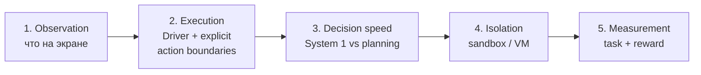

## Русская версия

# Что такое «computer-use агент»: пять задач, которые нужно решить, прежде чем ИИ тронет мышь

Сегодняшний дайджест приносит [trycua/cua](https://github.com/trycua/cua) — не первый в этом жанре проект, но с README, которое неожиданно чётко раскладывает по полочкам, из чего вообще состоит «агент, который пользуется компьютером», а не просто отвечает на вопросы через API. Разберём по шагам, какие задачи здесь на самом деле разные, хотя маркетинг обычно сваливает их в одно слово «computer use».

Первая задача — наблюдение. Агент, который работает с обычным API, получает структурированный ответ (JSON, текст). Агент, который работает с рабочим столом, должен сначала понять, что вообще на экране: какие элементы интерфейса кликабельны, где курсор, что изменилось после предыдущего действия. Это отдельная, и совсем не тривиальная, инженерная задача, для которой обычно используется компьютерное зрение или парсинг структуры интерфейса (в README cua упоминается сторонний OmniParser как одна из опций).

Вторая — исполнение. Даже если агент «понял» экран и решил, что нажать, кто-то должен физически (программно) нажать: переместить курсор, кликнуть, ввести текст — причём кроссплатформенно, на macOS, Windows и Linux, с разными API для каждой ОС. В cua это называется «Cua Driver», и именно здесь появляется важная деталь: README прямо говорит про «explicit action boundaries» — то есть исполняющий слой сам ограничивает, какие действия разрешены, а не просто слепо выполняет всё, что скажет модель. Это и есть настоящая граница авторизации в системе: не «агент решил», а «драйвер согласился выполнить именно это действие».

Третья задача — скорость решений. Не любое решение агента требует полного цикла reasoning — иногда нужно быстро выбрать значение в поле формы или понять, пуст ли чек-бокс. Cua выделяет это в отдельный класс моделей, CUA-S1, по аналогии с «System 1» у человека — быстрым, не рефлексивным мышлением, в отличие от медленного планирования всей задачи. Здесь порядок действий по-прежнему определяет код приложения, а не сама модель.

Четвёртая — изоляция. В отличие от вызова API, ошибка агента на живом рабочем столе может быть разрушительной: удалённый файл, отправленное не то письмо, случайная покупка. Поэтому такие системы обычно запускают агента в одноразовой облачной песочнице (Cua Fleets) или локальной VM (Lume, на Apple Silicon), а не на основной машине пользователя.

Пятая — измерение. Как понять, что агент действительно справляется, а не просто выглядит убедительно на видео из README? Для этого нужны воспроизводимые задачи с чёткой проверкой результата — в cua это Cua Bench, где решение задачи получает численный reward (например, 1.0 за правильно выполненное действие), а не субъективную оценку человека.

### Почему вам это важно

Когда в следующий раз увидите громкий анонс «наш агент теперь умеет пользоваться компьютером», проверяйте не общий слоган, а эти пять пунктов по отдельности: как он видит экран, кто и как ограничивает его действия, есть ли у него быстрый режим для рутинных решений, где он физически исполняется и как измеряется его успех. Ответ «мы решили все пять» — это совсем не то же самое, что ответ «мы решили одну и красиво её показали».

## English version

# What "computer-use agent" actually means: five problems to solve before an AI touches the mouse

Today's digest brings up [trycua/cua](https://github.com/trycua/cua) — not the first project in this space, but its README lays out unusually clearly what "an agent that uses a computer" is actually made of, rather than an agent that just answers questions through an API. Let's walk through the pieces, because marketing usually lumps them all into one phrase, "computer use."

The first problem is observation. An agent working against a normal API gets a structured response — JSON, text. An agent working against a desktop first has to figure out what's even on screen: which interface elements are clickable, where the cursor is, what changed after the last action. That's a distinct, non-trivial engineering problem, usually solved with computer vision or interface-structure parsing (cua's README mentions the third-party OmniParser as one option).

The second is execution. Even once an agent has "understood" the screen and decided what to press, something has to physically (programmatically) do it — move the cursor, click, type — and do it cross-platform, on macOS, Windows, and Linux, each with its own APIs. In cua this is "Cua Driver," and here's the detail worth noting: the README explicitly names "explicit action boundaries" — meaning the execution layer itself constrains which actions are allowed, rather than blindly carrying out whatever the model says. That's the actual authorization boundary in the system: not "the agent decided," but "the driver agreed to carry out this specific action."

The third is decision speed. Not every agent decision needs a full reasoning pass — sometimes you just need to pick a value for a form field or check whether a checkbox is empty. Cua splits this into a separate model class, CUA-S1, drawing on the human "System 1" analogy — fast, non-reflective thinking, as opposed to slow planning of the whole task. Here, application code still orders the actions, not the model itself.

The fourth is isolation. Unlike an API call, an agent's mistake on a live desktop can be destructive — a deleted file, a wrongly sent email, an accidental purchase. That's why these systems typically run the agent inside a disposable cloud sandbox (Cua Fleets) or a local VM (Lume, on Apple Silicon) rather than on the user's main machine.

The fifth is measurement. How do you know an agent is actually succeeding, rather than just looking convincing in a README demo video? That takes reproducible tasks with a clear-cut check on the outcome — in cua that's Cua Bench, where solving a task earns a numeric reward (for example, 1.0 for a correctly completed action) rather than a human's subjective judgment.

### Why it matters

Next time you see a loud announcement that "our agent can now use a computer," don't check the slogan — check these five items separately: how it sees the screen, who constrains its actions and how, whether it has a fast mode for routine decisions, where it's physically executed, and how its success is measured. Answering "we solved all five" is a very different claim from "we solved one and made it look good on video."
