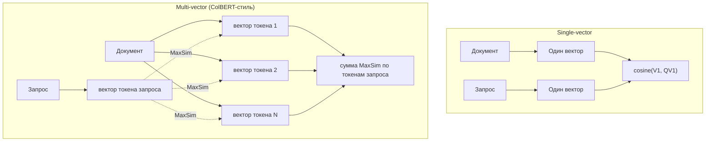

## Русская версия

# Один вектор на документ или вектор на токен: объясняем multi-vector embeddings через свежий пост Sentence Transformers

В сегодняшнем дайджесте — пост Тома Аарсена (Tom Aarsen) [«Training and Finetuning Multi-Vector Embedding Models with Sentence Transformers»](https://huggingface.co/blog/train-multi-vector-encoder). Сам заголовок предполагает, что читатель уже знает, чем «multi-vector» отличается от привычного «single-vector» эмбеддинга — а разница на самом деле фундаментальная для того, как вообще работает поиск по смыслу, и стоит того, чтобы её разобрать отдельно, до деталей конкретной библиотеки.

Обычная (single-vector) эмбеддинг-модель сжимает весь документ — абзац, страницу, целую статью — в одну точку в многомерном пространстве. Похожесть между запросом и документом считается одним числом: косинусным сходством между двумя векторами. Это дёшево и быстро (поиск сводится к ближайшим соседям по одному вектору на объект), но у сжатия «всё в одну точку» есть цена: если документ упоминает редкий термин мельком, в одном предложении из двадцати, этот сигнал легко теряется на фоне усреднённого смысла всего текста. Одна точка физически не может одновременно точно представлять и общую тему документа, и присутствие конкретного редкого слова.

Multi-vector подход, ближе всего к которому по духу стоит модель ColBERT, решает это иначе: документ представляется не одним вектором, а набором векторов — по одному на каждый токен (или на каждую значимую единицу текста). Похожесть между запросом и документом считается уже не одним косинусом, а через механизм вроде MaxSim: для каждого вектора запроса берётся максимальное сходство с любым из векторов документа, и эти максимумы суммируются по всем токенам запроса. Смысл в том, что для каждого слова запроса модель отдельно ищет, есть ли в документе токен, который ему хорошо соответствует, — вместо того чтобы полагаться на один усреднённый снимок всего документа. Это часто называют «late interaction»: взаимодействие между запросом и документом происходит после того, как оба закодированы, а не смешивается заранее, как в тяжёлых cross-encoder'ах, которые пропускают пару запрос+документ через модель целиком.

Цена такого подхода понятна: векторов на документ теперь не один, а по числу токенов, значит и хранить, и сравнивать приходится на порядки больше данных, чем при single-vector поиске (хотя всё ещё заметно дешевле полного cross-encoder'а, который вообще не поддаётся предвычислению). Именно поэтому обучение таких моделей — отдельная задача, которой посвящён разобираемый пост: нужно не просто дообучить энкодер контрастивным способом, как для single-vector, а сделать это так, чтобы агрегация через MaxSim (а не через усреднение или пулинг в одну точку) была частью самого обучающего сигнала — иначе модель будет учиться под одну метрику сходства, а использоваться под другую.

### Почему вам это важно

Если ваш RAG-пайплайн регулярно промахивается мимо документов с точным совпадением редкого термина, но в целом «на похожую тему» — это классический симптом single-vector сжатия, а не проблема с самим индексом или запросом; multi-vector / late-interaction подход — это отдельная архитектурная опция для таких случаев, а не просто более крупная модель того же типа.

## English version

# One vector per document, or one per token: explaining multi-vector embeddings via a fresh Sentence Transformers post

Today's digest surfaces a post by Tom Aarsen, [«Training and Finetuning Multi-Vector Embedding Models with Sentence Transformers»](https://huggingface.co/blog/train-multi-vector-encoder). The title itself assumes the reader already knows how "multi-vector" differs from the familiar "single-vector" embedding — and that difference is actually fundamental to how semantic search works at all, worth unpacking on its own before getting into any library-specific details.

A standard (single-vector) embedding model compresses an entire document — a paragraph, a page, a whole article — into a single point in a high-dimensional space. Similarity between a query and a document is then one number: the cosine similarity between two vectors. That's cheap and fast (search reduces to nearest neighbors over one vector per item), but compressing everything into one point has a cost: if a document mentions a rare term only once, in passing, that signal easily gets washed out by the averaged meaning of the whole text. A single point physically can't precisely represent both a document's overall topic and the presence of one specific rare word at the same time.

The multi-vector approach — closest in spirit to the ColBERT model — solves this differently: a document is represented not by one vector but by a set of vectors, one per token (or per meaningful text unit). Similarity between a query and a document is then computed not as a single cosine, but through a mechanism like MaxSim: for each query vector, you take its maximum similarity against any of the document's vectors, then sum those maxima across all query tokens. The point is that for each word in the query, the model separately looks for whether the document has a token that matches it well — rather than relying on one averaged snapshot of the whole document. This is often called "late interaction": the query and document interact only after both are already encoded, rather than being mixed upfront the way heavy cross-encoders do, which run the query+document pair through the model jointly.

The cost of this approach is straightforward: you now store as many vectors per document as it has tokens, so both storage and comparison require orders of magnitude more data than single-vector search (though it's still notably cheaper than a full cross-encoder, which can't be precomputed at all). That's exactly why training these models is its own problem — the subject of the post in question: you can't just fine-tune an encoder contrastively the way you would for single-vector search; the MaxSim aggregation (rather than averaging or pooling into one point) has to be part of the training signal itself, or the model ends up trained for one similarity metric and deployed under a different one.

### Why it matters

If your RAG pipeline keeps missing documents that mention a rare term exactly but are "generally about" something else, that's a classic symptom of single-vector compression, not a problem with your index or query itself — a multi-vector / late-interaction approach is a distinct architectural option for exactly that case, not just a bigger model of the same kind.
