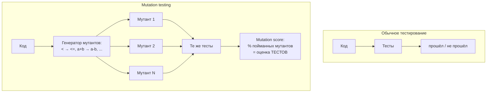

## Русская версия

# Что такое mutation testing и почему оно измеряет не код, а тест — объясняем через статью про GPU-ядра

В сегодняшнем посте про статью [«Measuring the Checker: Mutation Analysis for GPU-Kernel Benchmark Oracles»](https://huggingface.co/papers/2609.22220) я оставил метод почти нераскрытым — там было важнее рассказать, в чём проблема (слабые чекеры кормят RL-награду). Здесь разберём сам метод отдельно, потому что он старше LLM лет на сорок и применим далеко за пределами GPU-ядер.

Обычный тест отвечает на вопрос «проходит ли этот код мои тесты?». Это полезно, но у вопроса есть слепое пятно: он ничего не говорит о качестве самих тестов. Можно написать тест, который технически «покрывает» функцию (вызывает её хотя бы раз), но не проверяет ничего содержательного — например, не сравнивает результат ни с одним конкретным ожидаемым значением. Такой тест будет зелёным и для правильного кода, и для сломанного — просто потому, что он ничего толком не измеряет.

Mutation testing переворачивает вопрос: вместо «проходит ли код тесты» он спрашивает «а тесты вообще способны заметить, если код сломать?». Механика простая. Берётся рабочая программа, и в неё автоматически вносится одно небольшое, синтаксически валидное изменение — «мутация»: `<` меняется на `<=`, `a + b` — на `a - b`, константа `0` — на `1`, условие инвертируется. Получившийся «мутант» почти наверняка ведёт себя иначе, чем оригинал, хотя бы на каких-то входах. Дальше по мутанту прогоняются те же тесты, что и по оригиналу. Если хотя бы один тест падает — мутант «убит», тесты справились. Если все тесты проходят как ни в чём не бывало — мутант «выжил», и это плохая новость не для кода, а именно для тестов: они не заметили реальную, пусть и искусственную, поломку.

Повторив это для сотен или тысяч сгенерированных мутаций, получают mutation score — долю убитых мутантов. Число близкое к 100% означает, что тесты действительно ловят широкий класс возможных поломок. Число в районе 40-50% означает, что тесты создают иллюзию проверки, но реально пропускают половину способов сломать код незаметно. Важно понимать: mutation score не говорит, правильный ли исходный код — он говорит, насколько тестам можно доверять как индикатору.

Применительно к статье про GPU-ядра логика та же, только «тест» — это не unit-тест разработчика, а «чекер» бенчмарка, который решает, засчитывать ли сгенерированное LLM ядро как корректное. Если такой чекер — по сути «слабый тест» (мало случайных входов, мягкий допуск по точности) — его можно проверить ровно тем же способом: намеренно сломать эталонное ядро десятками мелких способов и посмотреть, сколько поломок чекер вообще замечает.

### Почему вам это важно

Mutation testing — не экзотика, у него есть готовые инструменты почти для любого языка (mutmut и cosmic-ray для Python, PIT для Java, Stryker для JS/TS). Если вы полагаетесь на покрытие тестами (coverage) как на метрику качества — стоит помнить, что 100% покрытия и 100% mutation score это совершенно разные утверждения, и первое не гарантирует второе.

## English version

# What mutation testing is, and why it scores the test rather than the code — explained via the GPU-kernel paper

Today's other post, on [«Measuring the Checker: Mutation Analysis for GPU-Kernel Benchmark Oracles»](https://huggingface.co/papers/2609.22220), left the method itself mostly unexplained — the priority there was the problem (weak checkers feeding RL reward). Here's the method on its own, because it predates LLMs by about forty years and applies far beyond GPU kernels.

A normal test answers "does this code pass my tests?" That's useful, but the question has a blind spot: it says nothing about the quality of the tests themselves. You can write a test that technically "covers" a function — calls it at least once — without checking anything meaningful, say, without comparing the result against any specific expected value. That test stays green for both correct and broken code, simply because it isn't really measuring anything.

Mutation testing flips the question: instead of "does the code pass the tests," it asks "can the tests even tell if the code breaks?" The mechanics are simple. Take a working program and automatically introduce one small, syntactically valid change — a "mutation": `<` becomes `<=`, `a + b` becomes `a - b`, a constant `0` becomes `1`, a condition gets inverted. The resulting "mutant" almost certainly behaves differently from the original on at least some inputs. You then run the same test suite against the mutant that you'd run against the original. If at least one test fails, the mutant is "killed" — the tests did their job. If every test passes unchanged, the mutant "survives," and that's bad news not for the code but for the tests: they failed to notice a real, if artificial, break.

Repeat this across hundreds or thousands of generated mutations, and you get a mutation score — the fraction of mutants killed. A number near 100% means the tests genuinely catch a wide range of possible breakages. A number around 40-50% means the tests create an illusion of checking while actually missing half the ways the code could silently break. The key thing to hold onto: mutation score doesn't tell you whether the original code is correct — it tells you how much you can trust the tests as an indicator.

Applied to the GPU-kernel paper, the logic is identical, except the "test" isn't a developer's unit test — it's the benchmark's "checker," which decides whether an LLM-generated kernel counts as correct. If that checker is effectively a weak test (few random inputs, a loose tolerance), it can be evaluated the exact same way: deliberately break a reference kernel in dozens of small ways and see how many of those breaks the checker actually notices.

### Why it matters

Mutation testing isn't exotic — there are ready-made tools for nearly every language (mutmut and cosmic-ray for Python, PIT for Java, Stryker for JS/TS). If you rely on test coverage as a quality metric, it's worth remembering that 100% coverage and a 100% mutation score are entirely different claims, and the first doesn't guarantee the second.
