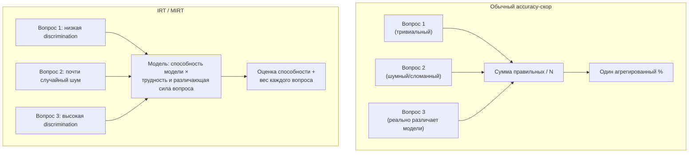

## Русская версия

# Item Response Theory: старый психометрический инструмент, который спрашивает не «сколько баллов», а «что вообще меряет тест»

Сегодняшний дайджест принёс запись в блоге Ai2 — [«BenchMIRT: What are LLM benchmarks actually measuring?»](https://huggingface.co/blog/allenai/benchmirt). Дайджест даёт только заголовок и автора, без тела статьи, поэтому конкретных находок BenchMIRT я здесь не пересказываю — их просто нет в том, что дошло. Зато сам заголовок называет метод прямо: MIRT, Multidimensional Item Response Theory, и это достаточно веский повод разобрать инструмент отдельно, потому что он старше современных LLM-бенчмарков на полвека и решает проблему, которая касается вообще любой попытки измерить «способность» по тесту из вопросов.

Обычный способ оценить модель на бенчмарке — посчитать долю правильных ответов, accuracy. У этого подхода есть скрытое допущение: каждый вопрос считается равноценным — один балл за один правильный ответ, независимо от того, тривиален вопрос или требует реального рассуждения, различает ли он сильные и слабые модели или все модели отвечают на него одинаково (правильно или неправильно). Если в тестовом наборе половина вопросов тривиальна, а часть вопросов вообще сформулирована неоднозначно или помечена неверным ответом (что реально случается в крупных автоматически собранных бенчмарках), итоговый процент смешивает сигнал с шумом, и две модели с одинаковым итоговым % могут иметь совершенно разный профиль реальных способностей.

Item Response Theory — область психометрики, разработанная для стандартизированных тестов у людей (SAT, GRE, адаптивное тестирование) ещё в середине XX века. Базовая идея: вместо «одна попытка — один балл» каждому вопросу («item») приписываются собственные параметры — как минимум сложность (при каком уровне способности испытуемого вероятность правильного ответа около 50%) и дискриминация (насколько хорошо этот конкретный вопрос отличает сильных испытуемых от слабых). Вопрос с нулевой дискриминацией — такой, где и сильные, и слабые отвечают примерно одинаково часто правильно — почти не несёт информации об измеряемой способности, сколько бы баллов за него ни начисляли. Модель испытуемого (в оригинале — человека, в применении к LLM — самой модели) оценивается не как сумма баллов, а как скрытая переменная, максимально согласованная с паттерном ответов по всем вопросам с учётом их параметров.

Multidimensional IRT — расширение той же идеи на случай, когда «способность» — это не один скаляр, а несколько скрытых измерений: например, отдельно «математическое рассуждение» и отдельно «извлечение фактов», которые вопрос может задействовать в разной пропорции. Применительно к LLM-бенчмаркам это отвечает на давнюю жалобу: агрегированный «% на MMLU» смешивает вопросы из десятков разных доменов в одно число, как будто это одна способность, хотя это заведомо не так.

Судя по названию, BenchMIRT применяет именно этот аппарат к существующим LLM-бенчмаркам — но какие конкретно бенчмарки, какие домены и какие выводы получились, дайджест не сообщает, и здесь я умышленно останавливаюсь на границе того, что реально известно.

### Почему вам это важно

Если вы выбираете модель по таблице лидеров или строите собственный eval-набор — сырой accuracy-процент не говорит вам, какие именно вопросы несли информацию, а какие были шумом или дублировали друг друга. IRT/MIRT — не экзотика, а зрелый, проверенный за десятилетия инструмент именно для этой проблемы, и его стоит знать даже без доступа к конкретной статье, которая его в очередной раз применяет.

## English version

# Item Response Theory: an old psychometric tool that asks not "how many points" but "what is the test actually measuring"

Today's digest surfaces an Ai2 blog post — [«BenchMIRT: What are LLM benchmarks actually measuring?»](https://huggingface.co/blog/allenai/benchmirt). The digest gives only the title and author, no post body, so I won't be recapping BenchMIRT's specific findings here — they simply aren't in what came through. But the title itself names the method directly: MIRT, Multidimensional Item Response Theory, which is reason enough to unpack the tool on its own, since it predates modern LLM benchmarks by half a century and addresses a problem relevant to any attempt to measure "ability" from a set of test questions.

The usual way to score a model on a benchmark is to count the fraction of correct answers — accuracy. That approach carries a hidden assumption: every question counts equally, one point for one correct answer, regardless of whether the question is trivial or demands real reasoning, and regardless of whether it distinguishes strong models from weak ones or gets answered the same way (right or wrong) by everything. If half the test set is trivial, and some questions are ambiguously worded or mislabeled outright (which genuinely happens in large, automatically assembled benchmarks), the final percentage mixes signal with noise, and two models with the same overall score can have entirely different underlying capability profiles.

Item Response Theory is a psychometrics field developed for standardized human testing (SAT, GRE, adaptive testing) back in the mid-20th century. The core idea: instead of "one attempt, one point," each question ("item") gets its own parameters — at minimum, a difficulty (the ability level at which a test-taker has roughly a 50% chance of answering correctly) and a discrimination (how well this specific question separates strong test-takers from weak ones). A question with zero discrimination — one that strong and weak test-takers answer correctly about equally often — carries almost no information about the ability being measured, no matter how many points it's worth. The test-taker's ability (originally a human's, applied to LLMs it's the model's own) is estimated not as a point sum but as a latent variable best fitting the pattern of answers across all items, weighted by their parameters.

Multidimensional IRT extends the same idea to the case where "ability" isn't a single scalar but several latent dimensions — say, "mathematical reasoning" separately from "fact retrieval," with a given question drawing on each in a different proportion. Applied to LLM benchmarks, this addresses a long-standing complaint: an aggregated "% on MMLU" collapses questions from dozens of different domains into one number as if it were a single ability, when it plainly isn't.

Going by the title, BenchMIRT applies exactly this machinery to existing LLM benchmarks — but which specific benchmarks, which domains, and what it actually found aren't stated in the digest, and I'm deliberately stopping at the edge of what's actually known here.

### Why it matters

If you're picking a model off a leaderboard or building your own eval set, a raw accuracy percentage doesn't tell you which questions were carrying information and which were noise or near-duplicates. IRT/MIRT isn't exotic — it's a mature tool tested over decades for exactly this problem, and it's worth knowing even without access to the specific paper applying it this time around.
