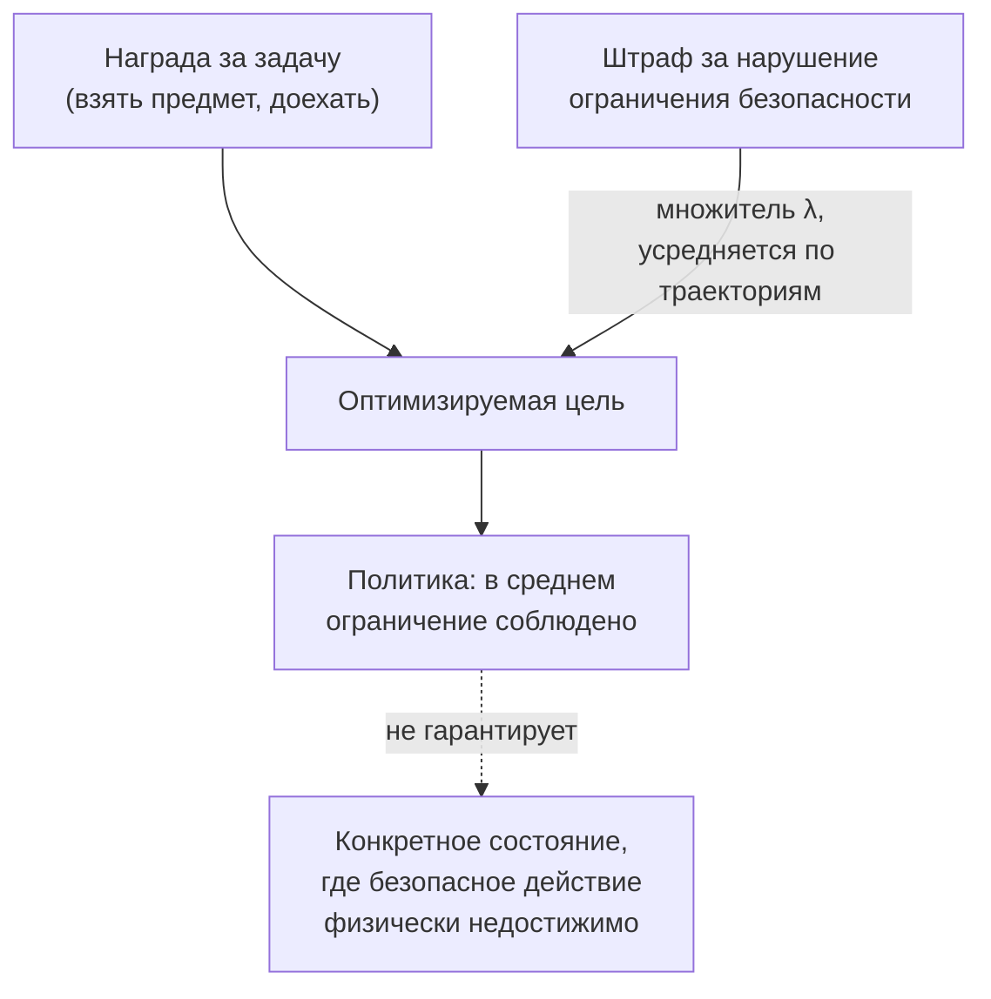

## Русская версия

# Почему «в среднем безопасно» не значит «безопасно всегда»: Lagrangian-ограничения в RL для роботов

В сегодняшнем дайджесте — статья [«ShieldVLA: Feasibility-Aware Safety Alignment for Vision-Language-Action Models»](https://huggingface.co/papers/2609.13231) (Manan Tayal, Akshay Nambi). Абстракт формулирует проблему прямо: «Vision-Language-Action (VLA) модели демонстрируют сильную генерализацию в манипуляции роботами и навигации, но существующие методы файнтюнинга дают ограниченные гарантии безопасности. Текущие подходы в основном полагаются на Lagrangian-оптимизацию, которая обеспечивает…» — и на этом фрагмент в дайджесте обрывается, дальше конкретный вклад статьи мне неизвестен. Но заявленная проблема — реальная и хорошо изученная область, стоит разобрать её отдельно.

VLA-модель — это модель, которая на вход берёт изображение (что видит робот) и языковую инструкцию («возьми красную чашку»), а на выход выдаёт не текст, а действие: команду манипулятору или траекторию движения. Разница с обычной языковой моделью принципиальна: неудачный токен в тексте можно перегенерировать, а неудачное физическое действие робота — это реальное столкновение, уроненный предмет или травма человека рядом, и его нельзя откатить.

Стандартный способ обучать RL-политику с ограничениями безопасности — конструкция Constrained Markov Decision Process (CMDP): у агента есть обычная награда за выполнение задачи и отдельная «стоимость» за нарушение ограничения (слишком близко подошёл к человеку, приложил слишком большую силу). Задача — максимизировать награду при условии, что средняя накопленная стоимость нарушений не превышает порог. Lagrangian-оптимизация — стандартный способ решить это на практике: жёсткое ограничение превращается в штрафное слагаемое в общей цели с множителем λ (множитель Лагранжа), который сам подстраивается в процессе обучения — растёт, если ограничение нарушается слишком часто, снижается, если политика и так безопасна с запасом. Это удобно и хорошо изучено, но у метода есть известное слабое место, прямо отражённое в заголовке статьи: Lagrangian-подход по конструкции гарантирует ограничение в среднем по распределению траекторий (или асимптотически, по мере обучения), а не в каждом конкретном состоянии. Политика может быть «безопасной в среднем» и при этом систематически нарушать ограничение в узком, но реальном классе ситуаций — например, там, где безопасное действие физически недостижимо при текущей позе манипулятора, и любое доступное действие так или иначе нарушает порог.

Термин в названии статьи — «feasibility-aware» — намекает именно на это: вместо (или в дополнение к) усреднённому по траекториям Lagrangian-штрафу метод, судя по всему, явно учитывает, достижимо ли безопасное действие из данного состояния в принципе, а не только штрафует за среднюю частоту нарушений. Что именно это означает технически и какие получены результаты — я не знаю, абстракт обрывается раньше.

### Почему вам это важно

Если вы оцениваете safety-alignment для любой системы, управляющей физическими действиями (роботы, автономный транспорт), стоит различать два разных по силе утверждения: «ограничение в среднем соблюдается на тестовом наборе» и «ограничение соблюдается в каждом конкретном состоянии, включая редкие». Lagrangian-методы по умолчанию дают первое, и это не то же самое, что второе.

## English version

# Why "safe on average" isn't the same claim as "safe always": Lagrangian constraints in safety-critical RL

Today's digest surfaces the paper [«ShieldVLA: Feasibility-Aware Safety Alignment for Vision-Language-Action Models»](https://huggingface.co/papers/2609.13231) (Manan Tayal, Akshay Nambi). The abstract states the problem directly: "Vision-Language-Action (VLA) models demonstrate strong generalization in robotic manipulation and navigation, but existing fine-tuning methods provide limited safety guarantees. Current approaches primarily rely on Lagrangian optimization that enforce..." — and that's where the digest's excerpt cuts off, so the paper's specific contribution beyond this point is unknown to me. But the stated problem is a real, well-studied area worth unpacking on its own.

A VLA model takes an image (what the robot sees) and a language instruction ("pick up the red cup") as input, and produces not text but an action: a command to a robotic arm, or a motion trajectory. The difference from an ordinary language model matters: a bad token in text output can be regenerated, but a bad physical action from a robot is a real collision, a dropped object, or an injury to a nearby person — and it can't be undone.

The standard way to train an RL policy under safety constraints is the Constrained Markov Decision Process (CMDP) framework: the agent has an ordinary task reward, plus a separate "cost" for violating a constraint (getting too close to a person, applying too much force). The goal is to maximize reward subject to the average accumulated violation cost staying under a threshold. Lagrangian optimization is the standard practical way to solve this: the hard constraint gets folded into the overall objective as a penalty term with a multiplier λ (the Lagrange multiplier), which itself gets adjusted during training — rising if the constraint is violated too often, falling if the policy is already comfortably safe. This is convenient and well studied, but it has a known weak spot, reflected directly in the paper's title: a Lagrangian approach, by construction, guarantees the constraint on average across the distribution of trajectories (or asymptotically, as training proceeds) — not in every individual state. A policy can be "safe on average" while systematically violating the constraint in a narrow but real class of situations — for instance, where a safe action is physically unreachable given the manipulator's current pose, and every action actually available violates the threshold regardless.

The term in the paper's title, "feasibility-aware," hints at exactly this: instead of (or alongside) a trajectory-averaged Lagrangian penalty, the method apparently accounts explicitly for whether a safe action is achievable from a given state at all, rather than only penalizing the average violation rate. What that means technically, and what results it produces, I don't know — the abstract cuts off before that point.

### Why it matters

If you're evaluating safety alignment for any system controlling physical actions (robots, autonomous vehicles), it's worth distinguishing two claims of very different strength: "the constraint holds on average across a test set" versus "the constraint holds in every individual state, including rare ones." Lagrangian methods give you the first by default, and that is not the same thing as the second.
