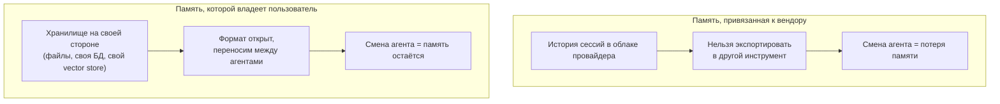

## Русская версия

# «Своя» память агента: почему portability и владение данными — не то же самое, что просто «есть память»

Сегодняшний дайджест принёс только заголовок и имя автора — [«Give Your Coding Agents a Memory You Own»](https://huggingface.co/blog/funes), David Corvoysier, без текста самого поста. Тела статьи в дайджест не попало, поэтому конкретной реализации Funes я здесь не пересказываю — но само название проекта и заголовок поста достаточно точно называют проблему, которую стоит разобрать отдельно, потому что она шире одного конкретного инструмента.

К слову о названии: «Funes» с высокой вероятностью отсылает к рассказу Хорхе Луиса Борхеса «Фунес, чудо памяти» (Funes el memorioso) — про человека, который после травмы обрёл абсолютную, безграничную память и помнит каждую деталь каждого мгновения в мельчайших подробностях. Это моя догадка по названию и общий культурный факт про рассказ Борхеса, а не подтверждённая деталь из самого поста — но она хорошо ложится на тему: «идеальная память» у агента — это не обязательно благо, если она не структурирована и ей нельзя управлять.

По существу заголовка: «memory you own» — фраза, которая осмысленно противопоставляет два разных устройства памяти у AI-агентов. Первый, сегодня наиболее распространённый вариант — память, привязанная к вендору: история диалогов, сводки прошлых сессий и извлечённые факты хранятся внутри инфраструктуры провайдера агента, в закрытом или полузакрытом формате. Это удобно, пока вы остаётесь с одним и тем же инструментом, но создаёт классический lock-in: если завтра вы захотите сменить агента или платформу, накопленный контекст — то, что агент «узнал» о вашем проекте за месяцы работы — как правило, не переносится вместе с вами.

Второй вариант — память, которой явно владеет пользователь: она хранится в формате и месте, которые вы контролируете (локальные файлы, ваша собственная база, свой vector store), и агент обращается к ней как к внешнему ресурсу, а не как к части своей закрытой инфраструктуры. Это прямое попадание в вектор «context economy» из нашего роадмапа: вопрос не «есть ли у агента память», а «что именно система решает положить в окно контекста, откуда это берётся и кому принадлежит источник». Владение памятью — это, по сути, вопрос portability: если контекст, накопленный про кодовую базу, легко экспортировать и подключить к другому инструменту, миграция между агентами перестаёт быть равносильна потере месяцев накопленного знания о проекте.

Для кодовых агентов это особенно ощутимо: память здесь — это не просто «что вы обсуждали», а конкретные факты о репозитории — принятые архитектурные решения, отвергнутые подходы и почему, стиль кода конкретной команды. Если это знание заперто внутри одного провайдера, каждая смена инструмента откатывает агента к нулевому пониманию проекта.

### Почему вам это важно

Выбирая агента для длительной работы с кодовой базой, стоит спросить не только «умеет ли он запоминать», но и «в каком формате, где физически хранится эта память и смогу ли я забрать её с собой». Ответ «да, но только внутри нашей платформы» — это не память, которой вы владеете, а ещё один канал зависимости от вендора.

## English version

# A memory you actually own: why portability isn't the same as just "having memory"

Today's digest surfaced only a title and author — [«Give Your Coding Agents a Memory You Own»](https://huggingface.co/blog/funes), David Corvoysier — with no post body. The article's text never made it into the digest, so I'm not recapping Funes's specific implementation here — but the project's name and the post's title name a problem worth unpacking on its own, since it's bigger than any one tool.

A note on the name: "Funes" very likely nods to Jorge Luis Borges's short story "Funes the Memorious" (Funes el memorioso) — about a man who, after an injury, gains a perfect, boundless memory and recalls every detail of every moment in overwhelming precision. That's my inference from the name plus general cultural knowledge of the Borges story, not a confirmed detail from the post itself — but it fits the theme neatly: "perfect memory" for an agent isn't automatically a good thing if it's unstructured and impossible to manage.

On the substance of the title: "memory you own" meaningfully contrasts two different memory architectures for AI agents. The first, and currently the more common one, is vendor-bound memory: conversation history, session summaries, and extracted facts live inside the agent provider's own infrastructure, in a closed or semi-closed format. That's convenient as long as you stick with the same tool, but it creates the classic lock-in problem: if you want to switch agents or platforms tomorrow, the accumulated context — what the agent "learned" about your project over months of work — typically doesn't travel with you.

The second option is memory the user explicitly owns: stored in a format and location you control (local files, your own database, your own vector store), with the agent treating it as an external resource rather than part of its own closed infrastructure. That lands directly in this roadmap's "context economy" vector: the question isn't "does the agent have memory," it's "what does the system choose to put in the context window, where does that come from, and who owns the source." Owning memory is fundamentally a portability question: if the context accumulated about a codebase can be exported and plugged into a different tool, switching agents stops being equivalent to losing months of accumulated project knowledge.

For coding agents specifically, this matters more than usual: memory here isn't just "what you discussed," it's concrete facts about the repository — architectural decisions made, approaches rejected and why, a specific team's code style. If that knowledge is locked inside one provider, every tool switch resets the agent back to zero understanding of the project.

### Why it matters

When choosing an agent for sustained work on a codebase, it's worth asking not just "can it remember things" but "in what format, where does that memory physically live, and can I take it with me." An answer of "yes, but only inside our platform" isn't memory you own — it's another channel of vendor dependency.
