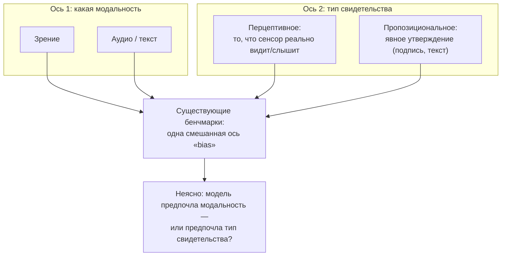

## Русская версия

# Модальный bias у omni-моделей: когда конфликт «что я вижу» vs «что мне сказали» путают с конфликтом между модальностями

В дайджесте — препринт [«Tri-PvP: Exposing Modality Bias in Omni-Modal Large Language Models through Perceptual-Propositional Evidence Conflicts»](https://huggingface.co/papers/2609.06011) за авторством Yen-Ting Piao, Shu-Yun Chen, Chin-Hui Chu, Chun-Wei Chen, Shih-Yun Shan Kuan и соавторов. Аннотация обрывается на «Existing benchmarks conflate two dis…» — то есть авторы утверждают, что существующие бенчмарки смешивают («conflate») два разных явления, но какие именно — текст не называет. Дальше — попытка честно разобрать, что стоит за терминами в заголовке, опираясь на название метода и то, что реально попало в дайджест, а не на предполагаемое содержание оборванной фразы.

Omni-modal LLM (OLLM) — модель, которая одновременно обрабатывает зрение, аудио и текст в одном контексте, а не поочерёдно через отдельные энкодеры с последующим слиянием. «Modality bias» в таких моделях — это систематическое предпочтение одной модальности другой при противоречии между ними: например, если видео показывает одно, а звуковая дорожка «говорит» другое, к какому каналу модель склонна доверять больше — и делает ли она это последовательно, а не случайно.

Здесь и появляется ключевое различие, которое, судя по названию метода «Perceptual-Propositional», авторы вводят намеренно. Возьмём два типа «свидетельства», которые может противоречить друг другу:

- **Перцептивное свидетельство** — то, что модель буквально воспринимает через сенсорный канал: пиксели кадра, форма объекта на видео, звуковая волна.
- **Пропозициональное свидетельство** — явное словесное утверждение о содержимом: подпись к изображению, транскрипт, текстовая метка «на фото — кошка».

Важно, что оба типа свидетельства могут прийти через любую модальность: текст может нести и перцептивное описание («на фото красный шар»), и пропозициональное утверждение («это красный шар, это факт»). Идея в том, что то, что раньше называли одним общим «modality bias» — модель предпочитает зрение аудио, или текст изображению, — на самом деле может расщепляться на два независимых эффекта: (1) собственно предпочтение канала (зрение vs звук как источник) и (2) предпочтение типа свидетельства (прямое восприятие vs явно сформулированное утверждение), независимо от того, через какой канал оно пришло. Существующие бенчмарки, где конфликт задаётся сразу по обеим осям одновременно, не могут различить, какой из двух эффектов на самом деле управляет решением модели — отсюда, вероятно, и «conflate two dis[tinct phenomena]» в оборванной аннотации.

### Почему вам это важно

Если вы оцениваете или выбираете omni-modal модель для задачи, где источники могут противоречить друг другу (например, видеонаблюдение с одновременной звуковой аннотацией, или мультимодальный поиск с текстовыми метаданными, которые могут расходиться с содержимым изображения), одного вопроса «какой модальности модель доверяет больше» недостаточно. Стоит проверять отдельно: доверяет ли модель прямому наблюдению больше, чем явному текстовому утверждению — вне зависимости от того, в какой модальности каждое из них выражено. Это два разных источника ошибки, и лечатся они, вероятно, по-разному.

## English version

# Modality bias in omni-modal models: when "what I perceive" vs. "what I'm told" gets confused with a conflict between modalities

Today's digest carries the preprint [«Tri-PvP: Exposing Modality Bias in Omni-Modal Large Language Models through Perceptual-Propositional Evidence Conflicts»](https://huggingface.co/papers/2609.06011) by Yen-Ting Piao, Shu-Yun Chen, Chin-Hui Chu, Chun-Wei Chen, Shih-Yun Shan Kuan, and co-authors. The abstract cuts off at "Existing benchmarks conflate two dis…" — the authors claim existing benchmarks conflate two distinct phenomena, but don't name which ones in what reached the digest. What follows is an honest attempt to unpack what the title's terms actually mean, grounded in the method's name and what genuinely made it through, not a guess at the truncated sentence's content.

An omni-modal LLM (OLLM) is a model that processes vision, audio, and text jointly within one context, rather than sequentially through separate encoders fused afterward. "Modality bias" in such models is a systematic preference for one modality over another when they contradict each other — if a video shows one thing and its audio track "says" another, which channel does the model tend to trust more, and does it do so consistently rather than randomly?

That's where the key distinction comes in — one the method's name, "Perceptual-Propositional," appears to introduce deliberately. Take two types of "evidence" that can conflict:

- **Perceptual evidence** — what the model literally perceives through a sensory channel: pixels in a frame, an object's shape in video, a sound wave.
- **Propositional evidence** — an explicit verbal claim about the content: an image caption, a transcript, a text label stating "this photo shows a cat."

Crucially, either type of evidence can arrive through any modality: text can carry both a perceptual description ("the photo shows a red ball") and a propositional assertion ("this is a red ball, as a stated fact"). The idea is that what used to be lumped together as a single "modality bias" — a model preferring vision over audio, or text over images — may actually split into two independent effects: (1) an actual channel preference (vision vs. sound as a source) and (2) a preference for the evidence type (direct perception vs. an explicitly stated claim), regardless of which channel carries it. Existing benchmarks, which vary both axes at once, can't tell which of the two effects is actually driving the model's decision — which is presumably what "conflate two dis[tinct phenomena]" in the truncated abstract is getting at.

### Why it matters

If you're evaluating or picking an omni-modal model for a task where sources can disagree — video surveillance with a simultaneous audio annotation, or multimodal search where text metadata can diverge from image content — asking only "which modality does the model trust more" isn't enough. Worth checking separately: does the model trust direct observation more than an explicit textual claim, regardless of which modality each one is expressed in? These are two different error sources, and they likely need different fixes.
