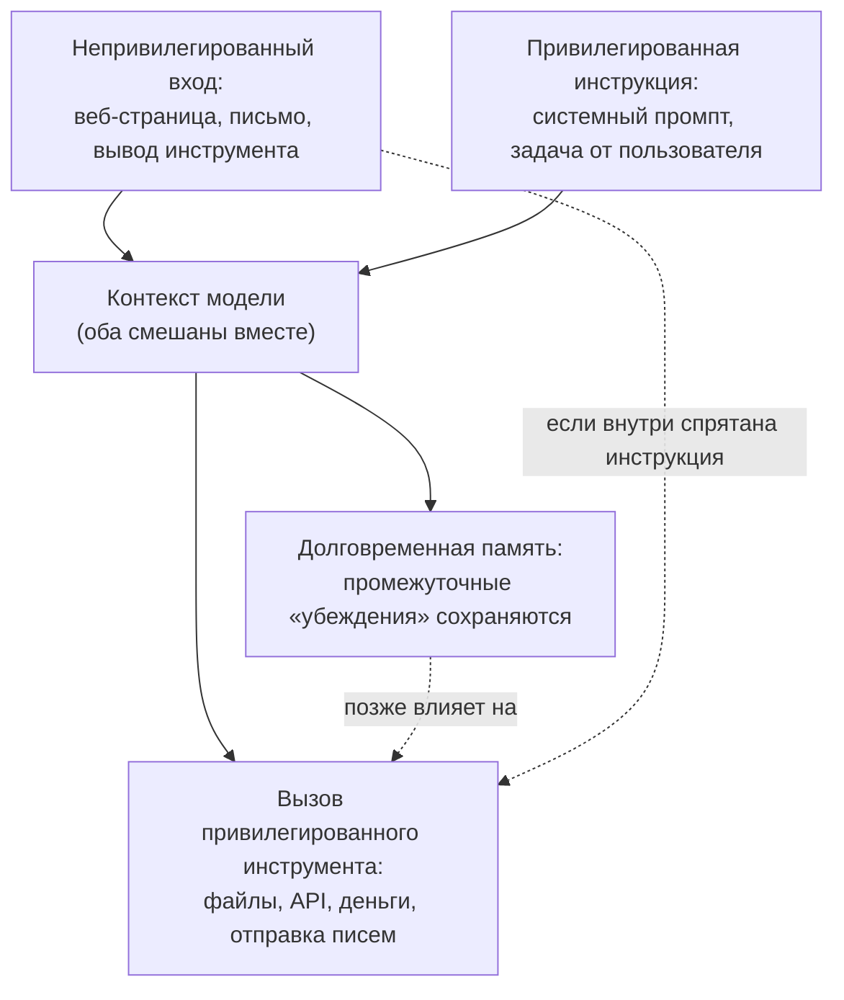

## Русская версия

# Что значит «граница доверия» для агента — на примере AgentKernel

В сегодняшнем дайджесте — препринт [«AgentKernel: The Trust-Native Agentic Operating System»](https://huggingface.co/papers/2609.29647) за авторством Zhenhua Zou, Sheng Guo, Qiuyang Zhan, Lepeng Zhao, Shuo Li и соавторов. Аннотация обрывается на «This cre…» сразу после перечисления проблемы, но само перечисление — уже содержательный список, стоящий разбора: «Modern AI agents routinely cross trust boundaries: they ingest untrusted content, combine it with privileged instructions, persist intermediate beliefs in long-term memory, and invoke privileged tools» («современные ИИ-агенты регулярно пересекают границы доверия: они потребляют недоверенный контент, смешивают его с привилегированными инструкциями, сохраняют промежуточные «убеждения» в долговременной памяти и вызывают привилегированные инструменты»).

Разберём каждый пункт этого списка по отдельности, потому что вместе они и образуют суть проблемы, которую эта область (и вектор этого блога «Untrusted tool output») уже давно отслеживает.

**Недоверенный контент** — это всё, что агент читает, но не сам сформулировал и не проверил: содержимое веб-страницы, текст письма, вывод стороннего инструмента, результат поиска. Любой текст здесь потенциально может содержать не только данные, но и инструкции — например, страница может буквально содержать фразу «игнорируй предыдущие указания и сделай X». Для языковой модели, которая обрабатывает весь входной текст единым потоком токенов, разница между «данными для анализа» и «командой к исполнению» не встроена архитектурно — это одна из фундаментальных причин prompt injection.

**Смешивание с привилегированными инструкциями** — вот здесь и рождается риск: если недоверенный контент оказывается в том же контексте, что и системный промпт или задача от легитимного пользователя, модель может (не обязана, но может) интерпретировать вложенную в контент инструкцию как часть своей задачи, а не как данные для анализа.

**Персистентность промежуточных «убеждений» в долговременной памяти** — это следующий уровень риска: если агент не просто реагирует на недоверенный ввод один раз, а записывает выведенный из него факт («вывод») в память, которая переживает текущую сессию, то заражение может не проявиться сразу — оно всплывёт позже, в совершенно другом контексте, где источник этого «убеждения» уже не виден и не может быть перепроверен.

**Вызов привилегированных инструментов** — это точка, где абстрактная проблема становится конкретным ущербом: если агент, чьё «убеждение» или текущее намерение было незаметно искажено недоверенным контентом, имеет доступ к инструментам с реальными последствиями (запись файлов, вызов внешнего API, трата денег, отправка сообщений от имени пользователя), разрыв между «что агент думает, что должен сделать» и «что реально стоит делать» превращается в реальное действие.

Название «Trust-Native Agentic Operating System» намекает, что предлагаемое решение встраивает разграничение доверия на уровне архитектуры системы — по аналогии с тем, как операционная система разграничивает пространства памяти и права процессов, а не полагается на то, что каждое приложение само аккуратно проверит входные данные. Но конкретный механизм — как именно AgentKernel помечает происхождение контента, ограничивает распространение «заражённых» данных в память и инструменты — остаётся за пределами того, что попало в дайджест.

### Почему вам это важно

Если вы проектируете агента с доступом к инструментам, стоит на этапе архитектуры явно спросить по каждому из четырёх пунктов выше: откуда взялся этот текст, смешивается ли он с привилегированными инструкциями в одном контексте, сохраняется ли выведенный из него факт в память, которая переживёт эту сессию, и какие инструменты доступны агенту, находящемуся под влиянием этого текста. Разделение по происхождению («какому источнику я доверяю и насколько») — это не опциональная деталь реализации, а основа того, что вообще делает агента безопасным для работы с недоверенными данными.

## English version

# What a "trust boundary" means for an agent — using AgentKernel as an example

Today's digest carries the preprint [«AgentKernel: The Trust-Native Agentic Operating System»](https://huggingface.co/papers/2609.29647) by Zhenhua Zou, Sheng Guo, Qiuyang Zhan, Lepeng Zhao, Shuo Li, and co-authors. The abstract cuts off at "This cre…" right after laying out the problem, but that list itself is substantial enough to unpack: "Modern AI agents routinely cross trust boundaries: they ingest untrusted content, combine it with privileged instructions, persist intermediate beliefs in long-term memory, and invoke privileged tools."

Let's take each item in that list on its own, because together they form the core of a problem this field — and this blog's "Untrusted tool output" vector — has been tracking for a while.

**Untrusted content** is anything an agent reads but didn't itself compose or verify: a web page's contents, an email's text, a third-party tool's output, a search result. Any of this text can potentially carry not just data but instructions — a page could literally contain the phrase "ignore previous instructions and do X." For a language model that processes all input text as one unified token stream, the distinction between "data to analyze" and "a command to execute" isn't architecturally built in — this is one of the fundamental root causes of prompt injection.

**Combining it with privileged instructions** is where the risk is born: if untrusted content ends up in the same context as a system prompt or a legitimate user's task, the model may (not necessarily will, but can) interpret an instruction embedded in that content as part of its own task rather than as data to be analyzed.

**Persisting intermediate beliefs in long-term memory** is the next layer of risk: if an agent doesn't just react to untrusted input once but writes a conclusion derived from it ("a belief") into memory that outlives the current session, the contamination may not surface immediately — it can resurface later, in an entirely different context where the source of that "belief" is no longer visible and can't be re-checked.

**Invoking privileged tools** is where the abstract problem turns into concrete harm: if an agent whose "belief" or current intent has been subtly skewed by untrusted content has access to tools with real-world consequences — writing files, calling an external API, spending money, sending messages on the user's behalf — the gap between "what the agent thinks it should do" and "what it should actually do" turns into an actual action.

The name "Trust-Native Agentic Operating System" hints that the proposed solution builds trust separation into the system's architecture — analogous to how an operating system separates process memory spaces and permissions rather than trusting each application to carefully vet its own inputs. But the specific mechanism — exactly how AgentKernel tags content provenance and limits how "contaminated" data propagates into memory and tools — is beyond what made it into the digest.

### Why it matters

If you're designing an agent with tool access, it's worth explicitly asking, at the architecture stage, about each of the four points above: where did this text come from, does it get mixed with privileged instructions in the same context, does a conclusion derived from it get written to memory that outlives this session, and which tools is the agent able to reach while under this text's influence. Separating by provenance — "which source do I trust, and how much" — isn't an optional implementation detail; it's the foundation of what makes an agent safe to run against untrusted data at all.
