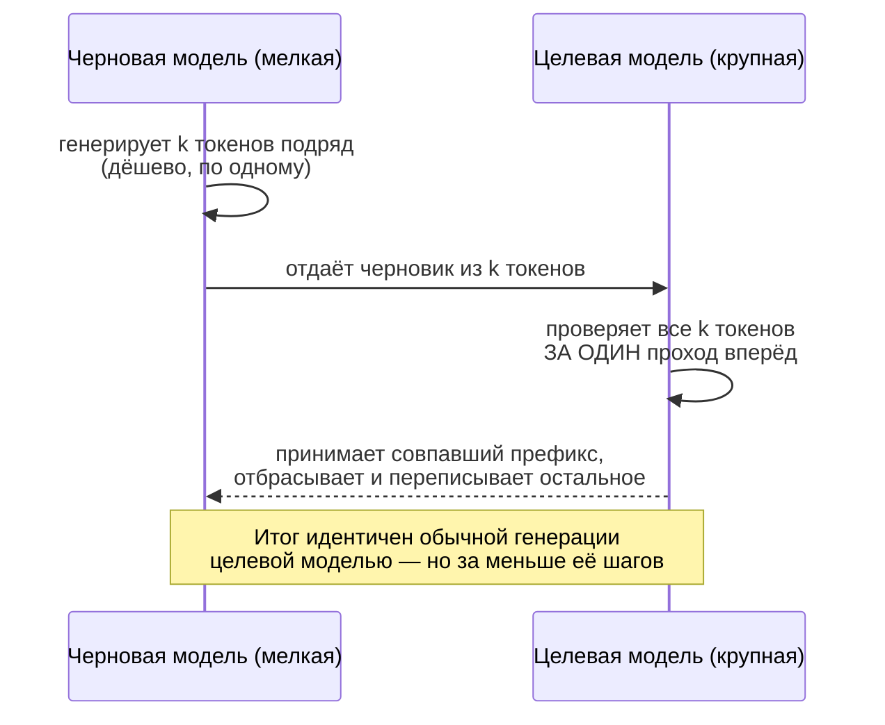

## Русская версия

# Speculative decoding: как «черновик» ускоряет генерацию текста, не меняя её результат

В карточке [NVIDIA/Model-Optimizer](https://github.com/NVIDIA/Model-Optimizer), сегодняшнего репозитория #3 в трендах GitHub, среди шести техник сжатия моделей отдельным пунктом стоит «speculative decoding» — обучение «черновой» подмодели предсказывать несколько токенов вперёд. Название звучит как ещё один вид сжатия, но по факту это ускорение другого рода — и разобраться, что здесь происходит на самом деле, полезнее, чем просто добавить термин в список.

Обычная авторегрессионная генерация у LLM — это цикл: модель считает распределение вероятностей для следующего токена, сэмплирует один токен, добавляет его к контексту, повторяет. Каждый токен — это отдельный полный проход через все веса модели. Для крупной модели это дорого именно потому, что проход тяжёлый, а токенов в ответе может быть сотни.

Speculative decoding разрывает это узкое место так: рядом с крупной («целевой») моделью работает маленькая и быстрая «черновая» модель. Черновая модель за несколько дешёвых шагов сама сочиняет последовательность из k токенов — это её собственное предположение о том, что сказала бы целевая модель. Затем целевая модель проверяет весь черновик не по одному токену, а за один проход: она умеет вычислить свои «настоящие» вероятности для всех k позиций параллельно, потому что архитектура трансформера позволяет обработать уже готовую последовательность токенов одним батчем, а не генерировать её пошагово. Дальше — простое правило: там, где предположение черновой модели совпадает с тем, что выбрала бы целевая (с точки зрения её же распределения вероятностей), токен принимается; в первой же точке расхождения черновик обрезается, а целевая модель сама генерирует правильный токен на этом месте — и цикл начинается заново от него.

Ключевое свойство: результат математически идентичен генерации одной только целевой моделью — это не аппроксимация и не потеря качества, а способ доказуемо получить тот же результат за меньшее число «дорогих» шагов целевой модели, когда черновая модель хорошо угадывает. Выигрыш в скорости зависит от того, насколько часто предположения черновой модели совпадают с целевой: на предсказуемых участках текста (шаблонный код, устойчивые фразы) ускорение заметно, на неожиданных поворотах — почти нулевое, потому что расхождение случается на первом же токене черновика.

Именно поэтому речь не про сжатие модели, а про её более быстрое использование без изменения самой модели — отсюда логика включить эту технику в один список рядом с квантованием и pruning: все они атакуют одну и ту же проблему (стоимость инференса), но с разных сторон.

### Почему вам это важно

Если вы обслуживаете LLM в проде и упираетесь в latency, а не в память — speculative decoding стоит попробовать раньше квантования: он не трогает веса целевой модели и, соответственно, не может испортить качество ответа, только скорость его получения. Но выигрыш сильно зависит от «предсказуемости» ваших реальных запросов — стоит измерить его на своих данных, а не полагаться на цифры из чужого бенчмарка.

## English version

# Speculative decoding: how a "draft" speeds up text generation without changing its output

The card for [NVIDIA/Model-Optimizer](https://github.com/NVIDIA/Model-Optimizer), today's #3 GitHub trending repo, lists "speculative decoding" as one of six model-compression techniques — training a small "draft" submodel to predict several tokens ahead. The name makes it sound like another form of compression, but it's actually a different kind of speedup — and it's worth unpacking what's really happening here rather than just filing the term away.

Ordinary autoregressive LLM generation is a loop: the model computes a probability distribution for the next token, samples one token, appends it to the context, and repeats. Each token costs one full forward pass through every weight in the model. For a large model this is expensive precisely because each pass is heavy, and a response can run to hundreds of tokens.

Speculative decoding breaks that bottleneck like this: alongside the large "target" model, a small, fast "draft" model runs in parallel. The draft model spends a few cheap steps composing a sequence of k tokens on its own — its own guess at what the target model would have said. The target model then checks the entire draft not one token at a time, but in a single pass: transformer architecture lets it score its own "real" probabilities for all k positions at once, because a batch of already-written tokens can be processed together instead of generated step by step. What follows is a simple rule: wherever the draft's guess matches what the target model would have chosen (by its own probability distribution), that token is accepted; at the first point of disagreement, the draft is cut off, and the target model generates the correct token itself at that position — and the loop restarts from there.

The key property: the result is mathematically identical to generation by the target model alone — this isn't an approximation or a quality trade-off, it's a way to provably get the same output using fewer of the target model's expensive steps, whenever the draft model guesses well. The speed gain depends on how often the draft's guesses match the target's: on predictable stretches of text (boilerplate code, fixed phrasing) the speedup is real; on unexpected turns it's close to zero, because the mismatch happens on the draft's very first token.

That's exactly why this isn't about shrinking the model — it's about using it faster without touching the model itself, which is why it sits on the same list as quantization and pruning: all of them attack the same problem (inference cost) from different angles.

### Why it matters

If you're serving an LLM in production and you're bottlenecked on latency rather than memory, speculative decoding is worth trying before quantization: it never touches the target model's weights, so it can't degrade answer quality — only how fast you get it. But the payoff depends heavily on how "predictable" your actual traffic is — measure it on your own data rather than trusting numbers from someone else's benchmark.
