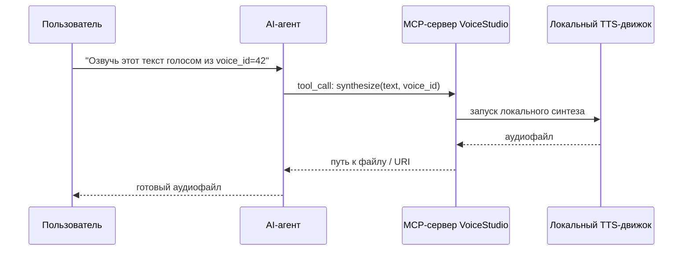

## Русская версия

# Зачем приложению для клонирования голоса свой MCP-сервер — что вообще такое MCP

В сегодняшнем посте про [VoiceStudio](https://github.com/debpalash/VoiceStudio) — локальную альтернативу ElevenLabs — мелькает деталь, которая легко теряется за темой «клонирование голоса»: у приложения есть встроенный MCP-сервер. Это не случайная галочка в списке фич, а часть более широкого паттерна, который стоит разобрать отдельно.

MCP — Model Context Protocol — открытый стандарт, который описывает, как AI-модель (точнее, агент вокруг неё) может обнаруживать и вызывать внешние инструменты единым способом, вместо того чтобы для каждого сервиса писать отдельную интеграцию. До MCP это выглядело так: если вы хотели, чтобы агент умел искать файлы, отправлять email и синтезировать голос, вам приходилось писать три разных обёртки под три разных API, каждую — под конкретную модель или фреймворк. MCP переворачивает это: сервер (например, VoiceStudio) один раз описывает свои инструменты в стандартизованном формате — имя, параметры, что возвращает, — а любой MCP-совместимый клиент (агент на базе Claude, GPT или локальной модели) может подключиться к этому серверу и увидеть список доступных функций без дополнительного кода под конкретно этот сервис.

Применительно к VoiceStudio это означает конкретную вещь: агент может вызвать «синтезируй эту фразу голосом номер 42» как обычный tool call — так же, как он вызывал бы поиск в интернете или чтение файла. Инструмент либо появляется в списке доступных агенту функций, либо нет — то есть granular-доступ определяется тем, какие MCP-серверы подключены к агенту, а не каким-то отдельным слоем разрешений внутри модели.

Именно здесь локальность VoiceStudio становится не просто вопросом приватности, а вопросом архитектуры интеграции. Если бы синтез голоса был только облачным API, агенту нужен был бы сетевой запрос с ключом доступа наружу — ещё одна точка, где данные покидают периметр. Локальный MCP-сервер держит весь путь «агент → инструмент → результат» на одной машине: и вызов, и голосовые данные, и результат не выходят за пределы локального окружения. Это общий сдвиг, который стоит держать в поле зрения: по мере того как локальные модели догоняют облачные по качеству, MCP становится способом дать им те же возможности агентной оркестрации, которые раньше были доступны только через облачные API.

### Почему вам это важно

Если вы строите AI-агента и рассматриваете, каким инструментам его подключать, MCP-сервер у сервиса — сигнал, что его можно интегрировать без кастомного кода под конкретную модель. А если инструмент вдобавок локальный, как у VoiceStudio, вы получаете агентную интеграцию без сетевого выхода наружу для каждого вызова — что снижает и латентность, и площадь атаки на конфиденциальные данные.

## English version

# Why does a voice-cloning app ship its own MCP server — and what is MCP anyway

Today's post about [VoiceStudio](https://github.com/debpalash/VoiceStudio) — a local ElevenLabs alternative — mentions a detail easy to lose under the "voice cloning" headline: the app ships its own MCP server. That's not a random checkbox in a feature list; it's part of a broader pattern worth unpacking on its own.

MCP — the Model Context Protocol — is an open standard describing how an AI model (more precisely, the agent wrapped around it) can discover and call external tools in one uniform way, instead of a bespoke integration per service. Before MCP, this looked like: if you wanted an agent that could search files, send email, and synthesize speech, you wrote three separate wrappers around three separate APIs, each tied to a specific model or framework. MCP flips that: a server (VoiceStudio, in this case) describes its tools once, in a standardized format — name, parameters, what it returns — and any MCP-compatible client (an agent built on Claude, GPT, or a local model) can connect to that server and see the available functions without writing service-specific glue code.

Applied to VoiceStudio, this means something concrete: an agent can call "synthesize this line with voice #42" as a plain tool call — the same way it would call a web search or a file read. The tool either shows up in the agent's available function list or it doesn't — access is granular by which MCP servers are wired up to the agent, not by some separate permission layer baked into the model itself.

This is exactly where VoiceStudio's local-first design stops being purely a privacy question and becomes an integration-architecture one. If voice synthesis were cloud-only, an agent calling it would need an outbound network request carrying an access key — one more point where data leaves the perimeter. A local MCP server keeps the whole "agent → tool → result" path on one machine: the call, the voice data, and the output never cross a network boundary. That's a broader shift worth watching: as local models close the quality gap with cloud ones, MCP is becoming the way to give them the same agent-orchestration capabilities that used to require a cloud API.

### Why it matters

If you're building an AI agent and deciding which tools to wire in, a service shipping its own MCP server is a signal it can be integrated without model-specific custom code. And if that tool is also local, like VoiceStudio, you get agent integration without an outbound network call on every invocation — cutting both latency and the attack surface for sensitive data.
