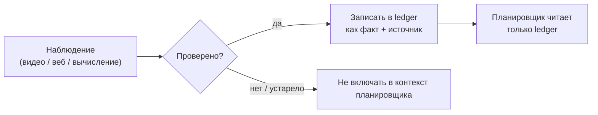

## Русская версия

# Evidence ledger: зачем агенту отдельный журнал фактов, а не просто длинная история чата

В сегодняшнем посте про [Omni-Decision](https://huggingface.co/papers/2607.11433) мелькает термин «evidence ledger» — «журнал доказательств». Звучит как узкоспециальная деталь одной конкретной статьи про омни-модальных агентов, но на самом деле это частный случай куда более общего паттерна, который стоит понимать отдельно от конкретной работы.

Начнём с проблемы. Когда LLM-агент работает долго — многошагово, с вызовами инструментов, с чтением веб-страниц, видео или результатов вычислений, — всё, что он «узнал» по дороге, обычно просто складывается в историю диалога: system-промпт, реплики пользователя, ответы инструментов, промежуточные рассуждения модели — всё вперемешку, в порядке появления. На коротких задачах это работает нормально. Но чем длиннее горизонт, тем острее встают три вопроса, на которые «история чата» отвечает плохо: (1) что из этого до сих пор актуально, а что устарело? (2) что было реально подтверждено внешним источником, а что — просто предположение модели на прошлом шаге, которое она сама же потом восприняла как факт? (3) как быстро найти нужный кусок информации, если контекст уже занимает десятки тысяч токенов?

Идея evidence ledger — отделить *журнал фактов* от *истории взаимодействия*. Вместо того чтобы планировщик каждый раз заново перечитывал всю сырую историю и сам решал, чему верить, система ведёт структурированную запись: каждый факт — с явной пометкой источника, статусом подтверждения и, желательно, временем актуальности. Планировщик работает с этим журналом, а не с сырым потоком наблюдений. Если наблюдение не прошло проверку (например, два источника противоречат друг другу, или видео было интерпретировано с низкой уверенностью) — оно либо не попадает в журнал, либо попадает с явной пометкой «не подтверждено», а не тихо просачивается в контекст как будто это установленный факт.

Это тот же принцип, что лежит в основе баз данных с явной схемой вместо файла с логами: структура окупается, когда объём растёт. Разница между «модель держит всё в одной длинной истории и надеется разобраться» и «модель ведёт отдельный проверяемый журнал» — это ровно то же различие, что между грудой бумаг на столе и картотекой. На коротких задачах разницы не видно. На длинных горизонтах — а именно туда движутся агентные системы — она становится решающей.

### Почему вам это важно

Если вы проектируете агента, которому предстоит работать дольше нескольких шагов — тем более если он тянет данные из разных источников (веб, файлы, вызовы других сервисов), — заранее заложите разделение между «сырым потоком наблюдений» и «проверенным журналом фактов, на которые можно ссылаться». Это не требует омни-модальности или сложной архитектуры: даже простой текстовый агент выигрывает от того, что явно отслеживает, какие утверждения в его памяти подтверждены, а какие — нет.

## English version

# Evidence Ledgers: Why an Agent Needs a Separate Fact Log, Not Just a Long Chat History

Today's post on [Omni-Decision](https://huggingface.co/papers/2607.11433) mentions a term worth unpacking on its own: "evidence ledger." It sounds like a narrow detail specific to one paper about omni-modal agents, but it's actually an instance of a much more general pattern worth understanding independently of that specific work.

Start with the problem. When an LLM agent runs for a while — multiple steps, tool calls, reading web pages, video, or computation results — everything it "learns" along the way typically just gets appended to the conversation history: the system prompt, user turns, tool outputs, the model's own intermediate reasoning, all mixed together in order of appearance. That works fine for short tasks. But the longer the horizon gets, the sharper three questions become, and "chat history" answers them badly: (1) what's still current versus stale? (2) what was actually verified by an external source, versus just a guess the model made at a previous step that it then started treating as fact? (3) how do you find the relevant piece of information once the context already runs to tens of thousands of tokens?

The evidence-ledger idea is to separate the *fact log* from the *interaction history*. Instead of the planner re-reading the entire raw history every time and deciding for itself what to trust, the system keeps a structured record: each fact tagged with an explicit source, a verification status, and ideally a validity window. The planner works off that ledger rather than the raw observation stream. If an observation fails verification — say, two sources conflict, or a video was interpreted with low confidence — it either doesn't make it into the ledger, or goes in explicitly flagged as unverified, instead of silently leaking into context as if it were an established fact.

It's the same principle behind a database with an explicit schema versus a log file: structure pays off once volume grows. The difference between "the model keeps everything in one long history and hopes to sort it out" and "the model maintains a separate, checkable ledger" is exactly the difference between a pile of papers on a desk and a filing system. On short tasks you won't notice. On long horizons — which is where agent systems are heading — it becomes decisive.

### Why it matters

If you're designing an agent meant to run for more than a few steps — especially one pulling data from multiple sources (web, files, calls to other services) — build in the separation between "raw observation stream" and "verified fact log you can point to" from the start. This doesn't require omni-modality or a complex architecture: even a plain text agent benefits from explicitly tracking which claims in its memory are verified and which aren't.
