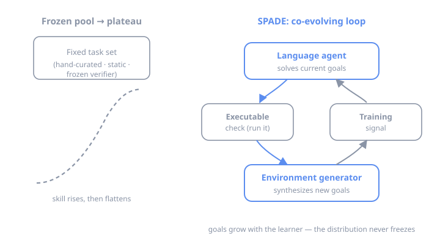
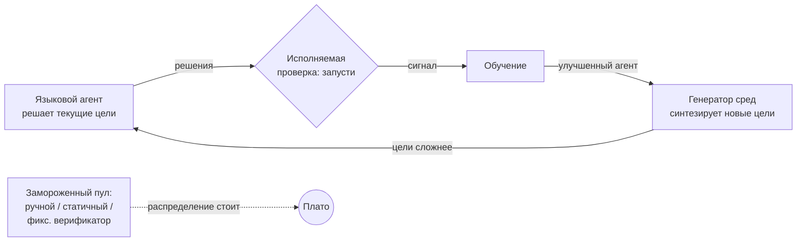

## Русская версия

# SPADE: агент, который сам себе выдумывает всё более сложные задачи

У любого «самообучающегося» агента есть неудобный потолок, о который он рано или поздно бьётся. Пока задачи, на которых он тренируется, кто-то придумал заранее — распределение целей заморожено. Агент растёт, а набор упражнений остаётся прежним. Через какое-то время он выжимает из них всё, что можно, и дальше просто топчется на месте. Это как качаться в зале, где штанга навсегда осталась на двадцати килограммах.

Авторы SPADE (Self-Play in Adaptive Synthetic Executable Environments) формулируют проблему честно: непрерывное самоулучшение требует постоянно расширяющегося пула целей — самопорождённых, разнообразных и адаптивных. А существующие способы готовить среды для языковых агентов этого не дают. Ручная курация упирается в человека, который физически не успевает придумывать новое. Статически синтезированные наборы генерируются один раз и застывают. Подход с «замороженным верификатором» фиксирует проверяющего — а значит, и потолок сложности, который он способен оценить. Во всех трёх случаях распределение целей стоит на месте, пока ученик уходит вперёд.

Идея SPADE — расклеить этот потолок. Ключевых слов в названии два. **Self-play**: агент не просто решает чужие задачи, а участвует в контуре, где новые цели рождаются вместе с его собственным ростом. **Executable environments**: среды — исполняемые. Задачу можно реально запустить и проверить результат кодом, а не сверять с застывшим оценщиком. Это тонкий, но важный момент: если проверка сама «исполняема», она не устаревает так, как устаревает обученный однажды верификатор. Проверяющий и генератор целей эволюционируют вместе с учеником, а не отстают от него на шаг.

По сути это попытка перенести на языковых агентов старую идею open-ended обучения: пусть сложность задач сама подтягивается к текущему уровню ученика — не слишком легко (нечему учиться), не слишком трудно (нет сигнала). Разница в том, что здесь единицей «задачи» становится исполняемая синтетическая среда, а не строчка из заранее собранного датасета.

Отнеситесь к этому со здоровым скепсисом. Само-порождение целей — обоюдоострая штука: если генератор скатывается в узкий или вырожденный класс задач, агент честно выучит эту вырожденность, и вы получите уверенный прогресс метрики в никуда. Конкретных цифр и бенчмарков я здесь намеренно не привожу — важно направление, а не рекламный слоган. Но направление любопытное: вместо «дайте больше данных» — «постройте контур, который сам производит нужные данные ровно тогда, когда ученик к ним готов».

### Почему вам это важно

Если вы строите систему, которая должна становиться лучше со временем, спросите себя: **откуда берётся сигнал обучения и не заморожен ли он?** Самый частый скрытый потолок — не размер модели и не бюджет, а статичный набор задач, который перестаёт учить, как только агент его перерос. SPADE — напоминание, что среду обучения стоит проектировать как живой, ко-эволюционирующий контур, а проверку — как что-то исполняемое и обновляемое, а не как эталон, отлитый в бетоне один раз. Практический вывод простой: прежде чем докупать данные, посмотрите, не пора ли научить систему производить их себе самой.

## English version

# SPADE: the agent that keeps inventing harder problems for itself

Every "self-improving" agent hits an awkward ceiling sooner or later. As long as the tasks it trains on were written by someone ahead of time, the goal distribution is frozen. The agent grows; the exercise set doesn't. Eventually it squeezes everything it can out of those tasks and just spins in place — like lifting in a gym where the barbell is bolted at twenty kilos forever.

The authors of SPADE (Self-Play in Adaptive Synthetic Executable Environments) state the problem plainly: continuous self-improvement needs an ever-expanding pool of goals — self-generated, diverse, and adaptive. The usual ways of preparing environments for language agents don't deliver that. Hand-curation is capped by a human who can't invent novelty fast enough. Statically synthesized sets are generated once and then set like concrete. The "frozen-verifier" approach pins the checker in place — and with it, the difficulty ceiling the checker can even recognize. In all three, the goal distribution stands still while the learner walks off.

SPADE's idea is to unstick that ceiling. Two words in the name carry the weight. **Self-play**: the agent doesn't just solve someone else's problems; it sits inside a loop where new goals are born alongside its own growth. **Executable environments**: the environments can actually be run, so a solution is checked by executing it rather than by consulting a frozen scorer. That's a subtle but real distinction — if the check is itself "executable," it doesn't go stale the way a once-trained verifier does. The checker and the goal generator evolve with the learner instead of trailing a step behind.

At heart this ports an old open-ended-learning idea onto language agents: let task difficulty track the learner's current level — not too easy (nothing to learn), not too hard (no usable signal). The twist is that the unit of a "task" becomes an executable synthetic environment, not a row from a dataset assembled in advance.

Keep a healthy skepticism. Self-generated goals cut both ways: if the generator collapses into a narrow or degenerate class of tasks, the agent will faithfully learn that degeneracy, and you'll get a confidently rising metric that means nothing. I'm deliberately not quoting specific numbers or benchmarks here — the direction matters, not the marketing line. And the direction is genuinely interesting: instead of "get more data," it's "build a loop that produces the right data exactly when the learner is ready for it."

### Why it matters

If you're building anything meant to improve over time, ask the one question that actually bites: **where does the training signal come from, and is it frozen?** The most common hidden ceiling isn't model size or budget — it's a static task set that stops teaching the moment the agent outgrows it. SPADE is a reminder to design the training environment as a living, co-evolving loop, and the check as something executable and refreshable rather than an oracle poured once and left to harden. The practical takeaway is blunt: before you buy more data, ask whether it's time to teach the system to produce its own.
