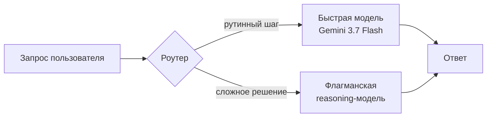

## Русская версия

# Gemini 3.7 Flash: Google делает ставку на быструю и дешёвую модель

Google Deepmind [представил Gemini 3.7 Flash](https://deepmind.google/blog/introducing-gemini-3-7-flash/) — очередную версию своей «быстрой» линейки моделей. Пока флагманы вроде GPT и Claude соревнуются в том, кто глубже думает над сложной задачей, у Google есть параллельный фронт: модель, которую можно дёшево дёргать миллион раз в секунду, не разоряя бюджет на инференс.

Это не случайность и не побочный продукт. Линейка Flash существует специально для сценариев, где вы не готовы платить за флагманскую модель на каждый чих: автодополнение, классификация, роутинг запросов, массовая обработка документов. Штука в том, что «быстро и дёшево» и «достаточно умно» — это два требования, которые обычно тянут в разные стороны, и каждая новая версия Flash — это попытка немного сдвинуть эту границу.

Здесь стоит вспомнить общую логику всей индустрии последних лет: не каждый запрос заслуживает полноценного «мышления». Если у вас агентная система, где модель дергается на каждый шаг цепочки — прочитать файл, решить, какой инструмент вызвать, отформатировать ответ — совершенно не обязательно гонять через это все запросы дорогую reasoning-модель. Разумный дизайн — маршрутизировать: тяжёлые, неоднозначные решения — к флагману, рутинные — к быстрой модели вроде Flash. Собственно, именно эту задачу — «кого из специалистов выбрать под конкретный запрос» — на днях формализовали в статье [Pandora's AI Model Routing Box](http://arxiv.org/abs/2608.20316v1), и релиз Gemini 3.7 Flash приходится ровно на тот момент, когда вопрос маршрутизации моделей перестаёт быть теоретическим.

Официальный анонс, как обычно у Google, скуп на технические детали и щедр на маркетинговые формулировки о «прорыве в скорости». Это нормально для дня релиза — конкретные бенчмарки и независимые сравнения появятся позже, и вот тогда будет видно, действительно ли Flash 3.7 сдвигает границу качество/цена, или это просто инкрементальное обновление с новым номером версии.

### Почему вам это важно

Если вы проектируете систему с несколькими LLM-вызовами на один пользовательский запрос — а таких систем становится всё больше, — вопрос «какая модель обрабатывает какой шаг» экономически важнее, чем кажется на старте. Дорогая reasoning-модель на каждом шаге — это не «более качественный продукт», а часто просто слитый бюджет. [Gemini 3.7 Flash](https://deepmind.google/blog/introducing-gemini-3-7-flash/) — ещё один сигнал, что вендоры воспринимают эту нишу всерьёз, и что вам стоит закладывать в архитектуру не одну модель, а осознанный выбор между несколькими.

## English version

# Gemini 3.7 Flash: Google doubles down on fast and cheap

Google DeepMind has [introduced Gemini 3.7 Flash](https://deepmind.google/blog/introducing-gemini-3-7-flash/), the latest entry in its "fast" model line. While flagship models from OpenAI and Anthropic compete on how deeply they can reason through a hard problem, Google is running a parallel front: a model you can call a million times a second without torching your inference budget.

This isn't an afterthought — it's a deliberate lane. The Flash line exists for exactly the use cases where paying flagship prices on every call makes no sense: autocomplete, classification, request routing, bulk document processing. The catch is that "fast and cheap" and "smart enough" usually pull in opposite directions, and each new Flash release is another attempt to nudge that frontier.

It's worth situating this in the industry's broader logic: not every request deserves full "thinking." In an agentic system where the model fires on every step of a chain — read a file, decide which tool to call, format the output — you don't need a heavyweight reasoning model on all of it. The sane design routes: hard, ambiguous decisions go to the flagship; routine steps go to a fast model like Flash. That exact problem — picking the right specialist for a given query — was just formalized in [Pandora's AI Model Routing Box](http://arxiv.org/abs/2608.20316v1), and Gemini 3.7 Flash lands right as model routing stops being a theoretical concern.

As usual with Google's release posts, the official announcement is light on technical detail and heavy on "breakthrough speed" language. That's normal on launch day — real benchmarks and independent comparisons will follow, and only then will it be clear whether Flash 3.7 genuinely moves the quality/price frontier or is just an incremental bump with a new version number.

### Why it matters

If you're designing a system with several LLM calls per user request — and more and more systems look like that — the question of which model handles which step matters more economically than it first appears. A heavyweight reasoning model on every step isn't "higher quality," it's often just wasted budget. [Gemini 3.7 Flash](https://deepmind.google/blog/introducing-gemini-3-7-flash/) is one more signal that vendors take this niche seriously, and that your architecture should plan for a deliberate choice between models, not just one.
