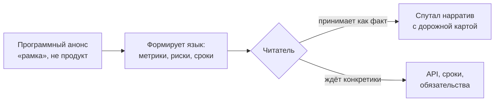

## Русская версия

# OpenAI анонсирует AI Futures: попытка застолбить нарратив о будущем ИИ

OpenAI [представила инициативу под названием AI Futures](https://openai.com/index/introducing-ai-futures) — судя по заголовку и месту публикации (корпоративный блог, раздел «index»), это не техническая фича и не модель, а скорее рамочный анонс: способ компании публично говорить о том, куда, по её мнению, движется индустрия ИИ дальше.

Здесь стоит сразу быть честным насчёт того, что мы знаем, а что нет. Сама страница анонса на момент публикации даёт немного конкретики для стороннего разбора — это типичная ситуация в день релиза у любого крупного вендора: сначала выходит громкий заголовок и общая рамка, а разбор деталей, критика и независимая проверка утверждений появляются уже потом, когда журналисты и исследователи успевают прочитать текст целиком и сопоставить его с реальными продуктовыми решениями компании.

Что можно сказать увереннее — это про сам жанр такого анонса. Крупные лаборатории регулярно выпускают материалы, которые не столько объявляют конкретный продукт, сколько формируют язык, которым потом будет описываться прогресс: какие метрики считаются важными, какие риски — приоритетными, какая временная шкала — реалистичной. Это тоже часть конкурентной борьбы, просто она идёт не в бенчмарках, а в нарративе. И именно поэтому здоровая читательская привычка — не принимать программные заявления вендора как готовый факт, а держать в уме, что они написаны из позиции компании с явным коммерческим интересом в том, чтобы именно её версия будущего стала общепринятой.

Из практических соседних сигналов сегодняшнего дня заметно, что OpenAI параллельно двигается сразу по нескольким направлениям — от [нулевого хранения данных для флагманских моделей](https://openai.com/index/offering-zero-data-retention-for-frontier-models) до кейсов внедрения ChatGPT в бизнес-процессы. AI Futures, судя по всему, — попытка связать эти разрозненные шаги в единую историю, а не отдельный технический релиз.

### Почему вам это важно

Когда крупный вендор анонсирует «рамку» вместо продукта, это сигнал не для инженеров, а для рынка и регуляторов — и относиться к такому тексту стоит соответствующе: не как к техническому руководству, а как к позиционированию. Прежде чем менять архитектуру или бизнес-план под свежий манифест, разумно подождать, пока за громким заголовком появятся конкретные обязательства, сроки или API — иначе легко спутать маркетинговый нарратив с дорожной картой.

## English version

# OpenAI announces AI Futures: staking a claim on the narrative

OpenAI has [introduced an initiative called AI Futures](https://openai.com/index/introducing-ai-futures) — judging from the headline and where it's published (the corporate blog's "index" section), this reads less like a technical feature or model release and more like a framing announcement: a way for the company to publicly state where it believes the AI industry is headed next.

Worth being upfront about what's known versus not. The announcement page itself offers little concrete detail for outside analysis as of publication — that's typical on release day for any major vendor: first comes the bold headline and the broad frame, then the detailed breakdown, criticism, and independent verification arrive later, once journalists and researchers have read the whole thing and checked it against the company's actual product decisions.

What's safer to say is something about the genre itself. Big labs regularly put out material that doesn't so much announce a specific product as shape the vocabulary that progress will later be described in: which metrics count as important, which risks get priority, which timeline reads as realistic. That's part of the competitive game too — it just plays out in narrative rather than benchmarks. Which is exactly why a healthy reading habit is to not take a vendor's programmatic statement as settled fact, and to keep in mind it's written from the position of a company with a clear commercial interest in its version of the future becoming the accepted one.

Looking at today's adjacent signals, OpenAI is clearly pushing on several fronts at once — from [zero data retention for frontier models](https://openai.com/index/offering-zero-data-retention-for-frontier-models) to case studies of ChatGPT inside business workflows. AI Futures looks like an attempt to tie those separate moves into a single story rather than stand as its own technical release.

### Why it matters

When a major vendor announces a "frame" instead of a product, the signal is aimed at markets and regulators, not engineers — and it's worth reading accordingly: as positioning, not as a technical guide. Before you rework architecture or business plans around a fresh manifesto, it's reasonable to wait for concrete commitments, timelines, or APIs to show up behind the headline — otherwise it's easy to mistake a marketing narrative for a roadmap.
