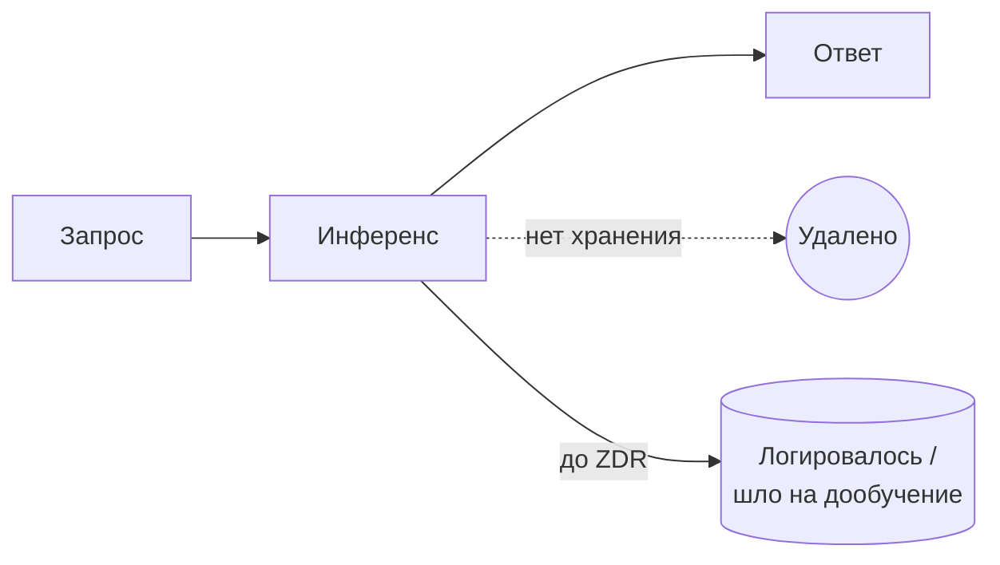

## Русская версия

# Zero Data Retention для флагманских моделей OpenAI: продажа доверия как фичи

OpenAI [объявила о расширении режима Zero Data Retention (ZDR)](https://openai.com/index/offering-zero-data-retention-for-frontier-models) на свои флагманские модели. Смысл ZDR простой: запросы и ответы не сохраняются на стороне провайдера дольше, чем нужно для обработки самого запроса — никакого логирования «на всякий случай», никакого хранения для последующего дообучения.

Это не новая идея — режимы с ограниченным хранением данных существуют у облачных API-провайдеров давно, обычно как опция для корпоративных клиентов с юридическими или комплаенс-требованиями (здравоохранение, финансы, госсектор). Но распространение ZDR именно на «фронтир»-модели — то есть на самые мощные и самые новые — важный сигнал: раньше топовые модели нередко были ровно теми, на которых компании неохотно расширяли гарантии приватности, потому что именно эти модели активнее всего используются для сбора сигналов дообучения.

Стоит понимать эту новость трезво: это не техническая революция, а конкурентный ход в очень конкретной борьбе — за корпоративных клиентов, у которых юридический отдел прямо блокирует использование любого API, если нет письменных гарантий о хранении данных. Anthropic, Google и другие вендоры годами продают точно такой же аргумент — «мы не используем ваши данные для обучения» — и этот анонс OpenAI, по сути, подтягивает их флагманскую линейку к тому же уровню контрактных гарантий, который у конкурентов уже был доступен.

Отдельно стоит держать в уме источник: сама формулировка «нулевое хранение» — это обещание провайдера, а не то, что вы можете верифицировать со своей стороны без независимого аудита или сертификации (SOC 2, и подобных). Это не повод не доверять — просто разница между «маркетинговым заявлением» и «технически проверяемым фактом» здесь ощутимая, и в сфере, где утечка промптов = утечка бизнес-логики или PII, это разница, которая имеет значение.

### Почему вам это важно

Если ваша компания рассматривает флагманские модели OpenAI для чувствительных данных, [этот анонс](https://openai.com/index/offering-zero-data-retention-for-frontier-models) — практический повод пересмотреть контракт и договор об обработке данных (DPA), а не просто прочитать заголовок и успокоиться. Приватность в LLM-продуктах — это не бинарный переключатель «включено/выключено», а стек гарантий: от политики хранения до реальной архитектуры инференса. ZDR закрывает один слой этого стека, но не заменяет остальные — и прежде чем принимать архитектурное решение, стоит прочитать конкретные условия, а не пресс-релиз.

## English version

# Zero Data Retention for OpenAI's frontier models: selling trust as a feature

OpenAI has [announced an expansion of Zero Data Retention (ZDR)](https://openai.com/index/offering-zero-data-retention-for-frontier-models) to its flagship models. The idea behind ZDR is simple: requests and responses aren't kept on the provider's side any longer than needed to process the request itself — no "just in case" logging, no storage for later fine-tuning.

This isn't a new concept — limited-retention modes have existed at cloud API providers for a while, usually as an option for enterprise customers with legal or compliance requirements (healthcare, finance, the public sector). But extending ZDR to "frontier" models specifically — the most capable, most recently released ones — is a meaningful signal: those top models were often exactly the ones companies were most reluctant to extend privacy guarantees to, since they're also the ones most actively mined for fine-tuning signal.

Worth reading this soberly: it's not a technical breakthrough, it's a competitive move in a very specific fight — for enterprise customers whose legal department flatly blocks any API without written data-retention guarantees. Anthropic, Google, and other vendors have been selling the exact same argument — "we don't train on your data" — for years, and this OpenAI announcement essentially brings its flagship line up to the same level of contractual guarantee competitors already offered.

One thing worth keeping separate: the phrase "zero retention" is a provider's promise, not something verifiable from your side without independent audit or certification (SOC 2 and similar). That's not a reason to distrust it — just a real gap between a marketing statement and a technically verifiable fact, and in a space where a prompt leak means a leak of business logic or PII, that gap matters.

### Why it matters

If your company is evaluating OpenAI's flagship models for sensitive data, [this announcement](https://openai.com/index/offering-zero-data-retention-for-frontier-models) is a practical reason to revisit the contract and the data processing agreement (DPA), not just read the headline and move on. Privacy in LLM products isn't a binary on/off switch — it's a stack of guarantees, from retention policy down to actual inference architecture. ZDR closes one layer of that stack, not all of it — and before making an architectural decision, it's worth reading the actual terms rather than the press release.
