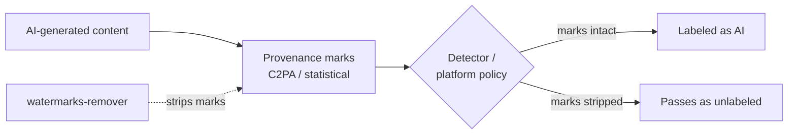

## Русская версия

# watermarks-remover: репозиторий на 16 тысяч звёзд, который стирает следы ИИ

Сегодня в трендах GitHub — [watermarks-remover](https://github.com/guillaumemeyer/watermarks-remover), проект с 16156 звёздами, который делает ровно то, что написано в названии: убирает мульти-вендорные метки происхождения ИИ-контента. По описанию из репозитория это не одна функция, а набор инструментов — «Unicode text hygiene» (чистка невидимых символов, которыми иногда маркируют сгенерированный текст), «statistical rewrite hooks» (переписывание текста так, чтобы сбить статистические детекторы) и удаление C2PA-метаданных и прочих служебных полей из PNG, JPEG, SVG, PDF, DOCX, HTML и Markdown.

Если вы не следили за темой: C2PA (Coalition for Content Provenance and Authenticity) — это открытый стандарт, который как раз и придумали для того, чтобы у изображений и документов можно было проверить происхождение — сгенерировано ли изображение ИИ-моделью, каким инструментом, когда. Крупные вендоры (Adobe, OpenAI, Google, Microsoft) годами продвигали C2PA именно как ответ на вопрос «как отличить настоящее от сгенерированного». watermarks-remover методично разбирает этот механизм на составные части и предлагает единый инструмент, который снимает все слои сразу — и текстовые, и файловые.

16 тысяч звёзд за короткое время — это явно не нишевый интерес разработчиков-исследователей. Это симптом куда более широкого спроса: людям — по разным причинам, не всегда добросовестным — нужен способ публиковать ИИ-контент так, чтобы он не выглядел помеченным как ИИ-контент. Причины могут быть самые разные: от вполне легитимного желания защитить приватность (метаданные файла могут утечь больше, чем вы думаете) до откровенно недобросовестного обхода политик платформ, требующих раскрытия ИИ-генерации.

Это стоит воспринимать не как разовый скандальный репозиторий, а как симптом гонки вооружений: механизмы провенанса появляются — появляются и инструменты их снятия, появляются более устойчивые механизмы провенанса — появляются более изощрённые инструменты снятия. Технически это тот же паттерн, что и в classic security: обфускация против детекции, и ни одна сторона не выигрывает этот раунд навсегда.

### Почему вам это важно

Если ваш продукт или пайплайн полагается на C2PA-метки или статистические детекторы ИИ-текста как на источник истины — [этот репозиторий](https://github.com/guillaumemeyer/watermarks-remover) прямое доказательство того, что полагаться на них как на единственный барьер нельзя. Провенанс-метки — полезный сигнал для добросовестных участников экосистемы, но не криптографическая гарантия против того, кто целенаправленно хочет их снять. Если решение критично (модерация контента, юридическая экспертиза, борьба с дезинформацией), нужен многослойный подход, а не один watermark, в существование обхода которого стоит закладываться заранее.

## English version

# watermarks-remover: a 16k-star repo that erases AI's fingerprints

Trending on GitHub today is [watermarks-remover](https://github.com/guillaumemeyer/watermarks-remover), a project with 16156 stars that does exactly what the name says: strips multi-vendor AI provenance marks. Per its own description, it's not a single feature but a toolkit — "Unicode text hygiene" (cleaning the invisible characters sometimes used to tag generated text), "statistical rewrite hooks" (rewriting text to throw off statistical detectors), and stripping C2PA metadata and other provenance fields from PNG, JPEG, SVG, PDF, DOCX, HTML, and Markdown.

For context: C2PA (Coalition for Content Provenance and Authenticity) is an open standard built specifically so images and documents can be checked for origin — whether an image was AI-generated, by which tool, and when. Major vendors (Adobe, OpenAI, Google, Microsoft) have pushed C2PA for years as the answer to "how do we tell real from generated." watermarks-remover methodically takes that mechanism apart and offers a single tool that strips every layer at once — text-based and file-based alike.

Sixteen thousand stars in a short window isn't niche researcher curiosity. It's a symptom of much broader demand: people — for reasons that aren't always in good faith — want a way to publish AI content so it doesn't look tagged as AI content. The motivations range widely: from a legitimate privacy concern (a file's metadata can leak more than you'd expect) to outright evasion of platform policies that require disclosing AI generation.

Read this less as a one-off scandalous repo and more as a symptom of an arms race: provenance mechanisms appear, tools to strip them appear, sturdier provenance mechanisms appear, more sophisticated stripping tools follow. Technically it's the same pattern as classic security: obfuscation against detection, and neither side wins the round permanently.

### Why it matters

If your product or pipeline treats C2PA marks or statistical AI-text detectors as ground truth, [this repo](https://github.com/guillaumemeyer/watermarks-remover) is direct proof you can't rely on them as your only barrier. Provenance marks are a useful signal for good-faith participants in the ecosystem, but not a cryptographic guarantee against someone actively trying to remove them. If the decision is high-stakes (content moderation, legal review, disinformation response), you need a layered approach, not a single watermark you should already assume can be stripped.

