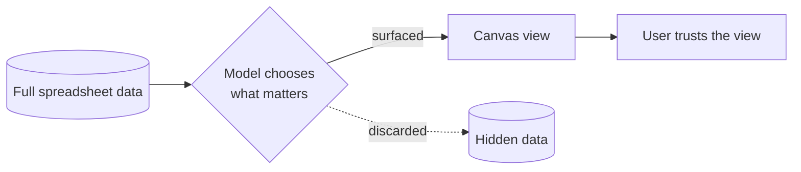

## Русская версия

# Sheets canvas: Google превращает таблицу в холст, который сам решает, что показать

Google [представил Sheets canvas](https://blog.google/products-and-platforms/products/workspace/sheets-canvas-for-google-sheets-spreadsheets/) — функцию для Google Sheets, которая, судя по заголовку анонса, должна «оживить» данные в таблице: превратить сухие строки и столбцы в визуальное представление, которое проще читать и с которым проще взаимодействовать, чем со стандартной сеткой ячеек.

Здесь интересна не сама идея «сделать красивую визуализацию из таблицы» — такие инструменты существуют давно, от сводных таблиц до BI-дашбордов. Интересно то, что происходит с этой идеей, когда за ней стоит ИИ-модель, встроенная прямо в продукт. Классическая визуализация требует, чтобы человек явно указал: вот эти столбцы — по осям, вот эта агрегация, вот этот тип графика. «Оживить данные» одной кнопкой предполагает, что модель сама решает, что в таблице заслуживает внимания, а что можно спрятать — по сути, тот же самый выбор, который любая агентная система делает с контекстным окном: не всё одинаково важно, и кто-то — человек или модель — должен решить, что показать, а что отбросить.

Это удобно ровно до тех пор, пока выбор модели совпадает с вашим намерением. Проблема с автоматической визуализацией «по умолчанию умной» в том, что она невидимо принимает решения за вас: какую метрику считать главной, какой временной диапазон — релевантным, какие выбросы — шумом, а какие — сигналом. В BI-инструментах эта работа обычно явная и настраиваемая; когда её забирает модель, экономится время, но теряется часть контроля, если не предусмотрен простой способ спросить «а почему именно так» или быстро переключиться на «покажи всё как есть».

Анонс со стороны Google, как обычно, в первую очередь демонстрирует use case, а не технические детали того, как модель принимает решения о визуализации. Это нормально для блог-поста уровня продукта, но именно поэтому стоит попробовать фичу на собственных данных, прежде чем доверять ей в отчётах для других людей.

### Почему вам это важно

[Sheets canvas](https://blog.google/products-and-platforms/products/workspace/sheets-canvas-for-google-sheets-spreadsheets/) — хороший повод задуматься о более общем паттерне: любая функция «ИИ сам разберётся, что показать» — это система, принимающая решения о контексте за вас. Прежде чем встраивать такую фичу в рабочий процесс, где на кону точность отчётности, стоит выяснить, можно ли увидеть логику выбора или хотя бы откатиться к «сырому» представлению данных — иначе удобство рискует незаметно превратиться в слепое пятно.

## English version

# Sheets canvas: Google turns the spreadsheet into a canvas that decides what to show

Google has [introduced Sheets canvas](https://blog.google/products-and-platforms/products/workspace/sheets-canvas-for-google-sheets-spreadsheets/), a Google Sheets feature that, per the announcement's title, is meant to "bring data to life" — turning dry rows and columns into a visual representation that's easier to read and interact with than a standard grid of cells.

What's interesting isn't "make a nice visualization from a table" — that idea is old, from pivot tables to full BI dashboards. What's interesting is what happens to that idea once an AI model sits behind it, built directly into the product. Classic visualization requires a person to explicitly say: these columns go on the axes, this is the aggregation, this is the chart type. "Bring data to life" with one click implies the model itself decides what in the table deserves attention and what can be hidden — essentially the same choice any agentic system makes about its context window: not everything is equally important, and someone — a human or a model — has to decide what to surface and what to drop.

That's convenient exactly as long as the model's choice matches your intent. The problem with "smart by default" auto-visualization is that it invisibly makes decisions on your behalf: which metric counts as the headline, which time range is relevant, which outliers are noise versus signal. In BI tools, that work is usually explicit and configurable; when a model takes it over, you save time but lose some control — unless there's an easy way to ask "why this view" or quickly switch to "show me the raw data."

As usual, Google's announcement leans on showing the use case rather than the technical details of how the model makes visualization decisions. That's normal for a product-level blog post, but it's also exactly why it's worth trying the feature on your own data before trusting it in reports other people will read.

### Why it matters

[Sheets canvas](https://blog.google/products-and-platforms/products/workspace/sheets-canvas-for-google-sheets-spreadsheets/) is a good prompt to think about a broader pattern: any "AI figures out what to show" feature is a system making context decisions for you. Before wiring a feature like this into a workflow where reporting accuracy matters, it's worth finding out whether you can see the selection logic, or at least fall back to the "raw" view of the data — otherwise convenience risks quietly becoming a blind spot.

