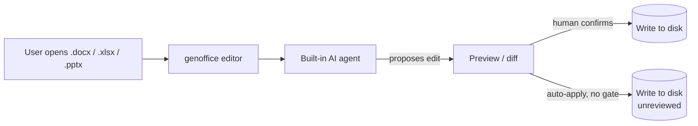

## Русская версия

# genoffice: open-source офисный пакет с ИИ-агентами внутри Word, Excel и PowerPoint

В трендах GitHub сегодня — [genoffice](https://github.com/genspark-ai/genoffice) от Genspark, набравший уже 3465 звёзд. Это бесплатный опенсорсный офисный пакет для macOS, Windows и Linux, который умеет открывать и редактировать .docx, .xlsx, .pptx, PDF и Markdown — и, что важнее, несёт встроенных ИИ-агентов прямо внутри редактора, а не как отдельный чат сбоку.

Идея на первый взгляд не новая: Microsoft Copilot, Google Workspace и десятки стартапов уже встраивают ИИ в офисные приложения. Но здесь принципиально другое — это open source, а значит агент не спрятан за API вендора, а работает над файлами, которые физически лежат у вас на диске, в редакторе, исходный код которого можно прочитать и изменить. Для форматов .docx/.xlsx/.pptx это особенно важно: они внутри — не текстовые файлы, а ZIP-архивы с XML-разметкой, и любой автоматизированный агент, который в них пишет, должен либо аккуратно парсить эту структуру, либо рисковать порчей документа при каждой правке.

Само появление такого проекта — сигнал о том, куда движется рынок «AI office»: не отдельные Copilot-подобные надстройки над закрытыми Word/Excel, а параллельная опенсорсная экосистема, где агент имеет прямой доступ к файловой системе и формату документа. Это меняет расклад рисков: вместо того чтобы доверять облачному вендору с вашими корпоративными таблицами, вы запускаете агента локально — но теперь именно вы отвечаете за то, какие права у него есть на диске и что он может сделать без подтверждения.

Три с половиной тысячи звёзд за короткое время — это не про нишевый интерес разработчиков, а про спрос на «ИИ, который реально правит документы», а не просто отвечает на вопросы о них.

### Почему вам это важно

Если ваша команда уже думает про ИИ-агентов, которые правят реальные офисные документы (контракты, финмодели в Excel, презентации для инвесторов), [genoffice](https://github.com/genspark-ai/genoffice) — удобный полигон для того, чтобы пощупать эту границу вживую: где заканчивается «агент предложил правку» и начинается «агент реально переписал файл». Именно здесь чаще всего теряются деньги и данные — не в самой генерации текста, а в моменте, когда агенту дают право сохранить (save/commit) без явного подтверждения человека. Перед тем как подпускать такой инструмент к рабочим документам, стоит явно решить, какие операции идут в режиме предпросмотра, а какие — сразу на диск.

## English version

# genoffice: an open-source office suite with AI agents built into Word, Excel, and PowerPoint

Trending on GitHub today is [genoffice](https://github.com/genspark-ai/genoffice) from Genspark, already at 3465 stars. It's a free, open-source office suite for macOS, Windows, and Linux that opens and edits .docx, .xlsx, .pptx, PDF, and Markdown — and, more notably, ships AI agents built directly into the editor rather than bolted on as a side chat panel.

The idea isn't new on its face: Microsoft Copilot, Google Workspace, and dozens of startups already embed AI in office apps. What's different here is that it's open source, meaning the agent isn't hidden behind a vendor API — it operates on files that live on your own disk, inside an editor whose source you can read and modify. That matters a lot for .docx/.xlsx/.pptx formats specifically: under the hood they're ZIP archives full of XML markup, and any automated agent writing to them has to either parse that structure carefully or risk corrupting the document on every edit.

The project's appearance itself signals where the "AI office" market is heading: not just Copilot-style add-ons layered onto closed Word/Excel, but a parallel open-source ecosystem where the agent has direct access to both the filesystem and the document format. That shifts the risk profile — instead of trusting a cloud vendor with your corporate spreadsheets, you run the agent locally, but now you're the one responsible for exactly what it's allowed to do on disk without asking first.

Thirty-five hundred stars in a short window isn't niche developer curiosity — it's demand for AI that actually edits documents, not just answers questions about them.

### Why it matters

If your team is already thinking about AI agents that edit real office documents — contracts, financial models in Excel, investor decks — [genoffice](https://github.com/genspark-ai/genoffice) is a convenient place to poke at that boundary firsthand: where "the agent proposed an edit" ends and "the agent actually rewrote the file" begins. That's usually where money and data get lost — not in the text generation itself, but in the moment an agent is given save/commit rights without an explicit human confirmation step. Before letting a tool like this near production documents, decide explicitly which operations run in preview mode and which write straight to disk.

