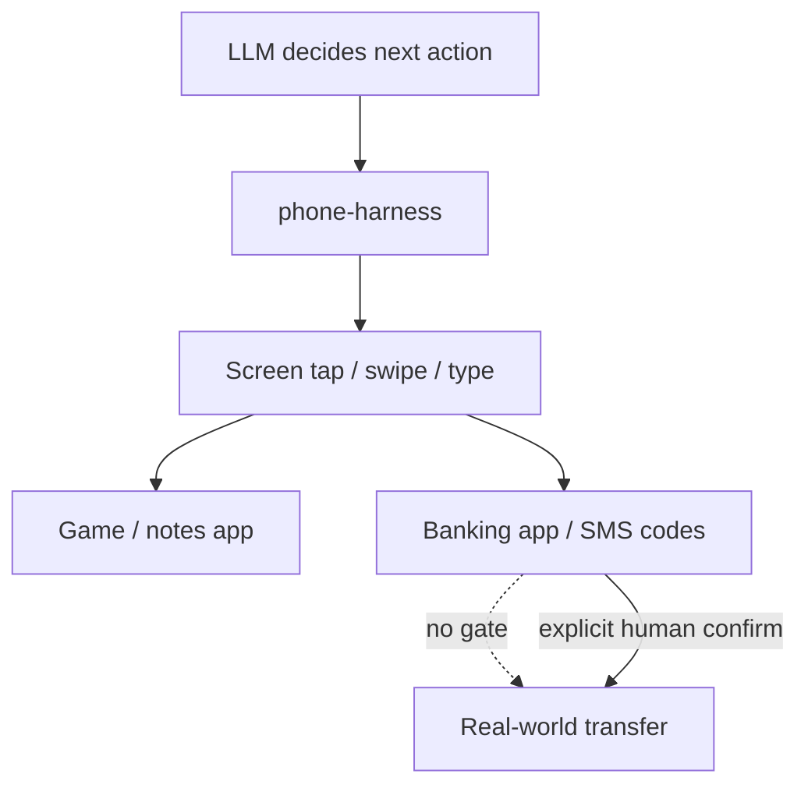

## Русская версия

# phone-harness: репозиторий, который отдаёт агенту управление вашим телефоном

В трендах GitHub — [phone-harness](https://github.com/ShawnPana/phone-harness), проект с 1977 звёздами, описание которого умещается в одну строку: «let your agent control your phone» — дайте своему агенту управлять вашим телефоном. Это очередной шаг в линейке «computer-use» харнессов — инструментов, которые позволяют LLM не просто отвечать текстом, а нажимать кнопки, свайпать экраны и запускать приложения так, как это делает живой человек с пальцем.

Разница между «агентом в браузере» и «агентом на телефоне» на первый взгляд кажется небольшой, но по факту это совсем другая площадка риска. Браузерный агент действует в песочнице вкладки. Телефон — это платёжные приложения, банковский клиент, СМС с кодами подтверждения, камера, микрофон, контакты и вся авторизация через биометрию, которая на этом устройстве и живёт. Харнесс, который умеет «нажимать что угодно на экране», по конструкции не различает безобидный тап по кнопке «дальше» в игре и тап по кнопке «подтвердить перевод» в банковском приложении — если только разработчик явно не встроил такое различение.

Название «harness» здесь выбрано осознанно: это не готовый продукт с одобрением App Store, а именно каркас, инфраструктурный слой, на который дальше можно навешивать конкретные автоматизации — от тестирования мобильных приложений до персональных ассистентов, которые бронируют столики и отвечают на сообщения за вас. Почти 2000 звёзд за короткое время говорят о том, что интерес к «agent on-device» уже не только у исследовательских лабораторий (вспомним ранние демо computer-use от крупных вендоров), но и в открытом инструментарии для разработчиков.

### Почему вам это важно

Если вы планируете строить или тестировать что-то поверх такого харнесса, ключевой вопрос — не «может ли агент нажать нужную кнопку», а «что мешает ему нажать не ту». [phone-harness](https://github.com/ShawnPana/phone-harness) — хороший повод заранее спроектировать границу авторизации: явный allowlist приложений и действий, обязательное подтверждение человеком перед платежами и отправкой сообщений, и логирование каждого действия агента на экране. Тестировать такие системы стоит на выделенном устройстве или в эмуляторе, а не на личном телефоне с реальными банковскими приложениями и живыми контактами.

## English version

# phone-harness: a repo that hands an agent control of your phone

Trending on GitHub is [phone-harness](https://github.com/ShawnPana/phone-harness), a project with 1977 stars whose description fits in one line: "let your agent control your phone." It's the latest entry in the growing line of "computer-use" harnesses — tools that let an LLM do more than answer in text, letting it tap buttons, swipe screens, and launch apps the way a person would with a finger.

The gap between "an agent in a browser" and "an agent on a phone" looks small at first glance, but it's actually a very different risk surface. A browser agent operates inside a tab's sandbox. A phone is payment apps, a banking client, SMS with confirmation codes, the camera, the microphone, contacts, and all the biometric authorization that lives on that exact device. A harness built to "tap anything on the screen" doesn't inherently distinguish between an innocuous tap on a game's "next" button and a tap that confirms a bank transfer — unless the developer explicitly builds that distinction in.

The name "harness" is deliberate: this isn't a polished, App Store–approved product, it's a scaffold — an infrastructure layer other people build specific automations on top of, from mobile app testing to personal assistants that book reservations and answer messages on your behalf. Nearly 2,000 stars in a short window suggests interest in "agent on-device" has moved beyond research labs' early computer-use demos and into open developer tooling.

### Why it matters

If you're planning to build or test something on top of a harness like this, the key question isn't "can the agent tap the right button" but "what stops it from tapping the wrong one." [phone-harness](https://github.com/ShawnPana/phone-harness) is a good prompt to design the authorization boundary up front: an explicit allowlist of apps and actions, mandatory human confirmation before payments or sending messages, and logging of every action the agent takes on screen. Test systems like this on a dedicated device or an emulator, not on a personal phone with real banking apps and live contacts.

