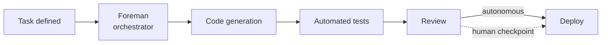

## Русская версия

# Vercel Labs представляет Foreman — шаблон "eve Software Factory"

В сегодняшних трендах GitHub — [eve-software-factory-template](https://github.com/vercel-labs/eve-software-factory-template) от Vercel Labs, набравший 983 звезды всего за короткое время. Официальное описание репозитория лаконично: «Meet Foreman, an eve Software Factory» — «Знакомьтесь, Foreman, eve Software Factory». Само название говорит о многом: «Foreman» (прораб, бригадир) — это не просто ещё один кодинг-ассистент, а метафора управляющего слоя, который координирует работу над проектом, а не просто пишет отдельные строки кода по запросу.

Термин «Software Factory» в последний год стал модным ярлыком: им называют системы, где не один агент пишет код по запросу человека, а целый конвейер — планирование задач, генерация кода, тестирование, ревью и деплой — организован так, чтобы работать с минимальным участием человека на каждом шаге. То, что именно Vercel — компания, стоящая за Next.js и одноимённой платформой деплоя, — выкатывает такой шаблон под своим экспериментальным брендом Labs, важно: это не игрушка энтузиаста, а сигнал от инфраструктурного вендора о том, куда, по его мнению, движется индустрия разработки.

Слово «template» в названии репозитория тоже показательно: это не готовый сервис, а стартовая точка — код, который разработчики форкают и адаптируют под себя, а не подключают как SaaS. Такой подход типичен для Vercel: они регулярно публикуют шаблоны (Next.js starter kits, AI SDK templates), которые задают паттерн, а дальше сообщество достраивает вокруг него.

Почти тысяча звёзд за считаные дни — довольно быстрый темп для инфраструктурного шаблона, а не готового продукта. Это говорит о том, что тема «агент-оркестратор для целого пайплайна разработки», а не просто «автокомплит в редакторе», сейчас в фокусе внимания разработчиков.

### Почему вам это важно

Если вы присматриваетесь к автономным конвейерам разработки — не единичному code-review-боту, а системе, которая сама решает, что делать дальше в цепочке «задача → код → тест → деплой», — [шаблон Foreman](https://github.com/vercel-labs/eve-software-factory-template) стоит изучить как референс того, как один из крупных инфраструктурных вендоров видит архитектуру такого конвейера. Отдельный вопрос, который стоит задать себе заранее: на каком именно шаге в этой цепочке — коммит, тесты, деплой — «прораб» действует автономно, а где обязательно должен остановиться и дождаться человека.

## English version

# Vercel Labs introduces Foreman — the "eve Software Factory" template

Trending on GitHub today is [eve-software-factory-template](https://github.com/vercel-labs/eve-software-factory-template) from Vercel Labs, already at 983 stars in a short window. The repo's own description is terse: "Meet Foreman, an eve Software Factory." The name itself says a lot — "Foreman" isn't just another coding assistant, it's a metaphor for a coordinating layer that manages work across a project rather than just writing individual lines of code on request.

"Software Factory" has become a trendy label over the past year: it describes systems where, instead of one agent writing code on a human's prompt, an entire pipeline — task planning, code generation, testing, review, and deployment — is organized to run with minimal human involvement at each step. That it's specifically Vercel — the company behind Next.js and its namesake deployment platform — shipping this template under its experimental Labs brand matters: this isn't a hobbyist toy, it's a signal from an infrastructure vendor about where it thinks the software development industry is headed.

The word "template" in the repo name is also telling: this isn't a finished hosted service, it's a starting point — code developers fork and adapt to their own needs, not something you subscribe to as SaaS. That's typical of how Vercel operates: it regularly ships templates (Next.js starter kits, AI SDK templates) that establish a pattern the community then builds around.

Nearly a thousand stars in a matter of days is a fast pace for an infrastructure template rather than a finished product. It suggests developer attention right now is on "an agent-orchestrator for an entire dev pipeline," not just "autocomplete in the editor."

### Why it matters

If you're evaluating autonomous development pipelines — not a single code-review bot, but a system that decides on its own what happens next across "task → code → test → deploy" — the [Foreman template](https://github.com/vercel-labs/eve-software-factory-template) is worth studying as a reference for how one of the larger infrastructure vendors thinks about that pipeline's architecture. One question worth asking up front: at exactly which step in that chain — commit, test, deploy — does the "foreman" act autonomously, and where does it have to stop and wait for a human.

