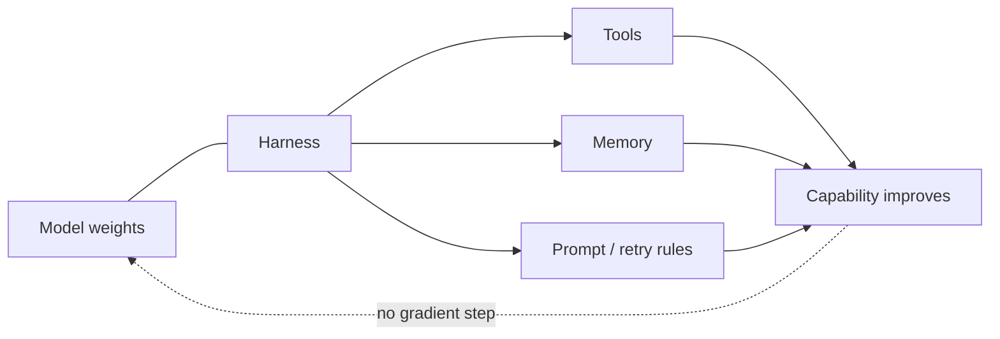

## Русская версия

# Lilian Weng о "harness engineering" для самоулучшающихся систем

В сегодняшнем дайджесте — новый пост Лилиан Вэн (Lilian Weng), одного из самых цитируемых блогеров в области ИИ-исследований, бывшего руководителя направления safety systems в OpenAI: [«Harness Engineering for Self-Improvement»](https://lilianweng.github.io/posts/2026-07-04-harness/). Само название — точная формулировка того, о чём в последний год всё чаще спорят инженеры агентных систем: «harness» (обвязка, каркас) — это не сама модель, а всё, что вокруг неё — инструменты, память, правила вызова функций, песочница, в которой она действует. Тезис в самом заголовке в том, что именно эта обвязка, а не только веса модели, становится ключевым рычагом для того, чтобы система улучшала сама себя.

Это принципиальный сдвиг фокуса. Годами разговор про «самоулучшение ИИ» шёл в терминах переобучения весов: дистилляция, RL с самостоятельно сгенерированными данными, синтетические курсы обучения. «Harness engineering» смещает акцент на другой рычаг: если агент может редактировать собственные инструменты, память, промпты и правила ретраев — он способен становиться эффективнее без единого шага градиентного спуска. Это перекликается с темой, которая всплывает в сегодняшнем дайджесте и в другом месте: препринт [«AI4AI-Bench»](http://arxiv.org/abs/2608.20318v1) прямо ставит вопрос, может ли ИИ-система улучшать сам процесс, который производит ИИ-системы — то есть тренировочный алгоритм, а не только конкретную модель. Харнесс-инжиниринг — это тот же вопрос, но на уровне инфраструктуры вокруг уже развёрнутого агента, а не на уровне обучающего пайплайна.

Практическая ценность такой рамки в том, что она даёт словарь для вещей, которые инженеры и так уже делают интуитивно: агент, который сам пишет себе заметки в файл памяти, который сам решает, когда вызвать конкретный инструмент, который сам корректирует свой системный промпт по итогам неудачной попытки — всё это примеры «self-improvement через harness», а не через веса.

### Почему вам это важно

Если вы строите агентную систему и упёрлись в потолок качества, стоит задать вопрос не «нужно ли дообучать модель», а «что можно улучшить в обвязке вокруг неё» — набор инструментов, формат памяти, структура промпта, правила эскалации к человеку. [Пост Лилиан Вэн](https://lilianweng.github.io/posts/2026-07-04-harness/) — хороший повод посмотреть на харнесс не как на техническую деталь реализации, а как на самостоятельный объект дизайна, который можно итеративно улучшать отдельно от самой модели — и часто дешевле и быстрее, чем переобучение.

## English version

# Lilian Weng on "harness engineering" for self-improving systems

Today's digest includes a new post by Lilian Weng, one of the most widely cited voices in AI research and former head of safety systems at OpenAI: [Harness Engineering for Self-Improvement](https://lilianweng.github.io/posts/2026-07-04-harness/). The title itself captures something agentic-systems engineers have been arguing about more and more this past year: the "harness" isn't the model — it's everything around it: tools, memory, function-calling rules, the sandbox the model acts inside. The framing implies that this surrounding scaffolding, not just the model's weights, is becoming the key lever for a system to improve itself.

That's a real shift in focus. For years, "AI self-improvement" was discussed almost entirely in terms of retraining weights: distillation, RL on self-generated data, synthetic training curricula. "Harness engineering" points at a different lever: if an agent can edit its own tools, memory, prompts, and retry logic, it can get more capable without a single step of gradient descent. That echoes a theme surfacing elsewhere in today's digest too — the preprint [AI4AI-Bench](http://arxiv.org/abs/2608.20318v1) directly asks whether an AI system can improve the process that produces AI systems, meaning the training algorithm itself, not just one model. Harness engineering is the same underlying question, but applied to the infrastructure around an already-deployed agent rather than the training pipeline.

The practical value of this framing is that it gives a name to things engineers already do intuitively: an agent that writes its own notes into a memory file, that decides on its own when to invoke a particular tool, that adjusts its own system prompt after a failed attempt — all of these are examples of "self-improvement through the harness," not through the weights.

### Why it matters

If you're building an agentic system and have hit a quality ceiling, the question worth asking isn't only "should we fine-tune the model" but "what can we improve in the scaffolding around it" — the tool set, the memory format, the prompt structure, the rules for escalating to a human. [Weng's post](https://lilianweng.github.io/posts/2026-07-04-harness/) is a good prompt to treat the harness not as an implementation detail but as its own design object — one you can iterate on separately from the model itself, often more cheaply and faster than retraining.

