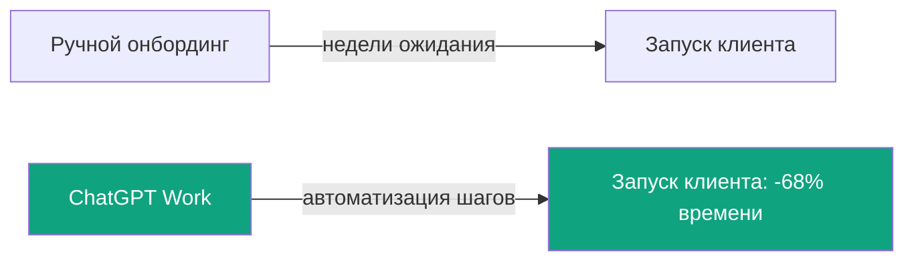

## Русская версия

# Stampli сократила запуск на 68% с ChatGPT Work — но что это значит для остальных

OpenAI опубликовал [кейс о финтех-компании Stampli](https://openai.com/index/stampli), которая, по заявлению поста, сократила время запуска новых клиентов на 68% с помощью ChatGPT Work — корпоративного тарифа ChatGPT, заточенного под автоматизацию внутренних процессов компаний. Stampli — платформа для автоматизации кредиторской задолженности (accounts payable), и «запуск клиента» здесь означает весь цикл онбординга: настройку интеграций, перенос данных, обучение сотрудников заказчика работе с системой.

Кейсы такого рода — это классический маркетинговый жанр вендора: реальная компания, реальная метрика, но метрика выбрана и посчитана самим вендором (или в тесном сотрудничестве с ним), а методология измерения обычно остаётся за кадром. 68% — это заметное число, но заметное не значит проверяемое: непонятно, что именно считалось «временем запуска» до автоматизации и после, сколько клиентов вошло в выборку и сравнивался ли этот показатель с тем, что уже давало Stampli до появления ChatGPT Work в их процессе.

Что при этом реально интересно — это не сама цифра, а класс задачи. Онбординг B2B-клиента — это последовательность структурированных, но разнородных шагов: собрать данные из разных форматов, сопоставить их со схемой продукта, сгенерировать документацию под конкретного клиента, ответить на типовые вопросы во время внедрения. Это ровно тот тип работы, где LLM-агент избавляет не столько от «думания», сколько от переключения контекста между десятком мелких, рутинных подзадач — а именно переключение контекста, а не сама задача, чаще всего и съедает время у человека.

### Почему вам это важно

Если у вас в компании есть похожий процесс — воронка, состоящая из десятка мелких ручных шагов между «клиент подписал контракт» и «клиент реально работает в системе», — [кейс Stampli](https://openai.com/index/stampli) стоит читать не как готовый рецепт, а как наводку на то, где искать. Прежде чем закладывать в план похожие 68%, посчитайте свою базовую линию сами: сколько сейчас реально уходит времени на онбординг, на каком именно шаге, и какая часть этого шага действительно текстовая/структурная работа, которую можно делегировать модели, а какая требует человеческого решения, которое автоматизировать нельзя.

## English version

# Stampli cut launch time by 68% with ChatGPT Work — what that actually tells the rest of us

OpenAI published a [case study on Stampli](https://openai.com/index/stampli), a fintech company that, per the post, cut new-customer launch time by 68% using ChatGPT Work — OpenAI's enterprise ChatGPT tier built for automating internal company processes. Stampli builds accounts-payable automation software, and "launch" here covers the full onboarding cycle: setting up integrations, migrating data, and training a customer's staff on the system.

Case studies like this are a familiar vendor-marketing genre: a real company, a real number, but a metric chosen and computed by the vendor itself (or closely with it), with the measurement methodology left out. 68% is a striking figure, but striking isn't the same as verifiable — it's unclear exactly what counted as "launch time" before and after, how many customers were in the sample, or whether this was benchmarked against Stampli's own pre-ChatGPT-Work baseline.

What's actually interesting here isn't the number itself but the class of task. B2B customer onboarding is a sequence of structured but varied steps: pulling data from different formats, mapping it to the product's schema, generating customer-specific documentation, answering routine questions during rollout. That's exactly the kind of work where an LLM agent saves less on "thinking" and more on context-switching between a dozen small, repetitive subtasks — and it's usually the context-switching, not the task itself, that eats a person's time.

### Why it matters

If your company has a similar process — a funnel made of a dozen small manual steps between "customer signed" and "customer is actually live" — the [Stampli case study](https://openai.com/index/stampli) is worth reading as a pointer to where to look, not a ready-made recipe. Before penciling in a similar 68%, measure your own baseline first: how much time onboarding actually takes today, at which specific step, and how much of that step is genuinely text/structural work you can hand to a model versus a human judgment call that can't be automated away.
