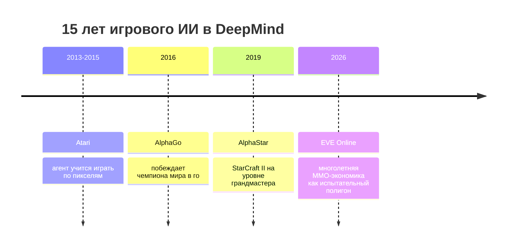

## Русская версия

# От Atari до EVE Online: DeepMind подводит итог 15 годам ИИ в играх

DeepMind опубликовал [ретроспективный пост](https://deepmind.google/blog/from-atari-to-eve-online-building-on-15-years-of-ai-research-in-games/) о пятнадцати годах исследований ИИ в играх — от первых агентов, обучавшихся играть в Atari по сырым пикселям, через AlphaGo и AlphaStar, до текущей работы с EVE Online, многолетней MMO с игровой экономикой, которую годами строят сами игроки. Формально это юбилейный пост, но за ним стоит вполне конкретная логика: игры для DeepMind никогда не были развлечением, а были последовательностью всё более сложных полигонов для обучения агентов действовать в неопределённости.

Ход эволюции показателен. Atari — это чистая среда с фиксированными правилами и понятной наградой (очки). Go и StarCraft — уже игры с огромным пространством решений и противником, но всё ещё закрытые системы с фиксированными правилами. EVE Online — качественно другой класс задачи: живая экономика, которую тысячи реальных игроков перестраивают годами, где нет единственно верной стратегии и где поведение среды меняется из-за решений других агентов-людей. Это гораздо ближе к тому, с чем сталкивается любой реальный ИИ-агент за пределами игровой лаборатории: открытый мир, где правила не зафиксированы заранее и где нужно постоянно адаптироваться к действиям других участников.

Стоит отделять ностальгический тон поста от практической ценности материала: DeepMind рассказывает историю, но за каждым шагом — Atari, AlphaGo, AlphaStar, EVE Online — стоит конкретный набор технических проблем, который решался: exploration в разреженном reward, self-play против самого себя, multi-agent координация, работа в среде с открытым концом и без явного финала эпизода. Этот прогресс — не просто хроника побед, а карта того, какие типы сред индустрия последовательно осваивала, прежде чем переходить к агентам, работающим в реальном мире.

### Почему вам это важно

Если вы проектируете eval-среду или тренировочный полигон для собственного агента — вне зависимости от того, игра это или нет, — [пост DeepMind](https://deepmind.google/blog/from-atari-to-eve-online-building-on-15-years-of-ai-research-in-games/) стоит читать как чек-лист вопросов: закрыта ли ваша среда или открыта, единственный ли в ней агент или несколько, конечен эпизод или бесконечен, и — самое важное — насколько среда, в которой вы тестируете агента, действительно похожа на ту, в которой он в итоге будет работать.

## English version

# From Atari to EVE Online: DeepMind looks back on 15 years of game AI research

DeepMind published a [retrospective post](https://deepmind.google/blog/from-atari-to-eve-online-building-on-15-years-of-ai-research-in-games/) covering fifteen years of AI-in-games research — from early agents learning to play Atari from raw pixels, through AlphaGo and AlphaStar, to current work with EVE Online, a years-old MMO whose economy is built by its own players over time. Nominally it's an anniversary piece, but there's a concrete thread behind it: for DeepMind, games were never entertainment — they were a sequence of increasingly hard testbeds for training agents to act under uncertainty.

The progression is telling. Atari is a clean environment with fixed rules and a legible reward (score). Go and StarCraft already have vast decision spaces and an opponent, but they're still closed systems with fixed rules. EVE Online is a qualitatively different class of problem: a living economy that thousands of real players reshape over years, with no single correct strategy, where the environment's behavior shifts because of decisions made by other human agents. That's much closer to what any real-world AI agent runs into outside a game lab: an open world where the rules aren't fixed in advance and constant adaptation to other participants' actions is required.

It's worth separating the post's nostalgic tone from its practical value: DeepMind is telling a story, but behind every step — Atari, AlphaGo, AlphaStar, EVE Online — sits a concrete set of technical problems being solved: exploration under sparse reward, self-play, multi-agent coordination, operating in an environment with no explicit episode boundary. That progression is less a highlight reel of wins and more a map of the environment classes the field worked through, in order, before moving toward agents that operate in the real world.

### Why it matters

If you're designing an eval environment or a training ground for your own agent — game or not — [DeepMind's post](https://deepmind.google/blog/from-atari-to-eve-online-building-on-15-years-of-ai-research-in-games/) is worth reading as a checklist of questions: is your environment closed or open, single-agent or multi-agent, does the episode ever end, and — most importantly — how closely does the environment you're testing the agent in actually resemble the one it will end up operating in.
