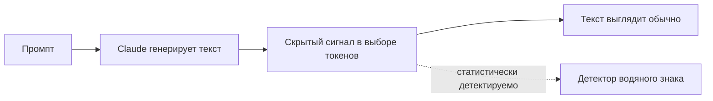
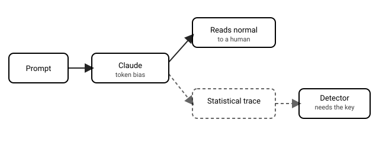

## Русская версия

# Как Claude маркирует сгенерированный текст: разбор Себастьяна Рашки

Себастьян Рашка — один из самых известных независимых авторов, объясняющих внутреннее устройство LLM без маркетингового шума, — опубликовал [разбор того, как Claude маркирует сгенерированный текст водяными знаками](https://magazine.sebastianraschka.com/p/claude-watermarking). Сама тема не новая: идея текстового watermarking для LLM обсуждается индустрией уже пару лет — обычно речь идёт о статистическом сдвиге в том, какие токены модель предпочитает на каждом шаге генерации, сдвиге незаметном человеку на глаз, но детектируемом специальным алгоритмом, который знает секретный ключ или паттерн.

Разберём честно, что мы можем сказать по заголовку и месту публикации, а что — нет. Рашка пишет для аудитории инженеров и исследователей, и его материалы обычно идут глубже пресс-релиза: разбирают, как техника работает на уровне механизма, какие у неё границы применимости и где она ломается. Учитывая эту репутацию, разумно ожидать, что пост не ограничивается «Anthropic заявляет X», а пытается объяснить принцип на уровне «как это можно было бы реализовать и почему это сложно сделать надёжно».

А сложность здесь реальная. Watermarking текста — это не то же самое, что watermarking изображений: текст короткий, его легко перефразировать, перевести на другой язык, пропустить через другую модель — и любое из этих действий потенциально разрушает статистический сигнал. Вопрос, который стоит держать в голове при чтении разбора: что происходит с водяным знаком, если сгенерированный текст отредактировать вручную, перевести или скормить другой модели для «рерайта» — и насколько вообще устойчив подобный механизм к таким прозаичным, не злонамеренным действиям, которые люди совершают с текстом каждый день.

### Почему вам это важно

Если вы думаете о происхождении (provenance) контента — будь то как разработчик, которому нужно понимать, что можно, а что нельзя гарантировать про AI-контент в своём продукте, или как читатель, которому интересно, насколько вообще реалистична идея «отличить текст ИИ от текста человека» — [разбор Рашки](https://magazine.sebastianraschka.com/p/claude-watermarking) стоит прочитать целиком, а не по заголовку: техническая устойчивость watermarking-схем — это именно тот случай, где детали механизма решают всё, а общие обещания вендора значат немного.

## English version

# How Claude watermarks generated text: Sebastian Raschka's breakdown

Sebastian Raschka — one of the best-known independent writers explaining how LLMs actually work under the hood, without the marketing gloss — published a [breakdown of how Claude watermarks generated text](https://magazine.sebastianraschka.com/p/claude-watermarking). The topic itself isn't new: the industry has been discussing text watermarking for LLMs for a couple of years now — typically it comes down to a statistical bias in which tokens the model prefers at each generation step, a bias invisible to a human reader but detectable by an algorithm that knows the secret key or pattern.

Let's be honest about what we can say from the title and venue alone versus what we can't. Raschka writes for an audience of engineers and researchers, and his pieces usually go deeper than a press release — breaking a technique down at the mechanism level, covering its limits, and where it breaks. Given that track record, it's reasonable to expect this post doesn't stop at "Anthropic claims X" but tries to explain the principle at the level of "here's roughly how you'd implement this, and here's why doing it reliably is hard."

And the difficulty here is real. Text watermarking isn't like image watermarking: text is short, easy to paraphrase, translate into another language, or run through another model — and any of those can potentially destroy the statistical signal. A question worth keeping in mind while reading the piece: what happens to the watermark if the generated text gets manually edited, translated, or fed to another model for a "rewrite" — and how robust is such a mechanism, really, to those mundane, non-malicious things people do with text every day.

### Why it matters

If you think about content provenance — whether as a developer who needs to understand what you can and can't actually guarantee about AI content in your product, or as a reader curious how realistic the idea of "telling AI text from human text" even is — [Raschka's breakdown](https://magazine.sebastianraschka.com/p/claude-watermarking) is worth reading in full rather than by headline: the technical robustness of watermarking schemes is exactly the kind of thing where mechanism details decide everything, and a vendor's general promises don't count for much.
