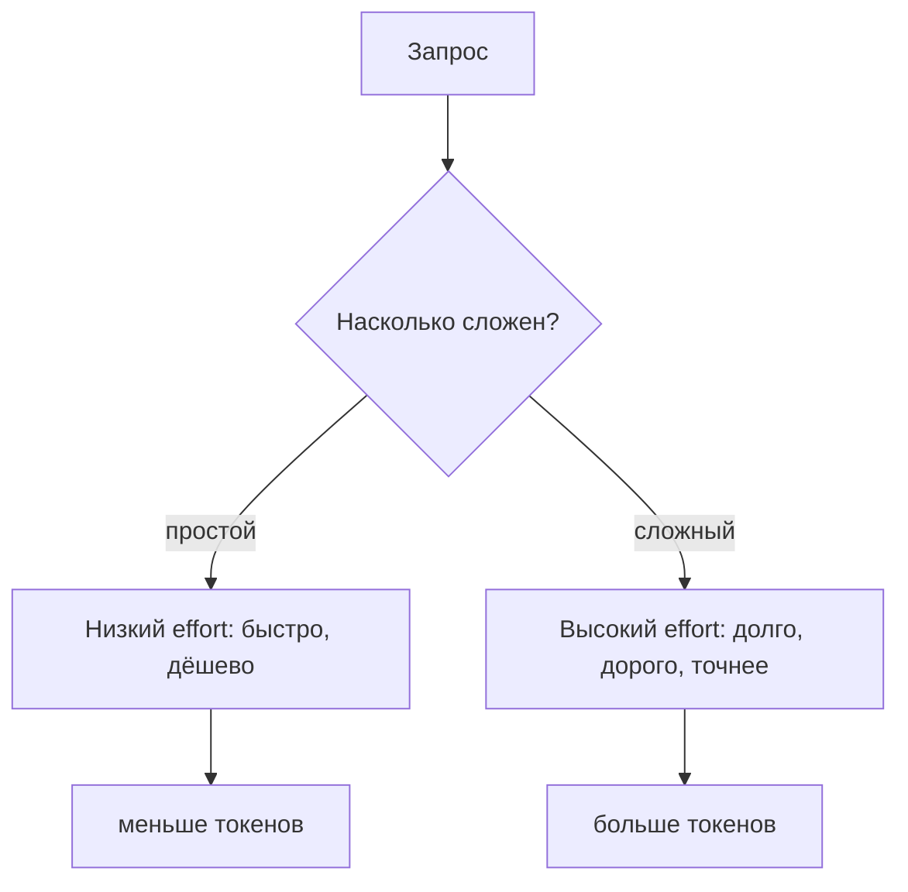

## Русская версия

# Управление reasoning effort в LLM: разбор Себастьяна Рашки

Себастьян Рашка опубликовал [материал о том, как управлять «усилием рассуждения» (reasoning effort) в современных LLM](https://magazine.sebastianraschka.com/p/controlling-reasoning-effort-in-llms). Тема на самом деле очень практическая: большинство reasoning-моделей последнего поколения — от OpenAI до Anthropic и Google — дают разработчику параметр, которым можно регулировать, сколько «внутренних размышлений» модель тратит на ответ, прежде чем выдать финальный текст. Больше размышлений — как правило, точнее ответ на сложных задачах, но и дороже, и медленнее.

Как и в случае с постом того же автора про watermarking, стоит быть честным: заголовок и площадка публикации говорят нам про формат и уровень (глубокий технический разбор для практикующих инженеров), но не про конкретные цифры и выводы внутри — их можно узнать только прочитав материал целиком. Что можно сказать с уверенностью — это про саму проблему, которую решает управление reasoning effort: «усилие» — это не бинарный переключатель «думать или не думать», а континуум, и задача разработчика — найти точку на этом континууме, где качество ответа для конкретного класса задач уже достаточное, а деньги и время ещё не тратятся впустую.

Это прямое продолжение темы роутинга моделей, которая уже не первый день всплывает в новостях: если у вас агентная система с десятками вызовов модели на одну пользовательскую сессию, вопрос «сколько reasoning effort выделить именно этому шагу» становится не менее важным архитектурным решением, чем выбор самой модели. Слишком низкий effort на сложном шаге — ошибки. Слишком высокий effort на тривиальном — сожжённый бюджет и задержка, которую пользователь не просил.

### Почему вам это важно

Если вы строите продукт поверх reasoning-моделей и платите за токены размышлений — [разбор Рашки](https://magazine.sebastianraschka.com/p/controlling-reasoning-effort-in-llms) стоит прочитать не как теорию, а как повод пересчитать собственный pipeline: есть ли у вас сейчас единый reasoning effort на все типы запросов, и если да — сколько денег вы, вероятно, теряете на том, что тривиальные запросы думают так же долго, как сложные, вместо того чтобы effort выбирался под конкретный шаг задачи.

## English version

# Controlling reasoning effort in LLMs: Sebastian Raschka's breakdown

Sebastian Raschka published a [piece on controlling "reasoning effort" in modern LLMs](https://magazine.sebastianraschka.com/p/controlling-reasoning-effort-in-llms). It's a genuinely practical topic: most recent-generation reasoning models — from OpenAI to Anthropic to Google — expose a parameter developers can use to control how much "internal thinking" the model spends before producing a final answer. More thinking generally means a more accurate answer on hard problems, but also more expensive and slower.

As with the same author's watermarking post, it's worth being upfront: the title and venue tell us about the format and level — a deep technical breakdown for practicing engineers — but not the specific numbers and conclusions inside, which you can only get from reading the piece itself. What we can say with confidence is about the underlying problem reasoning-effort controls solve: "effort" isn't a binary think-or-don't-think switch, it's a continuum, and the developer's job is finding the point on that continuum where answer quality for a given task class is already good enough, without wasting money and time going further.

This connects directly to the model-routing theme that's been surfacing in the news lately: if you're running an agentic system with dozens of model calls per user session, "how much reasoning effort to give this particular step" becomes just as important an architecture decision as which model to call. Too little effort on a hard step means errors. Too much effort on a trivial one means burned budget and latency the user never asked for.

### Why it matters

If you're building a product on top of reasoning models and paying for thinking tokens, [Raschka's breakdown](https://magazine.sebastianraschka.com/p/controlling-reasoning-effort-in-llms) is worth reading not as theory but as a prompt to re-examine your own pipeline: do you currently use one fixed reasoning effort across all request types, and if so, how much money are you probably losing to trivial requests thinking just as long as hard ones, instead of setting effort per step of the task.
