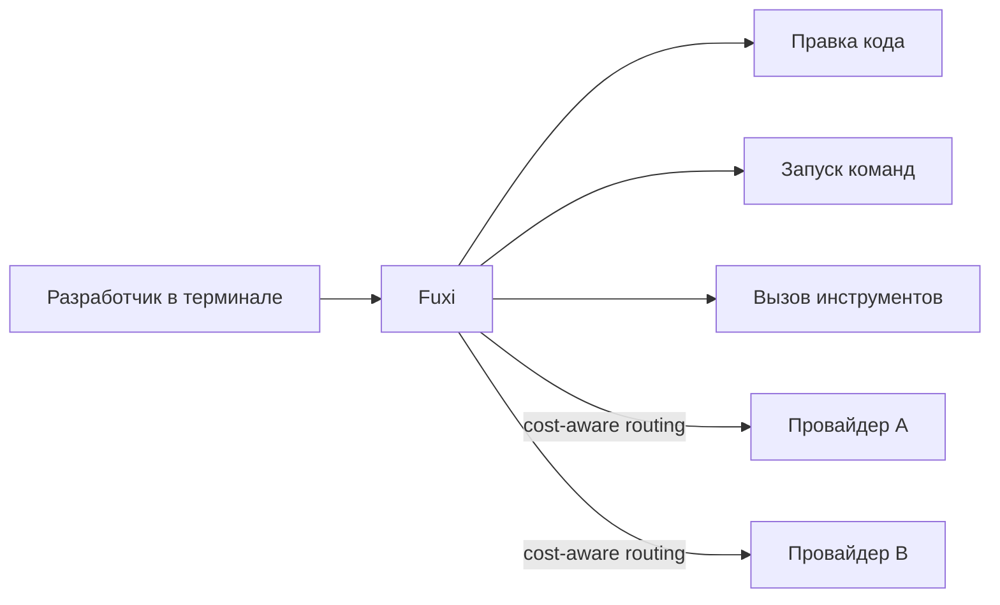

## Русская версия

# Fuxi: ещё один терминальный кодинг-агент, но со ставкой на cost-aware роутинг

В трендах GitHub — [Fuxi](https://github.com/fuxicodex/Fuxi), набравший 1702 звезды. Собственное описание репозитория лаконично: «быстрый, самодостаточный ИИ-кодинг-агент, который живёт в вашем терминале — редактирует код, запускает команды и управляет инструментами, с cost-aware роутингом между провайдерами LLM». По сути, это ещё один представитель уже переполненной категории терминальных кодинг-агентов, которая за последний год выросла из нишевого инструмента для энтузиастов в полноценный рыночный сегмент с десятками конкурирующих проектов.

В этой толпе выделяться названием функций уже не получается — редактирование кода, запуск shell-команд, вызов инструментов есть почти у всех. А вот заявленный «cost-aware routing across LLM providers» — уже конкретная архитектурная деталь, а не просто маркетинговая формулировка. Это означает, что Fuxi не привязан к одному вендору моделей: он умеет — по крайней мере, по заявлению — выбирать, какому провайдеру отправить конкретный запрос, ориентируясь в том числе на стоимость. Это прямое следствие рыночной реальности: цены на инференс у разных вендоров расходятся в разы, и агент, который может гонять рутинные шаги через дешёвую модель, а сложные — через дорогую, экономит реальные деньги на масштабе.

Стоит сохранять здоровый скептицизм по умолчанию для любого нового кодинг-агента с звёздами на GitHub: звёзды — это не тест на надёжность, а показатель заметности среди разработчиков, обычно всплеск в первые дни после публикации в правильном месте (Hacker News, X, профильные чаты). Настоящая проверка — насколько роутинг реально «cost-aware» на практике: учитывает ли он не только прайс-лист, но и то, что дешёвая модель может ошибиться там, где нужна дорогая, и переделка стоит дороже сэкономленного.

### Почему вам это важно

Если вы уже пользуетесь одним из терминальных кодинг-агентов и присматриваетесь к альтернативам, [Fuxi](https://github.com/fuxicodex/Fuxi) стоит взять на пробу именно ради заявленного мультипровайдерного роутинга — но не как решение вслепую, а с собственным замером: сравните стоимость и качество выполнения одной и той же задачи на вашем реальном коде через Fuxi и через тот инструмент, которым вы пользуетесь сейчас, прежде чем менять привычный workflow.

## English version

# Fuxi: another terminal coding agent, this time betting on cost-aware routing

Trending on GitHub is [Fuxi](https://github.com/fuxicodex/Fuxi), currently at 1,702 stars. The repo's own description is terse: "a fast, self-contained AI coding agent that lives in your terminal — edit code, run commands, and drive tools, with cost-aware routing across LLM providers." At its core, it's another entry in the already-crowded category of terminal coding agents, which over the past year has grown from a niche enthusiast tool into a full market segment with dozens of competing projects.

Standing out in that crowd by feature name alone is no longer possible — editing code, running shell commands, calling tools are table stakes at this point. What's actually a specific architectural detail rather than a marketing line is the claimed "cost-aware routing across LLM providers." That means Fuxi isn't locked to a single model vendor: it can, at least by its own claim, decide which provider to route a given request to based partly on cost. That's a direct response to market reality — inference pricing varies wildly across vendors, and an agent that can push routine steps through a cheap model while reserving an expensive one for harder ones saves real money at scale.

Healthy default skepticism applies to any new coding agent with GitHub stars: star count isn't a reliability test, it's a proxy for visibility among developers, usually a spike in the first days after landing on the right platform (Hacker News, X, dev chats). The real test is how "cost-aware" the routing actually is in practice — whether it accounts for more than a price sheet, since a cheap model failing where an expensive one was needed can cost more in rework than it saved.

### Why it matters

If you're already using one of the terminal coding agents and eyeing alternatives, [Fuxi](https://github.com/fuxicodex/Fuxi) is worth a trial specifically for the claimed multi-provider routing — but not as a blind swap: benchmark cost and output quality on the same real task in your own codebase, comparing Fuxi against whatever tool you currently use, before changing your daily workflow.
