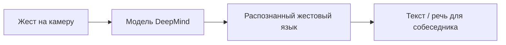

## Русская версия

# DeepMind отдаёт распознавание жестового языка в руки пользователей

DeepMind опубликовал [пост о доведении технологии распознавания жестового языка до конечных пользователей](https://deepmind.google/blog/putting-sign-language-ai-into-users-hands/). Формат публикации — блог о продуктовом/исследовательском применении, а не пресс-релиз о новой модели с бенчмарками, поэтому будем честны: заголовок и площадка говорят нам про направление и аудиторию (accessibility-технологии, доведённые от лабораторного прототипа до чего-то, чем реально можно пользоваться), а конкретные технические детали — какой язык жестов, какая точность, какое устройство — можно узнать только из самого текста.

Распознавание жестового языка — заметно более сложная задача, чем может показаться человеку, незнакомому с темой. Это не просто «распознать жест» как отдельный статичный символ: жестовые языки — полноценные естественные языки со своей грамматикой, где значение зависит от последовательности движений, мимики, положения тела и скорости — контекст здесь так же важен, как порядок слов в обычном языке. Именно поэтому прогресс в этой области годами шёл медленнее, чем в распознавании речи или текста: данных меньше, вариативность выше, а cost ошибки для пользователя — выше, чем for автокоррекции в мессенджере.

То, что DeepMind описывает переход именно как «putting AI into users' hands» — не «мы обучили модель», а «мы довели её до рук пользователей» — само по себе значимый сигнал: это язык про инженерию продукта и доступность (accessibility), а не про очередной рекорд на бенчмарке. Для accessibility-технологий именно этот переход — от лабораторного прототипа к рабочему инструменту, которым можно пользоваться каждый день, — обычно и есть самая трудная часть, а не первоначальное исследование.

### Почему вам это важно

Если вы работаете над accessibility-продуктами или просто интересуетесь тем, как задачи с высокой контекстной зависимостью (жест, мимика, интонация) решаются мультимодальными моделями, — [пост DeepMind](https://deepmind.google/blog/putting-sign-language-ai-into-users-hands/) стоит прочитать как пример того, что путь от исследовательского прорыва до реального продукта для конкретного сообщества пользователей часто занимает годы и требует совершенно другого набора компетенций, чем обучение самой модели.

## English version

# DeepMind puts sign language AI into users' hands

DeepMind published a [post about bringing sign language recognition technology to end users](https://deepmind.google/blog/putting-sign-language-ai-into-users-hands/). The format is a product/research-application blog post, not a press release with benchmarks for a new model, so let's be upfront: the title and venue tell us the direction and audience — accessibility technology moving from a lab prototype to something people can actually use — while the specific technical details (which sign language, what accuracy, what device) can only come from reading the piece itself.

Sign language recognition is a noticeably harder problem than it might look to someone unfamiliar with the space. It's not just "recognize a gesture" as an isolated static symbol: sign languages are full natural languages with their own grammar, where meaning depends on a sequence of movements, facial expression, body position, and speed — context matters here just as much as word order does in spoken language. That's exactly why progress in this area has moved more slowly than in speech or text recognition for years: less data, more variability, and a higher cost of error for the user than an autocorrect mistake in a messaging app.

The fact that DeepMind frames this as "putting AI into users' hands" rather than "we trained a model" is itself a meaningful signal: it's the language of product engineering and accessibility, not another benchmark record. For accessibility technology, that transition — from lab prototype to a tool people can rely on every day — is usually the hardest part, not the initial research.

### Why it matters

If you work on accessibility products, or you're just interested in how highly context-dependent tasks (gesture, facial expression, timing) get tackled by multimodal models, [DeepMind's post](https://deepmind.google/blog/putting-sign-language-ai-into-users-hands/) is worth reading as an example of how the path from a research breakthrough to a real product for a specific user community often takes years and demands a completely different set of skills than training the model itself.
