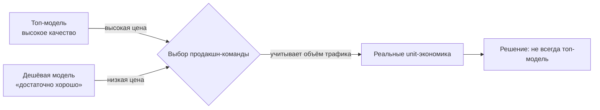

## Русская версия

# Лучшая модель — не значит популярная модель: урок для Anthropic

Саймон Уиллисон [обратил внимание](https://simonwillison.net/2026/Aug/23/anthropics-best-ai-model-struggles-to-attract-users-as-cheaper-t/) на аргумент, который в последнее время звучит в индустрии всё громче: флагманская модель Anthropic, при всём её техническом превосходстве, с трудом наращивает пользовательскую базу — на фоне того, как более дешёвые инструменты продолжают набирать обороты. Заголовок жёсткий, и стоит сразу проговорить: это не заявление самой Anthropic и не независимо проверенная статистика, а тезис, который обсуждается в сообществе и который Уиллисон посчитал достаточно интересным, чтобы процитировать.

И всё же логика за этим тезисом заслуживает разбора, потому что она бьёт по одному из самых устойчивых мифов индустрии: «лучшая модель по бенчмаркам = лучший бизнес». На практике эти две вещи связаны намного слабее, чем кажется. Бенчмарки меряют то, что легко измерить — качество кода, математику, рассуждение на кураторских датасетах. Решение о том, какую модель включить в продакшн, принимается по совершенно другому набору критериев: цена за токен при реальном объёме трафика, задержка, стабильность API, и — что часто недооценивают — просто «достаточно ли хорошо», чтобы не тратить время на миграцию с уже работающего решения.

Именно здесь и рождается ловушка для лидера по качеству. Если топовая модель стоит в разы дороже конкурентов, а разница в качестве для конкретной задачи заметна только на грани — скажем, между 94% и 96% точности — то для большинства коммерческих сценариев экономически рациональнее взять модель подешевле и оптимизировать промпт, чем платить премию за последние проценты. Это ровно то давление, о котором говорит цитируемый Уиллисоном тезис: конкуренты снизу — открытые модели, более дешёвые API-тиры от тех же вендоров, узкоспециализированные модели — отъедают долю рынка не потому, что они лучше, а потому что они «достаточно хороши» за меньшие деньги.

Стоит быть скептичным и в другую сторону: подобные заголовки легко превращаются в инфоповод сами по себе, независимо от того, насколько они отражают реальную динамику компании. «Топовая модель теряет пользователей» — это цепляющая рамка, которая продаётся лучше, чем нюансированный разбор сегментации рынка по типам задач. Прежде чем делать выводы о судьбе конкретного вендора, стоит спросить: о каком именно сегменте пользователей речь — массовый потребительский чат или энтерпрайз-контракты с высокой маржой? Это совершенно разные рынки с разной чувствительностью к цене.

### Почему вам это важно

Если вы выбираете модель для своего продукта, этот спор — хороший повод пересмотреть собственные критерии выбора. Вместо вопроса «какая модель топ в лидерборде» задайте себе вопрос «какая модель даёт приемлемое качество при моём реальном профиле нагрузки и по какой цене». [Тезис, который цитирует Уиллисон](https://simonwillison.net/2026/Aug/23/anthropics-best-ai-model-struggles-to-attract-users-as-cheaper-t/), в конечном счёте не про то, что топовые модели плохие — а про то, что рынок голосует деньгами не только за качество, но и за соотношение цены и «достаточности».

## English version

# Best model doesn't mean most-used model: a lesson for Anthropic

Simon Willison [flagged](https://simonwillison.net/2026/Aug/23/anthropics-best-ai-model-struggles-to-attract-users-as-cheaper-t/) an argument that's been getting louder in the industry lately: Anthropic's flagship model, for all its technical edge, is struggling to grow its user base while cheaper tools keep gaining ground. The headline is blunt, and it's worth saying up front: this isn't a statement from Anthropic itself or independently audited data — it's a thesis circulating in the community that Willison found worth quoting.

Still, the logic behind it deserves unpacking, because it cuts against one of the industry's most persistent myths: "best model on the benchmarks equals best business." In practice, those two things are far more loosely coupled than they seem. Benchmarks measure what's easy to measure — code quality, math, reasoning on curated datasets. The decision of which model to put in production runs on an entirely different set of criteria: cost per token at real traffic volume, latency, API stability, and — often underrated — whether it's simply "good enough" that migrating off an already-working setup isn't worth the effort.

That's exactly where the trap forms for a quality leader. If the top model costs several times more than competitors, and the quality gap for a specific task only shows up at the margin — say, between 94% and 96% accuracy — then for most commercial use cases it's economically rational to pick a cheaper model and optimize the prompt rather than pay a premium for the last few percentage points. That's the pressure the thesis Willison quotes is pointing at: challengers from below — open models, cheaper API tiers from the same vendors, narrowly specialized models — eat market share not because they're better, but because they're good enough for less money.

It's worth staying skeptical in the other direction too: headlines like this can become a story in their own right, regardless of how well they capture a company's actual trajectory. "Top model losing users" is a catchier frame than a nuanced breakdown of market segmentation by task type. Before drawing conclusions about any one vendor's fate, it's worth asking which user segment is actually being discussed — mass-market consumer chat, or high-margin enterprise contracts? Those are very different markets with very different price sensitivity.

### Why it matters

If you're choosing a model for your product, this debate is a good prompt to revisit your own selection criteria. Instead of asking "which model tops the leaderboard," ask "which model gives acceptable quality for my actual load profile, at what price." [The thesis Willison quotes](https://simonwillison.net/2026/Aug/23/anthropics-best-ai-model-struggles-to-attract-users-as-cheaper-t/) isn't ultimately about top models being bad — it's about the market voting with its wallet on price-to-sufficiency, not just raw quality.

