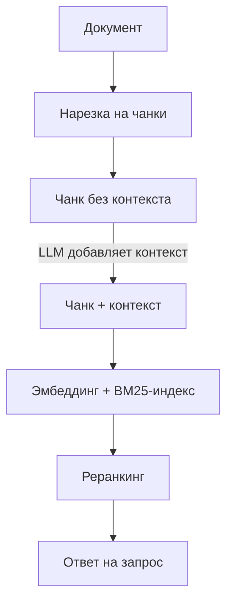

## Русская версия

# Contextual Retrieval от Anthropic: RAG ломается на нарезке чанков — вот почему

Ещё один инженерный пост Anthropic, который продолжает всплывать в лентах как обязательное чтение для всех, кто строит RAG-пайплайны — [«Introducing Contextual Retrieval»](https://www.anthropic.com/engineering/contextual-retrieval). Проблема, которую он разбирает, знакома каждому, кто хоть раз резал документы на чанки для эмбеддингов: отдельный кусок текста, вырванный из документа, часто теряет контекст, необходимый для того, чтобы его вообще можно было найти по релевантному запросу. Фраза «доход компании вырос на 3% по сравнению с прошлым кварталом» без указания, о какой компании и каком квартале речь, — бесполезна и для эмбеддинга, и для BM25-поиска по ключевым словам.

Решение, которое предлагает Anthropic, звучит обманчиво просто: перед тем как индексировать чанк, попросите LLM сгенерировать короткий, специфичный для этого куска контекст — буквально несколько предложений, объясняющих, откуда этот фрагмент и что он значит в рамках всего документа, — и приклейте этот контекст к чанку перед тем, как считать эмбеддинг и построить BM25-индекс. Метод так и называется — Contextual Embeddings + Contextual BM25. Дальше в пайплайн добавляется этап реранкинга, который дополнительно сортирует найденные кандидаты по релевантности перед тем, как отдать их модели.

Здесь стоит сохранять трезвость: сама Anthropic публикует эти цифры в собственном инженерном блоге, а значит, это не независимый бенчмарк, а результат, полученный на выбранной ими методологии и датасетах, оптимизированный, естественно, чтобы показать метод в выгодном свете. Это не делает метод плохим — идея «добавить контекст перед индексацией» логична и легко проверяется на собственных данных — но воспринимать заявленные улучшения как универсальную гарантию для любого корпуса документов не стоит. Насколько метод сработает у вас, зависит от структуры ваших документов: для однородных, хорошо структурированных текстов выигрыш может быть меньше, чем для разрозненных корпоративных вики с кучей implicit-контекста.

Отдельная практическая деталь, которую стоит учитывать: генерация контекста для каждого чанка через LLM — это дополнительный проход по всему корпусу документов при индексации, а значит, дополнительные вычисления и деньги на каждую переиндексацию. Anthropic предлагает использовать prompt caching, чтобы снизить эту стоимость, но сам факт затрат стоит закладывать в бюджет заранее, а не выяснять постфактум.

### Почему вам это важно

Если у вас RAG-система регулярно «не находит» очевидный ответ, который точно есть в базе знаний, [этот метод](https://www.anthropic.com/engineering/contextual-retrieval) — конкретный, воспроизводимый шаг для диагностики: проверьте, не потерял ли чанк контекст при нарезке. Прежде чем усложнять архитектуру ретривера, попробуйте самый дешёвый эксперимент — добавить контекстную аннотацию к чанкам на своих собственных данных и посмотреть, меняется ли качество поиска, вместо того чтобы сразу верить цифрам из чужого инженерного блога.

## English version

# Anthropic's Contextual Retrieval: RAG breaks at chunking — here's why

Another Anthropic engineering post that keeps resurfacing as required reading for anyone building RAG pipelines: [«Introducing Contextual Retrieval»](https://www.anthropic.com/engineering/contextual-retrieval). The problem it tackles is familiar to anyone who's ever chunked documents for embeddings: a standalone piece of text, pulled out of a document, often loses the context needed to actually be found by a relevant query. The sentence "the company's revenue grew 3% compared to the previous quarter," without specifying which company or which quarter, is useless both for embeddings and for keyword-based BM25 search.

The fix Anthropic proposes sounds deceptively simple: before indexing a chunk, ask an LLM to generate a short, chunk-specific context — literally a few sentences explaining where this fragment comes from and what it means within the full document — and prepend that context to the chunk before computing its embedding and building the BM25 index. The method is named accordingly: Contextual Embeddings + Contextual BM25. A reranking stage is then added to the pipeline, further sorting the retrieved candidates by relevance before handing them to the model.

It's worth staying level-headed here: Anthropic publishes these figures on its own engineering blog, which means it's not an independent benchmark but a result obtained on methodology and datasets they chose, naturally optimized to present the method favorably. That doesn't make the method bad — the idea of "add context before indexing" is logical and easy to verify on your own data — but treating the claimed improvements as a universal guarantee for any document corpus isn't warranted. How well it works for you depends on your document structure: for uniform, well-structured text the gain may be smaller than for messy corporate wikis full of implicit context.

One practical detail worth keeping in mind: generating context for every chunk via an LLM is an extra pass over your entire document corpus at indexing time, meaning extra compute and cost every time you reindex. Anthropic suggests using prompt caching to reduce that cost, but the cost itself is worth budgeting for upfront rather than discovering after the fact.

### Why it matters

If your RAG system routinely "can't find" an obvious answer that's definitely in the knowledge base, [this method](https://www.anthropic.com/engineering/contextual-retrieval) gives you a concrete, reproducible diagnostic step: check whether the chunk lost its context during splitting. Before making your retriever architecture more complex, try the cheapest experiment first — add contextual annotation to chunks on your own data and see whether retrieval quality actually changes, rather than taking the numbers from someone else's engineering blog on faith.

